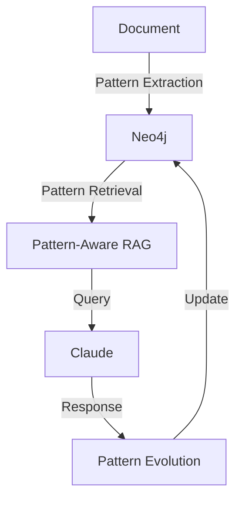

# Pattern-Aware RAG Quick Start Guide

## 🚀 Getting Started

### 1. System Overview
The Pattern-Aware RAG system enhances traditional RAG with:
- Pattern evolution through concept spaces
- Multi-modal field navigation
- Semantic relationship discovery
- Dynamic learning windows

### 2. Key Components



### 3. Priority Tasks

#### Immediate Focus
1. **Pattern Retrieval**
   ```python
   # Implement in Neo4jStateStore
   async def get_relevant_patterns(query: str, context: Dict) -> List[Pattern]:
       # TODO: Add implementation
       pass
   ```

2. **Claude Integration**
   ```python
   # Implement in ClaudeInterface
   async def query_with_context(query: str, patterns: List[Pattern]) -> Response:
       # TODO: Add implementation
       pass
   ```

3. **Response Processing**
   ```python
   # Implement in ResponseAnalyzer
   async def analyze_response(response: Response) -> List[Pattern]:
       # TODO: Add implementation
       pass
   ```

### 4. Development Environment

```bash
# Setup
git clone https://github.com/your-org/habitat-windsurf.git
cd habitat-windsurf
python -m venv venv
source venv/bin/activate
pip install -r requirements.txt

# Run Tests
pytest src/habitat_evolution/tests/pattern/test_field_navigation.py
pytest src/tests/pattern_aware_rag/integration/test_full_cycle.py
pytest src/habitat_evolution/tests/visualization/test_semantic_pattern_visualization.py
```

### 5. Key Files

```
habitat-windsurf/
├── src/
│   ├── habitat_evolution/
│   │   ├── pattern_aware_rag/
│   │   │   ├── pattern_aware_rag.py     # Core implementation
│   │   │   ├── core/
│   │   │   │   ├── pattern_processor.py # Pattern handling
│   │   │   │   └── coherence.py        # Pattern coherence
│   │   │   └── services/
│   │   │       ├── neo4j_service.py    # Graph storage
│   │   │       └── mongo_service.py    # State history
│   │   └── tests/
│   │       └── pattern/
│   │           └── test_field_navigation.py
│   └── tests/
│       └── pattern_aware_rag/
│           └── integration/
│               └── test_full_cycle.py
└── docs/
    ├── PATTERN_AWARE_RAG.md    # Main documentation
    ├── TESTING.md              # Testing guide
    └── PATTERN_ORIGINATION.md  # Pattern lifecycle
```

### 6. Common Patterns

#### Pattern Evolution
```python
# Always use window states
window = window_manager.current_window
if window.can_accept_pattern(pattern):
    await window.process_pattern(pattern)

# Never force transitions
# DON'T: pattern.state = WindowState.OPEN  # Wrong!
```

#### Context Management
```python
# Always use JSON serialization
context = json.dumps({"temporal": data})

# Always handle errors
try:
    await neo4j_store.store_patterns(patterns)
except Neo4jError as e:
    await handle_integration_error(e, patterns)
```

### 7. Testing Strategy

1. **Unit Tests**: Individual components
   ```bash
   pytest src/habitat_evolution/tests/unit/
   ```

2. **Integration Tests**: Component interaction
   ```bash
   pytest src/tests/pattern_aware_rag/integration/
   ```

3. **Field Navigation**: Pattern discovery
   ```bash
   pytest src/habitat_evolution/tests/pattern/
   ```

### 8. Next Steps

1. **Pattern Retrieval**
   - Implement relevance scoring
   - Add pattern reconstruction
   - Write tests in test_live_cycle.py

2. **Claude Integration**
   - Setup Claude API client
   - Implement context-aware querying
   - Add response handling

3. **Pattern Evolution**
   - Implement evolution tracking
   - Add stability metrics
   - Setup version management

### 9. Common Issues

1. **Neo4j Connection**
   ```python
   # Check connection string
   NEO4J_URI = "bolt://localhost:7687"
   ```

2. **Window States**
   ```python
   # Ensure proper transitions
   CLOSED -> OPENING -> OPEN -> CLOSING
   ```

3. **Pattern Coherence**
   ```python
   # Validate before storage
   assert pattern.coherence_score > 0.5
   ```

### 10. Resources

- [Neo4j Documentation](https://neo4j.com/docs/)
- [Claude API Documentation](https://docs.anthropic.com/claude/docs)
- [Testing Documentation](TESTING.md)
- [Pattern Evolution Guide](PATTERN_ORIGINATION.md)

## Need Help?
- Check existing test cases for examples
- Review PATTERN_AWARE_RAG.md for architecture details
- Run tests with -v flag for verbose output
- Use logging for debugging: `logging.getLogger(__name__).setLevel(logging.DEBUG)`
