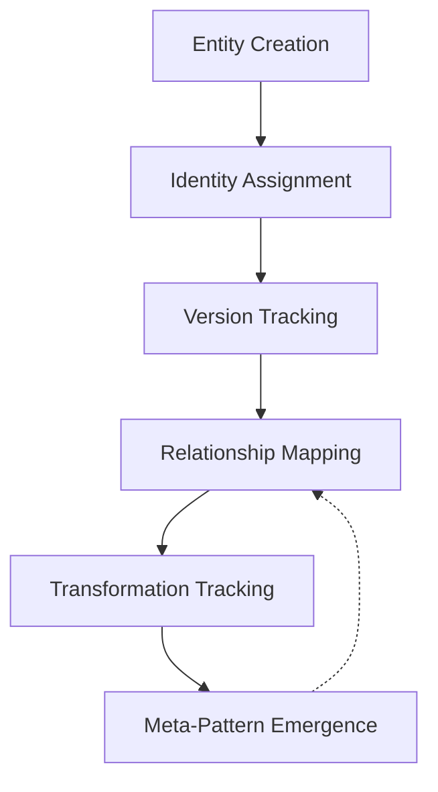
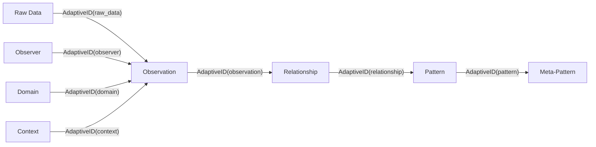
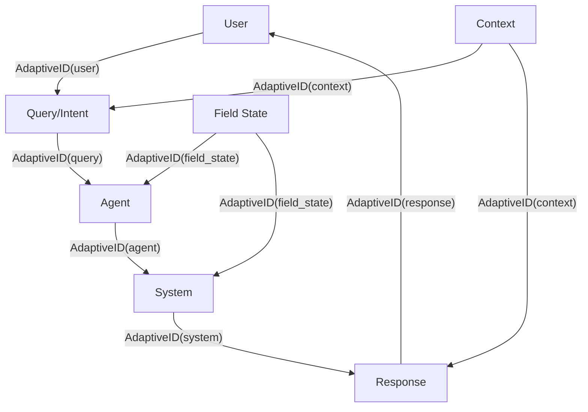
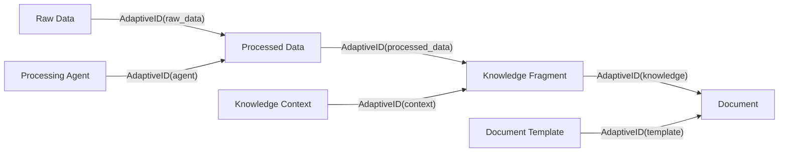
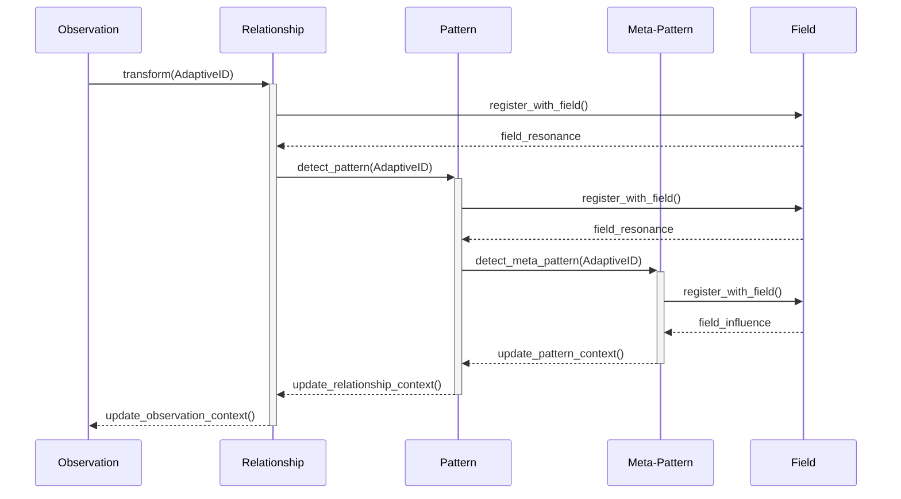

# Adaptive ID Flow: Entity Identity in Habitat Evolution

## Overview

Habitat Evolution's field-first approach requires a sophisticated identity management system that can track entities, transformations, and relationships across the entire ecosystem. This document outlines an efficient flow of identities for entities in the system, including observations, patterns, users, agents, systems, data, and documents.

The adaptive identity system enables the field itself to determine what's connected through its topology and dynamics, rather than imposing artificial domain boundaries or relationships. This aligns with Habitat's core principles of pattern emergence without predefined structures.

## Core Identity Principles



1. **Universal Identity**: Every entity in the system receives a unique AdaptiveID
2. **Versioned History**: All changes to entities are tracked with versioned history
3. **Relationship Preservation**: Relationships between entities maintain their own identities
4. **Transformation Lineage**: Transformations between entity types preserve lineage
5. **Field-Aware Identity**: Identity structures adapt based on field dynamics

## Entity Types and ID Flow

### 1. Observation Frame Entities



**Code Reference**:
```python
# From src/habitat_evolution/adaptive_core/id/adaptive_id.py
def __init__(
    self,
    base_concept: str,
    creator_id: str,
    weight: float = 1.0,
    confidence: float = 1.0,
    uncertainty: float = 0.0,
):
    self.id = str(uuid.uuid4())
    self.base_concept = base_concept
    self.creator_id = creator_id
    # ...
```

### 2. User-Agent-System Interaction Flow



### 3. Data-Document Transformation Flow



## Efficient ID Structure

The AdaptiveID structure should balance uniqueness, readability, and efficiency:

```
adaptive_id = {
    "id": "<uuid>",
    "base_concept": "<entity_type>",
    "creator_id": "<source_id>",
    "versions": {
        "<version_id>": {
            "data": { ... },
            "timestamp": "<iso_datetime>",
            "origin": "<transformation_source>"
        }
    },
    "relationships": {
        "<relationship_id>": {
            "target_id": "<target_adaptive_id>",
            "type": "<relationship_type>",
            "strength": <float>,
            "created_at": "<iso_datetime>"
        }
    },
    "metadata": {
        "created_at": "<iso_datetime>",
        "last_modified": "<iso_datetime>",
        "version_count": <int>
    }
}
```

**Code Reference**:
```python
# From src/habitat_evolution/adaptive_core/id/adaptive_id.py
def create_snapshot(self) -> Dict[str, Any]:
    """Create a snapshot of current state."""
    with self._lock:
        return {
            "id": self.id,
            "base_concept": self.base_concept,
            "current_version": self.current_version,
            "versions": self.versions,
            "temporal_context": self.temporal_context,
            "spatial_context": self.spatial_context,
            "metadata": self.metadata,
            "user_interactions": self.user_interactions
        }
```

## Pattern Transformation ID Flow

The transformation from observations to patterns to meta-patterns is a key flow in Habitat Evolution:



## Implementation Recommendations

1. **Lazy Loading**: Load entity details only when needed to reduce memory overhead
2. **Relationship Caching**: Cache frequently accessed relationships for performance
3. **Hierarchical Storage**: Store entities hierarchically based on relationship strength
4. **Field-Aware Indexing**: Index entities based on field topology for efficient retrieval
5. **Versioning Optimization**: Store only deltas between versions rather than full snapshots

## Implications

The implications of this adaptive identity system are significant:

1. **Emergent Knowledge Representation**: Knowledge can emerge naturally from the field without predefined structures
2. **Traceable Transformations**: All transformations from raw data to insights can be traced
3. **Contextual Relevance**: Entities maintain their context across transformations
4. **Evolving Understanding**: As the field evolves, the understanding of entities can evolve
5. **Cross-Domain Relationships**: Relationships can span traditional domain boundaries

## Code Implementation Example

```python
def transform_observation_to_relationship(observation_id: AdaptiveID) -> AdaptiveID:
    """Transform an observation into a relationship with lineage preservation."""
    # Get observation data
    observation = observation_id.get_current_version_data()
    
    # Create relationship with lineage to observation
    relationship_id = AdaptiveID(
        base_concept="relationship",
        creator_id=observation_id.id,  # Preserve lineage
        weight=observation_id.weight,
        confidence=observation_id.confidence
    )
    
    # Structure the relationship data
    relationship_data = {
        "source": observation["entity"],
        "predicate": observation["action"],
        "target": observation["object"],
        "derived_from": observation_id.id,
        "context": observation["context"]
    }
    
    # Add the data as a new version
    relationship_id.add_version(relationship_data, "observation_transformation")
    
    # Create bidirectional relationship
    observation_id.add_relationship(relationship_id.id, "transformed_to")
    relationship_id.add_relationship(observation_id.id, "derived_from")
    
    return relationship_id
```

## Conclusion

An efficient adaptive identity flow is essential for Habitat Evolution's field-first approach. By treating identity as adaptive and field-aware, the system can allow patterns to emerge naturally from field dynamics rather than imposing predefined structures.

The proposed ID flow enables a topology of transformations where entities maintain their identity and lineage across the system, from raw data to meta-patterns, and across user-agent-system-data-document interactions. This approach aligns with the core principles of Habitat Evolution, where the field itself determines what's connected through its topology and dynamics.
