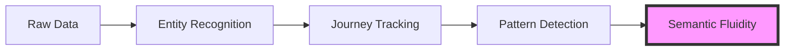

# Data-Semantic Fluidity: The Transformative Power of ActantJourney

## Simple Concept, Profound Implications

At its core, data-semantic fluidity is about breaking down the artificial barrier between data and meaning.

Traditional systems treat data as fixed and meaning as an interpretation layer on top. Our approach is fundamentally different: **we treat meaning as an emergent property that flows alongside data, transforming as it crosses domain boundaries**.

## How ActantJourney Enables Fluidity

The ActantJourney framework enables data-semantic fluidity through three simple mechanisms:

1. **Entities as Travelers**: We track how entities (actants) move across different contexts, carrying meaning with them
2. **Adaptive Identity**: Entities maintain their core identity while adapting to new contexts
3. **Pattern Emergence**: As entities travel, patterns emerge that transcend individual domains

## Why This Matters

This approach solves three fundamental problems in information systems:

1. **The Static Data Problem**: Traditional systems freeze meaning at the point of data capture
2. **The Context Gap**: Most systems struggle to maintain context across domain boundaries
3. **The Emergence Blindness**: Conventional approaches miss emergent patterns that arise from cross-domain interactions

## Real-World Example: Climate Risk Analysis

In climate risk analysis, the same entity (e.g., "sea level rise") transforms as it moves across domains:

- In **scientific data**: A measurable physical phenomenon (X cm rise)
- In **economic impact**: A financial risk factor (Y% property devaluation)
- In **policy response**: A governance challenge (Z adaptation measures)

Traditional systems treat these as separate data points. Our approach tracks the semantic journey, revealing how meaning transforms while maintaining identity.

## The Simplicity Revolution

The beauty of this approach is its simplicity:

1. **Observe** entities as they appear in different contexts
2. **Track** their journeys across domain boundaries
3. **Detect** emergent patterns in their transformations

No complex algorithms. No massive training datasets. Just a fundamental shift in how we think about the relationship between data and meaning.

## Beyond NLP and Systems Theory

This approach transcends traditional NLP (which focuses on extracting fixed meaning) and systems theory (which often treats boundaries as static):

- Instead of extracting meaning, we **follow meaning as it flows**
- Instead of modeling fixed systems, we **track how systems transform each other**

## Getting Started

To implement data-semantic fluidity in your own systems:

1. Identify the key entities (actants) in your domain
2. Track how they appear in different contexts
3. Observe the patterns that emerge as they cross boundaries
4. Use these patterns to inform decision-making

The ActantJourney framework provides the tools to make this possible, turning the abstract concept of semantic fluidity into practical reality.
