```mermaid
graph TD
    %% Main Components
    Field[Tonic-Harmonic Field] 
    Agent[Agent Observer]
    User[User/Client Application]
    
    %% Field Subcomponents
    PatternSpace[Pattern Space]
    Relationships[Pattern Relationships]
    FieldState[Field State]
    EvolutionTracker[Pattern Evolution Tracker]
    
    %% Agent Subcomponents
    Retriever[Pattern Retriever]
    Navigator[Pattern Navigator]
    Analyzer[Pattern Analyzer]
    QueryEnhancer[Query Enhancer]
    
    %% Field Internal Structure
    Field --> PatternSpace
    Field --> Relationships
    Field --> FieldState
    Field --> EvolutionTracker
    
    %% Agent Internal Structure
    Agent --> Retriever
    Agent --> Navigator
    Agent --> Analyzer
    Agent --> QueryEnhancer
    
    %% Field-Agent Interactions
    Retriever -- "get_pattern_by_id()" --> PatternSpace
    Navigator -- "get_patterns_in_proximity()" --> Relationships
    Analyzer -- "get_constructive_dissonance()" --> FieldState
    QueryEnhancer -- "get_patterns_for_query()" --> PatternSpace
    EvolutionTracker -- "pattern quality states" --> Analyzer
    
    %% User Interactions
    User -- "Queries" --> Agent
    Agent -- "Enhanced Responses" --> User
    
    %% Data Flow
    PatternSpace -- "Patterns" --> Retriever
    Relationships -- "Related Patterns" --> Navigator
    FieldState -- "Dissonance Data" --> Analyzer
    PatternSpace -- "Relevant Patterns" --> QueryEnhancer
    
    %% Style
    classDef field fill:#f9f,stroke:#333,stroke-width:2px
    classDef agent fill:#bbf,stroke:#333,stroke-width:2px
    classDef user fill:#bfb,stroke:#333,stroke-width:2px
    
    class Field,PatternSpace,Relationships,FieldState,EvolutionTracker field
    class Agent,Retriever,Navigator,Analyzer,QueryEnhancer agent
    class User user
```

# Field Representation and Agent Observer Schematic

## Key Components

### Tonic-Harmonic Field (Source of Truth)
- **Pattern Space**: Contains all patterns detected in the system with their properties
- **Pattern Relationships**: Stores relationships between patterns (spatial, temporal, causal, etc.)
- **Field State**: Maintains the current state of the vector-tonic field
- **Pattern Evolution Tracker**: Tracks how patterns evolve through quality states over time

### Agent Observer (Navigation Layer)
- **Pattern Retriever**: Retrieves specific patterns by ID
- **Pattern Navigator**: Navigates relationships between patterns
- **Pattern Analyzer**: Analyzes constructive dissonance and pattern evolution
- **Query Enhancer**: Enhances user queries with pattern context

## Interaction Flow

1. The **Tonic-Harmonic Field** maintains the mathematical representation of all patterns and their relationships
2. The **Agent Observer** does not modify the field but only observes and navigates it
3. The Agent uses API calls like `get_pattern_by_id()` to retrieve information from the field
4. The Agent can analyze constructive dissonance by observing tensions in the field
5. User queries are processed by the Agent, which retrieves relevant patterns from the field
6. The Agent returns enhanced responses that incorporate pattern context

## Key Principles

1. **Field as Source of Truth**: The tonic-harmonic field is the authoritative source of patterns and relationships
2. **Agent as Observer Only**: The agent does not create or modify patterns, only retrieves and navigates them
3. **Preservation of Field Properties**: The mathematical properties of the field (resonance, dissonance, etc.) are preserved
4. **Separation of Concerns**: Pattern detection and evolution occur in the field; navigation and retrieval occur in the agent

This schematic represents a simplified view of how the agent observer interacts with the tonic-harmonic field representation while maintaining the integrity of Habitat's pattern detection capabilities.
