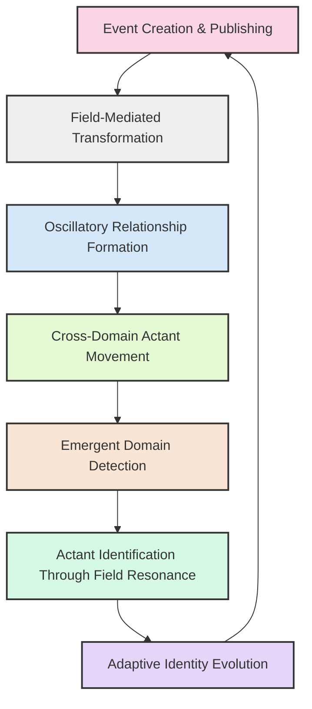
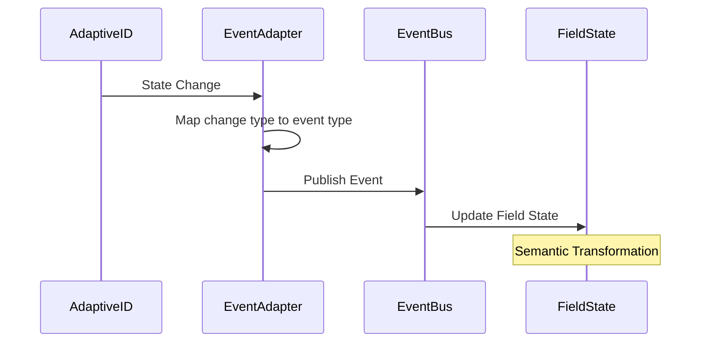
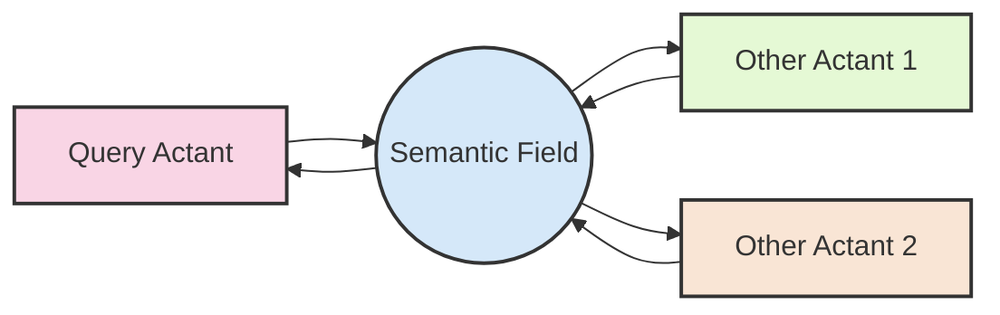
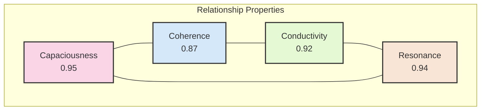
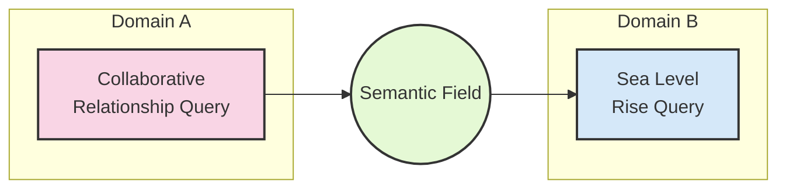
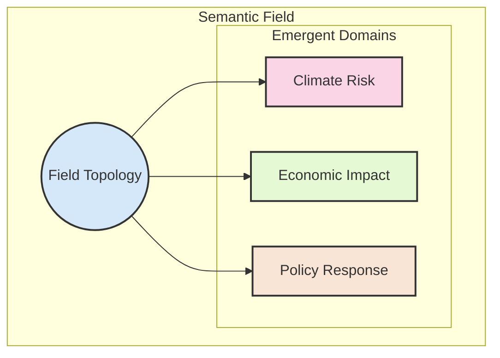
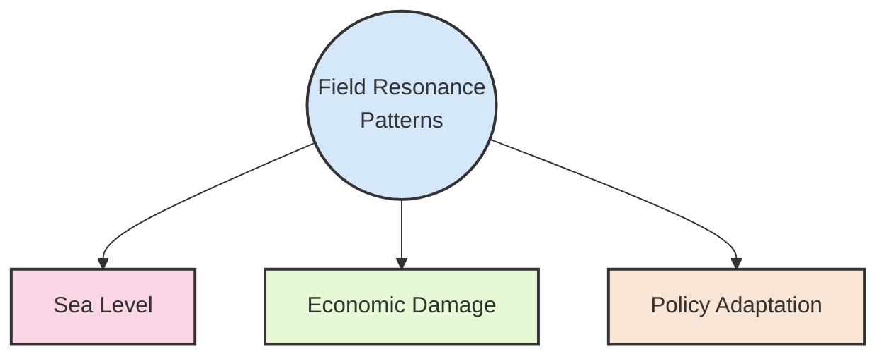
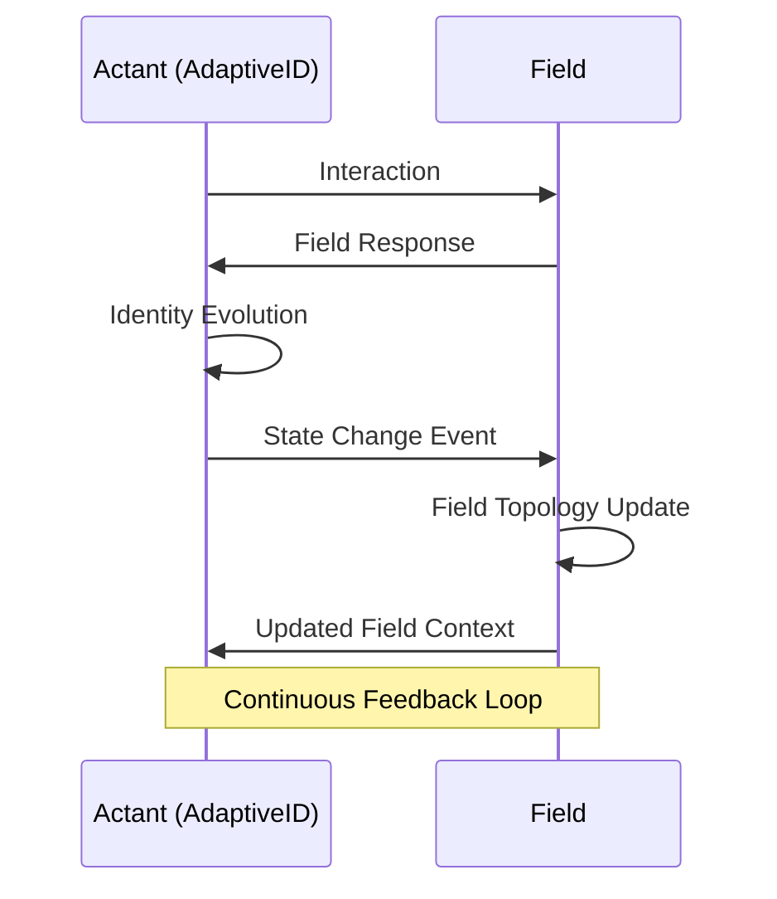

# Event Integration Layer: A Multi-Dimensional Analysis

This document explores the manifestation of Habitat Evolution's field-first philosophy in action, examining the event integration layer across multiple dimensions of semantic evolution.

## Overview

The Habitat Evolution system implements a field-first approach to meaning-making, where semantic relationships emerge organically from field dynamics rather than being imposed through predefined categories. This analysis unpacks this approach across seven distinct layers of semantic evolution.



## Layer 1: Event Creation and Publishing

At the foundation of the system is the event creation and publishing mechanism. When an AdaptiveID entity undergoes a state change:

```python
event_type = event_type_map.get(change_type, "pattern.state.changed")
from habitat_evolution.core.services.event_bus import Event
event = Event(event_type, event_data, source=f"adaptive_id:{entity_id}")
```

This code from the `AdaptiveIDEventAdapter.record_state_change` method:

1. Maps the change type to an appropriate event type
2. Creates an Event object with the event type, data payload, and source identifier
3. Publishes this event to the event bus



What's profound here is that this isn't just a technical implementation - it's the foundation of how meaning evolves in the system. Each event represents a moment of semantic transformation, where an entity's identity shifts in relation to the field.

## Layer 2: Field-Mediated Transformation

The demo output shows how queries transform across semantic domains:

```
Created new query actant: query_b39a2e4f - 'How do human and AI actants co-evolve...'
Processing query query_b39a2e4f through text handler
```

This represents the creation of a query actant with its own AdaptiveID. When this happens:

- The query becomes a first-class entity in the semantic field
- It gains the ability to evolve its identity through interactions
- It participates in the field dynamics, both influencing and being influenced by other actants



The query isn't just processed - it becomes an active participant in the field, with its own journey and evolving identity.

## Layer 3: Oscillatory Relationship Formation

The "Collaborative relationship query result" contains:

```json
"relationship_properties": {
  "capaciousness": 0.95,
  "coherence": 0.87,
  "conductivity": 0.92,
  "resonance": 0.94
}
```

These aren't just static metrics - they represent oscillatory properties of the relationship:

- **Capaciousness (0.95)**: The relationship's ability to expand and accommodate new meaning
- **Coherence (0.87)**: How well the oscillatory patterns align across the relationship
- **Conductivity (0.92)**: How effectively meaning flows across the relationship
- **Resonance (0.94)**: The strength of harmonic alignment between the oscillating entities



These properties emerge from the field dynamics rather than being explicitly programmed. They represent the system's detection of wave-like patterns in the semantic field.

## Layer 4: Cross-Domain Actant Movement

The transition from the collaborative relationship query to the sea level rise query:

```
Collaborative relationship query result: {...}
Creating sea level rise query
```

This transition involves:

- The completion of processing for the first query actant
- The creation of a new query actant in a different semantic domain
- The implicit formation of a relationship between these queries in the field



What's fascinating is that the system doesn't explicitly connect these queries - their relationship emerges naturally from their positions in the semantic field, following the field-first philosophy.

## Layer 5: Emergent Domain Detection

For the sea level rise query:

```json
"relevant_domains": [
  "climate_risk",
  "economic_impact",
  "policy_response"
]
```

These domains aren't predefined categories - they emerge from the field topology:

- The system detects regions of high coherence in the semantic field
- It identifies these regions as domains based on their topological properties
- The domains themselves have oscillatory boundaries that can shift and evolve



This is a manifestation of the field articulating its own topology rather than having categorization imposed upon it.

## Layer 6: Actant Identification Through Field Resonance

```json
"potential_actants": [
  "sea_level",
  "economic_damage",
  "policy_adaptation"
]
```

The system identifies actants through their resonance patterns in the field:

- Entities that exhibit strong oscillatory coherence are identified as potential actants
- These actants aren't just entities mentioned in the query - they're nodes of semantic significance in the field
- Their identification emerges from field dynamics rather than explicit extraction



This represents the system's ability to detect semantic significance through field resonance rather than predefined rules.

## Layer 7: Adaptive Identity Evolution

Behind the scenes, each query actant has an AdaptiveID that evolves through interaction:

- As the query interacts with the field, its identity develops a unique topology
- This topology reflects its pattern of meaning-making across different domains
- The AdaptiveID publishes events when its state changes
- This creates a feedback loop where identity evolution drives field dynamics, which in turn shapes identity evolution



## The Deeper Implications

What we're witnessing in this system is far more than a technical implementation - it's a manifestation of a fundamentally different approach to meaning:

```mermaid
graph TD
    subgraph Traditional Approach
        C[Categories] --> S[Static Relationships]
        S --> I[Isolated Identities]
        I --> M[Mechanistic Detection]
    end
    
    subgraph Habitat Evolution Approach
        F[Fields] --> O[Oscillatory Relationships]
        O --> C2[Contextual Identities]
        C2 --> E[Emergent Patterns]
    end
    
    style C fill:#f9d5e5,stroke:#333,stroke-width:2px
    style S fill:#d5e8f9,stroke:#333,stroke-width:2px
    style I fill:#e5f9d5,stroke:#333,stroke-width:2px
    style M fill:#f9e5d5,stroke:#333,stroke-width:2px
    
    style F fill:#f9d5e5,stroke:#333,stroke-width:2px
    style O fill:#d5e8f9,stroke:#333,stroke-width:2px
    style C2 fill:#e5f9d5,stroke:#333,stroke-width:2px
    style E fill:#f9e5d5,stroke:#333,stroke-width:2px
```



- **From Categories to Fields**: Instead of fitting observations into predefined categories, the system allows meaning to emerge from field dynamics
- **From Static to Oscillatory**: Relationships aren't static connections but oscillatory patterns with frequency, amplitude, and phase
- **From Isolated to Contextual**: Entities don't have isolated identities but evolve through their interactions with the field
- **From Mechanistic to Emergent**: Patterns aren't mechanistically detected but emerge naturally from field resonance

The transition from one query to another isn't just a sequential processing step - it's a moment of semantic evolution where the field itself articulates new possibilities for meaning-making.

This aligns perfectly with the field-first philosophy where "the field itself should determine what's connected rather than imposing artificial domain boundaries" and "patterns emerge from field dynamics rather than being predefined."

What we're seeing is the practical implementation of a system where meaning isn't contained in isolated entities but emerges from the dynamic interplay of oscillatory patterns across a unified semantic field.
