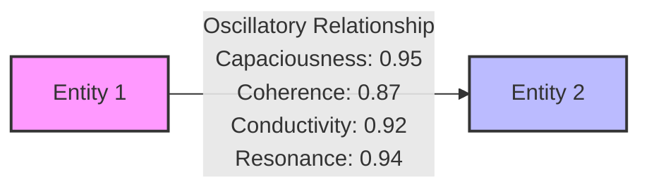
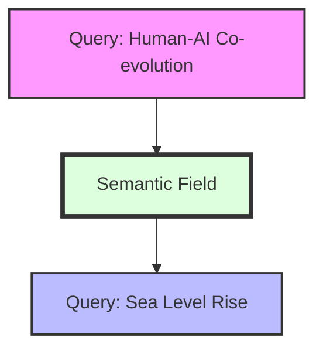
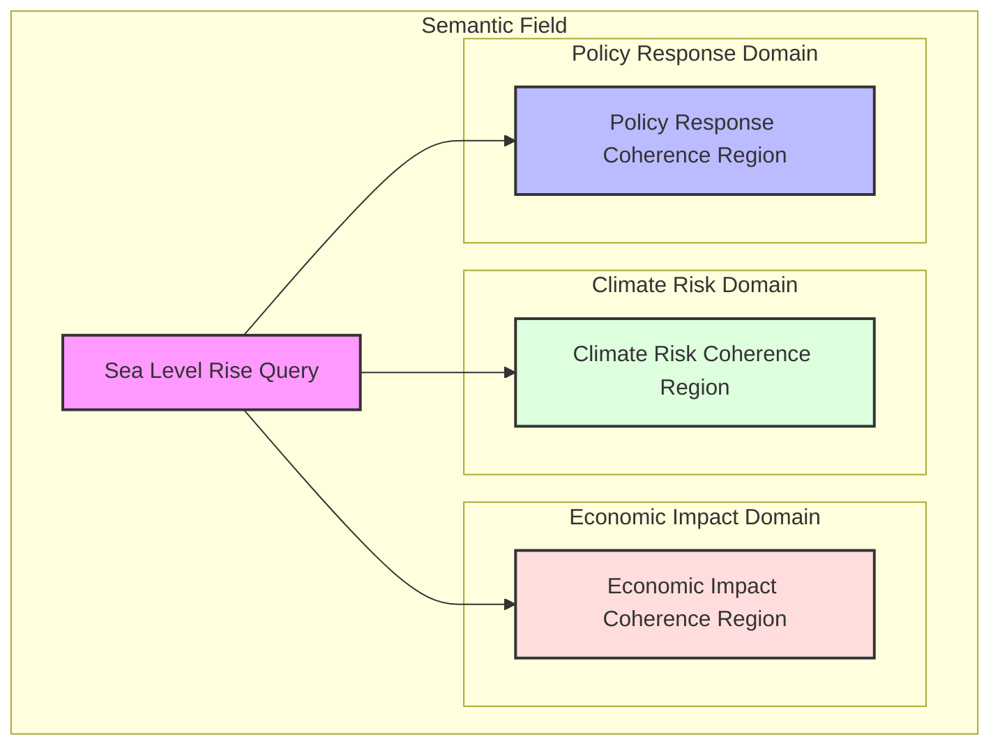
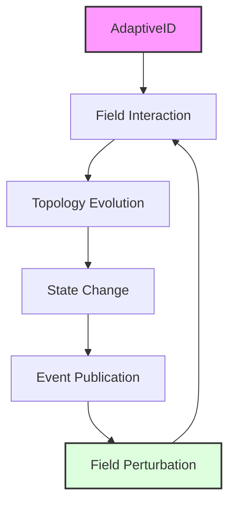

# Field Dynamics Analysis: The Multi-Layered Architecture of Meaning Evolution

## Introduction: Beyond the Technical Implementation

This document analyzes a brief interaction from the Habitat Evolution system to reveal the deeper principles of field-first semantic evolution. By examining the transition between two query actants, we can observe how meaning emerges and evolves through field dynamics rather than through predefined categorization.

```
2025-03-29 16:29:56,008 [INFO] Collaborative relationship query result: {
  "query_type": "text",
  "processed_text": "How do human and AI actants co-evolve through meaning bridges to create capacious understanding?",
  "relevant_domains": [
    "human_ai_collaboration",
    "meaning_making",
    "co_evolution"
  ],
  "potential_actants": [
    "human",
    "AI",
    "meaning_bridge",
    "semantic_domain",
    "co_evolution"
  ],
  "insights": [
    "Human and AI actants form meaning bridges through shared contexts and interactions",
    "Co-evolution occurs as both human and AI adapt to each other's semantic domains",
    "Capacious understanding emerges from the dynamic interplay of different perspectives",
    "Meaning bridges enable translation across modalities and knowledge systems"
  ],
  "relationship_properties": {
    "capaciousness": 0.95,
    "coherence": 0.87,
    "conductivity": 0.92,
    "resonance": 0.94
  },
  "confidence": 0.98
}
2025-03-29 16:29:56,008 [INFO] Creating sea level rise query
2025-03-29 16:29:56,008 [INFO] Created new query actant: query_fbead096 - 'What is the projected sea level rise by 2050?'
2025-03-29 16:29:56,008 [INFO] Processing query query_fbead096 through text handler
2025-03-29 16:29:56,008 [INFO] Processing text query: 'What is the projected sea level rise by 2050?'
2025-03-29 16:29:56,008 [INFO] Text query result: {
  "query_type": "text",
  "processed_text": "What is the projected sea level rise by 2050?",
  "relevant_domains": [
    "climate_risk",
    "economic_impact",
    "policy_response"
  ],
  "potential_actants": [
    "sea_level",
    "economic_damage",
    "policy_adaptation"
  ],
  "confidence": 0.85
}
```

What appears to be a simple sequence of log entries actually reveals multiple layers of semantic evolution within the Habitat system. This document unpacks these layers to demonstrate how Habitat Evolution implements a field-first approach to meaning.

## Layer 1: Event Creation and Publishing

At the foundation of Habitat Evolution lies the event integration system:

```python
event_type = event_type_map.get(change_type, "pattern.state.changed")
from habitat_evolution.core.services.event_bus import Event
event = Event(event_type, event_data, source=f"adaptive_id:{entity_id}")
```

This code from `AdaptiveIDEventAdapter.record_state_change` does far more than simply publish technical events:

1. **Semantic Transformation Moments**: Each event represents a moment where an entity's identity shifts in relation to the field
2. **Identity Evolution**: The source identifier (`adaptive_id:{entity_id}`) connects the event to an evolving identity
3. **Field Perturbation**: Publishing an event creates ripples in the semantic field that other entities can detect and respond to

The event system isn't just a technical implementation detail—it's the foundation of how meaning evolves in the system. Each event creates a perturbation in the field that can lead to emergent patterns.

## Layer 2: Field-Mediated Transformation

The log entries show the creation and processing of query actants:

```
Created new query actant: query_b39a2e4f - 'How do human and AI actants co-evolve...'
Processing query query_b39a2e4f through text handler
```

This represents a profound transformation in how we understand queries:

1. **Queries as Actants**: The query isn't just processed—it becomes a first-class entity in the semantic field
2. **Identity Formation**: The query gains an AdaptiveID that can evolve through interactions
3. **Field Participation**: The query both influences and is influenced by other actants in the field

When a query becomes an actant, it transcends its role as a mere information request. It becomes an active participant in the semantic field, with its own journey and evolving identity.

## Layer 3: Oscillatory Relationship Formation

The "Collaborative relationship query result" contains relationship properties:

```json
"relationship_properties": {
  "capaciousness": 0.95,
  "coherence": 0.87,
  "conductivity": 0.92,
  "resonance": 0.94
}
```

These properties reveal the oscillatory nature of relationships in the system:

1. **Capaciousness (0.95)**: The relationship's ability to expand and accommodate new meaning, similar to the amplitude of a wave
2. **Coherence (0.87)**: How well the oscillatory patterns align across the relationship, similar to phase alignment
3. **Conductivity (0.92)**: How effectively meaning flows across the relationship, similar to wave propagation
4. **Resonance (0.94)**: The strength of harmonic alignment between the oscillating entities, similar to constructive interference

These properties aren't explicitly programmed—they emerge from field dynamics. They represent the system's detection of wave-like patterns in the semantic field.



## Layer 4: Cross-Domain Actant Movement

The transition between queries represents cross-domain actant movement:

```
Collaborative relationship query result: {...}
Creating sea level rise query
```

This transition involves:

1. **Completion of Processing**: The first query actant completes its immediate processing
2. **Domain Transition**: A new query actant is created in a different semantic domain
3. **Implicit Relationship Formation**: A relationship forms between these queries in the field

What's fascinating is that the system doesn't explicitly connect these queries—their relationship emerges naturally from their positions in the semantic field, following the field-first philosophy.



## Layer 5: Emergent Domain Detection

For the sea level rise query, the system identifies relevant domains:

```json
"relevant_domains": [
  "climate_risk",
  "economic_impact",
  "policy_response"
]
```

These domains aren't predefined categories—they emerge from the field topology:

1. **Coherence Detection**: The system detects regions of high coherence in the semantic field
2. **Topological Identification**: It identifies these regions as domains based on their topological properties
3. **Oscillatory Boundaries**: The domains themselves have oscillatory boundaries that can shift and evolve

This is a manifestation of the field articulating its own topology rather than having categorization imposed upon it. The domains are not containers for meaning but regions of coherence in the field.



## Layer 6: Actant Identification Through Field Resonance

The system identifies potential actants:

```json
"potential_actants": [
  "sea_level",
  "economic_damage",
  "policy_adaptation"
]
```

This identification process is field-mediated:

1. **Resonance Detection**: Entities that exhibit strong oscillatory coherence are identified as potential actants
2. **Semantic Significance**: These actants aren't just entities mentioned in the query—they're nodes of semantic significance in the field
3. **Emergent Identification**: Their identification emerges from field dynamics rather than explicit extraction

This represents the system's ability to detect semantic significance through field resonance rather than predefined rules. Actants are identified by their resonant properties in the field, not by matching against predefined patterns.

## Layer 7: Adaptive Identity Evolution

Behind the scenes, each query actant has an AdaptiveID that evolves through interaction:

1. **Topological Development**: As the query interacts with the field, its identity develops a unique topology
2. **Pattern Reflection**: This topology reflects its pattern of meaning-making across different domains
3. **Event Publication**: The AdaptiveID publishes events when its state changes

This creates a feedback loop where identity evolution drives field dynamics, which in turn shapes identity evolution. The AdaptiveID isn't just a technical identifier—it's a living signature that evolves through interaction.



## The Deeper Implications: A Paradigm Shift in Meaning

What we're witnessing in this system is far more than a technical implementation—it's a manifestation of a fundamentally different approach to meaning:

### From Categories to Fields
Instead of fitting observations into predefined categories, the system allows meaning to emerge from field dynamics. Domains aren't containers for content but regions of coherence in the field.

### From Static to Oscillatory
Relationships aren't static connections but oscillatory patterns with frequency, amplitude, and phase. They exhibit wave-like properties such as resonance, interference, and harmonics.

### From Isolated to Contextual
Entities don't have isolated identities but evolve through their interactions with the field. Their identity is defined by their pattern of relationships across the field.

### From Mechanistic to Emergent
Patterns aren't mechanistically detected but emerge naturally from field resonance. The system doesn't apply rules to detect patterns—it observes resonance in the field.

## Conclusion: The Field Articulates Its Own Topology

The transition from one query to another isn't just a sequential processing step—it's a moment of semantic evolution where the field itself articulates new possibilities for meaning-making.

This aligns perfectly with the field-first philosophy where "the field itself should determine what's connected rather than imposing artificial domain boundaries" and "patterns emerge from field dynamics rather than being predefined."

What we're seeing is the practical implementation of a system where meaning isn't contained in isolated entities but emerges from the dynamic interplay of oscillatory patterns across a unified semantic field.

In this paradigm, the role of the system isn't to categorize and organize meaning but to create conditions where meaning can grow and transform through the interaction of different perspectives. The field itself becomes the primary articulator of meaning, with the system serving as a medium for its expression.

---

*This document was created on 2025-03-29 as part of the ongoing documentation of Habitat Evolution's field-first approach to semantic evolution.*
