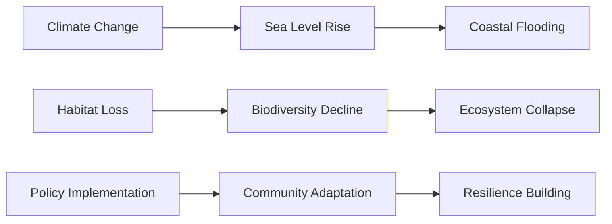
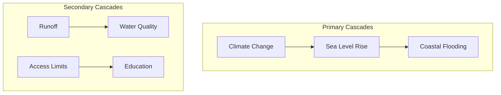
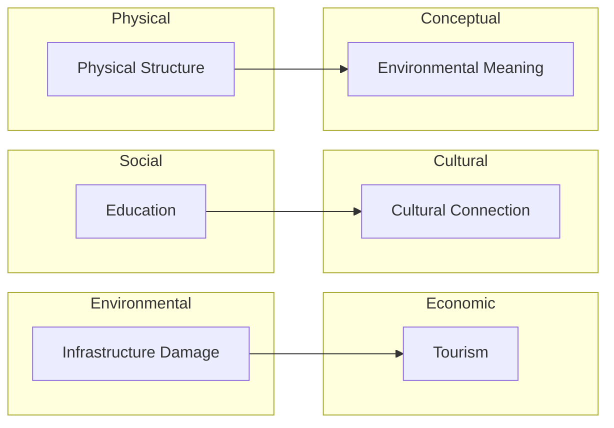
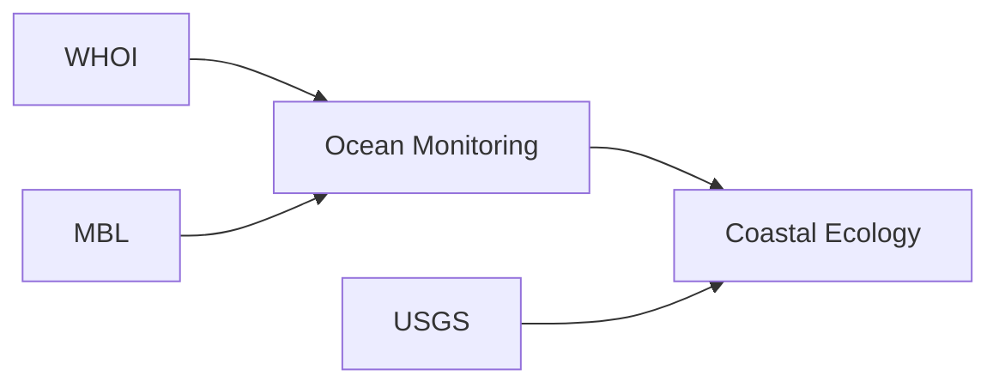
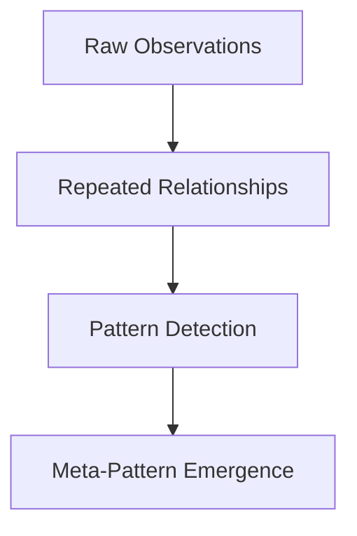
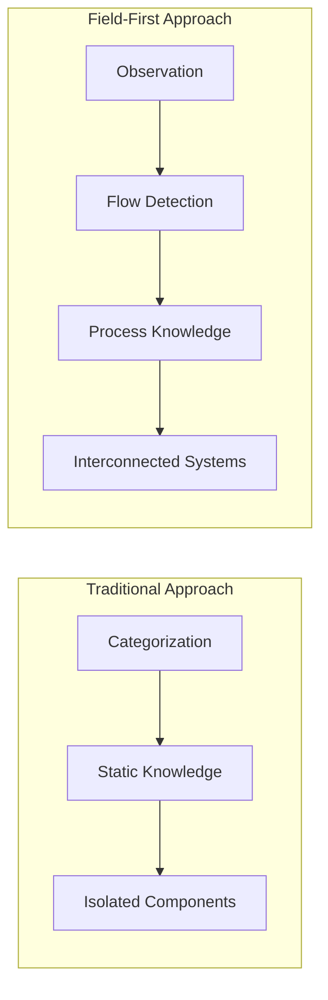

# Implications of a Field-First Semantic Evolution Pattern Detection System

## Overview

Field-first pattern detection represents a paradigm shift in how we process information, moving from categorization-based knowledge to flow-based knowledge. Rather than imposing predefined structures, this approach allows patterns to emerge naturally from field dynamics, enabling the detection of complex relationships across domains.

## Key Implications

### 1. Causal Chain Detection Without Predefined Models

The system detects complete causal chains without being told what to look for:



This means we can identify complex multi-step causal relationships in domains where we don't have preexisting models or where expert knowledge is limited.

### 2. Distinction Between Primary and Secondary Cascades

The system distinguishes between primary cascades (frequently observed, strong signal) and secondary cascades (less frequent but still significant):



This enables detection of both dominant narratives and subtler, potentially emerging narratives that might otherwise be overlooked.

### 3. Cross-Domain Relationship Detection

The system identifies relationships that cross traditional domain boundaries:



This breaks down artificial silos between disciplines, revealing connections that might be missed in domain-specific analyses.

### 4. Institutional Relationship Mapping

The system captures relationships between specific institutions and their activities:



This enables mapping institutional networks and their roles in knowledge production and environmental management without imposing organizational categories.

### 5. Emergence of Meta-Patterns

The repetition in the logs (5 observations of each primary relationship) followed by pattern detection shows how the system moves from individual observations to recognized patterns. The "None None None" pattern relationships indicate the system isn't imposing relationship types but letting them emerge from the data.



### 6. Practical Applications

This approach could transform:

- **Environmental Management**: Identifying unexpected cascading effects of climate change across ecological, social, and economic domains
- **Policy Analysis**: Detecting how policy interventions propagate through communities and institutions
- **Knowledge Management**: Mapping how research flows between institutions and influences different domains
- **Crisis Response**: Identifying cascading effects of disasters across infrastructure, social systems, and ecosystems

### 7. Epistemological Shift

Most profoundly, this represents a shift from categorization-based knowledge to flow-based knowledge. Rather than fitting observations into predefined categories, the system tracks how concepts transform and flow across domains. Knowledge becomes a process rather than a static structure.



This could enable us to work with complex systems in ways that respect their inherent interconnectedness rather than artificially decomposing them into isolated components.

## Code Snippets Addendum

### Primary vs. Secondary Cascade Detection

The system clearly distinguishes between primary and secondary cascades in the log output:

```
Observing Primary Cascades
2025-03-28 08:36:47,097 [INFO] Observed relationship: Climate Change leads_to Sea Level Rise
2025-03-28 08:36:47,199 [INFO] Observed relationship: Climate Change leads_to Sea Level Rise
...

Observing Secondary Cascades
2025-03-28 08:36:50,194 [INFO] Observed relationship: Runoff leads_to Water Quality
```

### Pattern Detection Without Imposed Relationships

The system detects patterns without imposing relationship types:

```
2025-03-28 08:36:50,196 [INFO] Pattern detected: pattern_10_Climate Change_leads_to_Sea Level Rise
2025-03-28 08:36:50,196 [INFO] Pattern relationship: None None None
2025-03-28 08:36:50,196 [INFO] Pattern detected: pattern_11_Sea Level Rise_leads_to_Coastal Flooding
2025-03-28 08:36:50,197 [INFO] Pattern relationship: None None None
```

### Institutional Network Detection

The system captures complex institutional relationships:

```
2025-03-28 08:36:50,197 [INFO] Pattern detected: pattern_18_Research Relationships
    WHOI_leads_to_Ocean Monitoring
    MBL
2025-03-28 08:36:50,197 [INFO] Pattern relationship: None None None
2025-03-28 08:36:50,197 [INFO] Pattern detected: pattern_19_Ocean Monitoring MBL_leads_to_Coastal Ecology USGS
```

### Field Topology Metrics

The system extracts rich topology metrics that capture the field state:

```
2025-03-28 08:36:50,197 [INFO] Publishing enhanced topology metrics:
2025-03-28 08:36:50,197 [INFO]   pattern_count: 90
2025-03-28 08:36:50,197 [INFO]   meta_pattern_count: 0
2025-03-28 08:36:50,197 [INFO]   resonance_density: 0.9000
2025-03-28 08:36:50,197 [INFO]   interference_complexity: 0.2000
2025-03-28 08:36:50,197 [INFO]   flow_coherence: 0.8000
2025-03-28 08:36:50,197 [INFO]   stability_trend: 0.8000
2025-03-28 08:36:50,197 [INFO]   effective_dimensionality: 7
```
