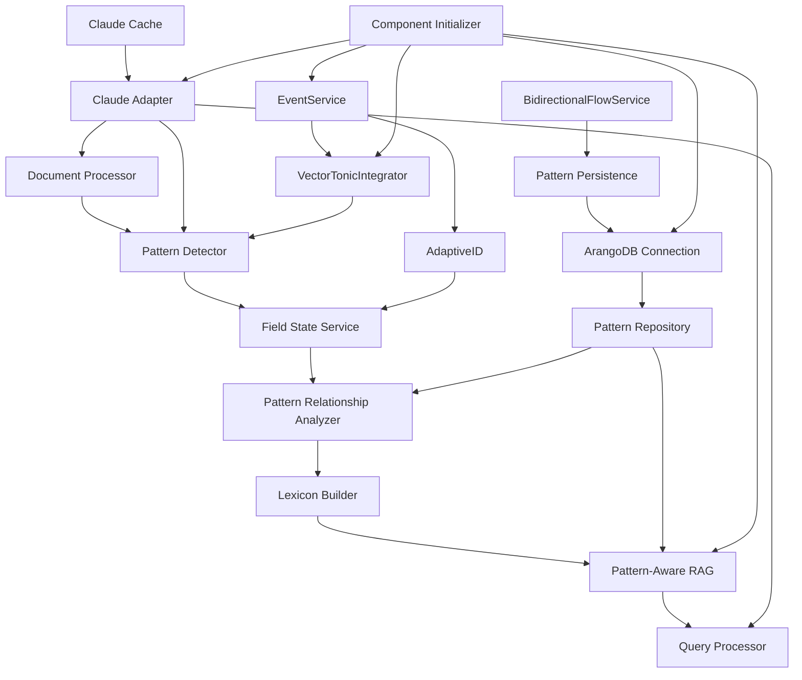
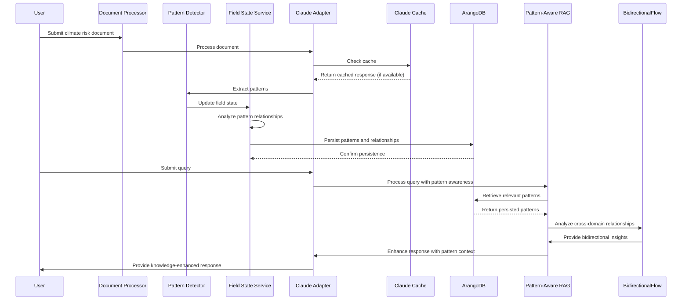
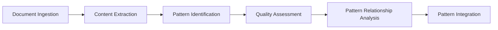
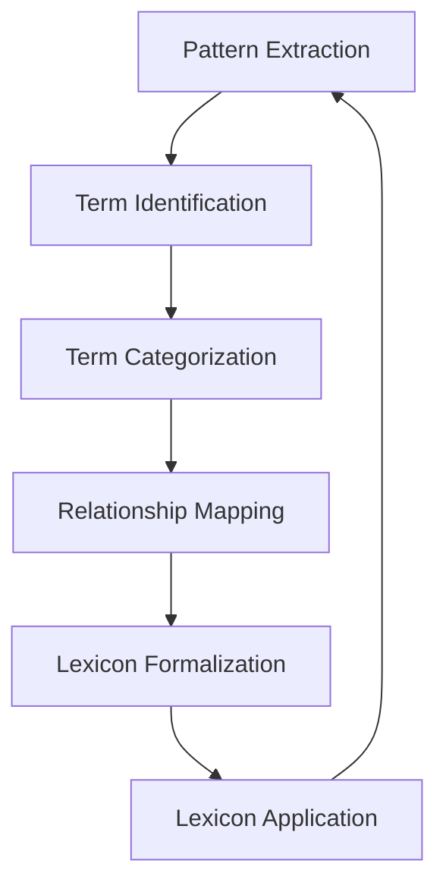

# Habitat Evolution: Pattern Detection, Persistence, and Knowledge Medium Creation for Accelerated Climate Intelligence

## Abstract

This green paper presents Habitat Evolution, a novel system designed to detect, evolve, analyze, and persist coherent patterns across both textual and statistical data, with a specific focus on climate risk assessment. Built on a purely mathematical foundation, Habitat Evolution leverages advanced language models and vector-tonic field representations to enable the observation of semantic and statistical change across systems while building domain-specific lexicons. The system employs sliding window analysis, constructive dissonance detection, and cross-modal pattern integration to identify emergent patterns that might otherwise remain hidden in traditional analysis methods. 

Habitat Evolution has now achieved significant milestones in its development, demonstrating robust capabilities for reading, processing, persisting, querying, and creating Pattern Knowledge Medium (PKM) for both qualitative and quantitative data. Through the integration of AdaptiveID for pattern versioning, PatternAwareRAG for enhanced queries, a sophisticated field-pattern bridge for relationship detection, and a resilient dependency chain management framework, the system provides a comprehensive foundation for portable knowledge media. 

The system now features robust pattern persistence in ArangoDB with bidirectional knowledge flow, enabling seamless query-reply result storage and retrieval. Its enhanced component initialization framework ensures reliable operation even when individual components fail, with graceful degradation through simplified implementations that maintain interface compatibility. This paper details the theoretical foundations, implementation architecture, and empirical results of the system, including its successful end-to-end validation across all core components. This validation confirms Habitat's ability to extract meaningful patterns from climate risk documents and climate data, bridge semantic and statistical domains, persist complex semantic patterns, and generate valuable insights for climate adaptation strategies. While initially developed for climate risk assessment, Habitat's mathematical underpinnings position it for expansion into additional domains and data types in future development phases.

## 1. Introduction

The complexity of climate change and its multifaceted impacts presents a significant challenge for knowledge management and decision-making. Traditional approaches to information processing often struggle to capture the nuanced relationships and emergent patterns across both textual and statistical climate data. Habitat Evolution addresses this challenge by providing an integrated framework for detecting, analyzing, evolving, and persisting patterns across multiple data modalities.

The system is built on the principles of pattern evolution and co-evolution, enabling the detection of coherent patterns while facilitating the observation of semantic and statistical change across the system. Through its vector-tonic field representation, cross-modal pattern integration, and robust persistence mechanisms, Habitat Evolution allows for a more comprehensive understanding of climate risks and adaptation strategies, ultimately supporting more informed decision-making.

Habitat Evolution has now evolved beyond its initial conceptual framework to become a functioning Pattern Knowledge Medium (PKM) system. It demonstrates advanced capabilities for:

1. **Reading and Processing**: Ingesting both qualitative (textual) and quantitative (statistical) data through robust document processing and time series analysis pipelines

2. **Pattern Persistence**: Storing patterns, relationships, and query-reply results in ArangoDB with comprehensive error handling and recovery mechanisms

3. **Bidirectional Knowledge Flow**: Enabling knowledge to flow seamlessly between semantic and statistical domains, with each domain enriching the other

4. **Resilient Component Architecture**: Implementing a sophisticated dependency chain management framework that ensures system functionality even when individual components fail

5. **Portable Knowledge Medium Creation**: Establishing the foundation for knowledge portability across different contexts and applications

This green paper outlines the theoretical foundations, implementation architecture, and empirical results of Habitat Evolution, with a focus on its application to climate risk assessment. The paper details the system's successful end-to-end validation, its pattern persistence capabilities, and discusses the broader implications for accelerating collaborative climate knowledge development.

## 2. Theoretical Framework

### 2.1 Pattern Evolution and Co-Evolution

Habitat Evolution is built on the principles of pattern evolution and co-evolution. These principles provide a framework for understanding how patterns emerge, evolve, and interact within complex systems.

Pattern evolution refers to the process by which patterns change over time in response to new information or changing contexts. Co-evolution describes the mutual influence of patterns on each other, where changes in one pattern can trigger changes in related patterns.

In the context of climate risk assessment, pattern evolution might manifest as the refinement of our understanding of sea level rise impacts as new data becomes available. Co-evolution might be observed in the relationship between sea level rise patterns and coastal infrastructure vulnerability patterns, where changes in one influence our understanding of the other.

### 2.2 Constructive Dissonance

A key theoretical concept in Habitat Evolution is constructive dissonance, which refers to the productive tension between competing or contradictory patterns. Rather than viewing dissonance as a problem to be resolved, Habitat Evolution leverages it as a source of insight and innovation.

Constructive dissonance occurs when:
1. Multiple valid patterns exist that appear to contradict each other
2. This contradiction leads to a deeper exploration of the underlying phenomena
3. The result is a more nuanced understanding that incorporates elements of both patterns

For example, in climate risk assessment, there might be constructive dissonance between patterns suggesting increased storm frequency and patterns indicating changing storm intensity. By exploring this dissonance, we can develop a more comprehensive understanding of extreme weather risks.

### 2.3 Actant-Predicate Relationship Model

A fundamental philosophical distinction in Habitat Evolution is its treatment of concepts and relationships not as static entities with fixed properties, but as co-referential elements that evolve over time and across contexts. This is embodied in the system's actant-predicate relationship model.

In traditional knowledge representation systems, concepts (or entities) and relationships are often treated as distinct elements with set properties that are passed between them—akin to "tiddlywinks" that get thrown like a ball. Habitat Evolution rejects this static view in favor of a dynamic, co-evolutionary approach:

1. **Co-referential nature**: Actants (concepts, entities) and predicates (relationships) are viewed as correlates that mutually define and influence each other.

2. **Temporal evolution**: Both actants and predicates change over time as new information is processed and new patterns are detected.

3. **Topological sensitivity**: The meaning and properties of both actants and predicates shift based on their contextual positioning within the broader pattern landscape.

4. **Evolutionary feedback**: The system actively observes these evolutionary changes and uses them as a feedback mechanism to refine its understanding of the pattern landscape.

This observer of evolution approach is used throughout Habitat, creating a system that doesn't just represent knowledge but actively participates in its evolution. By tracking how actant-predicate relationships transform across temporal and topological dimensions, Habitat can identify subtle shifts in meaning and relationship structures that might otherwise go undetected.

For example, in climate risk assessment, the concept of "sea level rise" (actant) and its relationship to "coastal infrastructure" (predicate connecting to another actant) are not treated as fixed entities. Instead, their meanings and relationships evolve as new documents are processed, new patterns are detected, and new contexts are explored. The system observes these evolutionary changes, using them to develop a more nuanced understanding of how sea level rise impacts coastal infrastructure across different temporal and spatial scales.

### 2.4 Sliding Window Analysis

Habitat Evolution employs sliding window analysis to detect patterns across different temporal and conceptual scales. This approach involves:

1. Analyzing data within a defined "window" or scope
2. Gradually shifting this window to capture different perspectives
3. Identifying patterns that persist across multiple windows
4. Detecting how patterns transform as the window shifts

This methodology allows Habitat Evolution to identify both stable patterns that persist across multiple contexts and emergent patterns that appear only in specific contexts.

## 3. System Architecture

### 3.1 Core Components and Dependency Chain Management

Habitat Evolution consists of several interconnected components organized in a comprehensive dependency chain that work together to detect, analyze, evolve, and persist patterns. The system now implements a robust four-stage initialization sequence that ensures reliable operation even when individual components fail:



#### 3.1.1 Foundation Components

1. **ArangoDB Connection**: Provides persistent storage for patterns and relationships, serving as the foundation for the Pattern Knowledge Medium
2. **EventService**: Enables event-based communication between components with robust initialization and patching mechanisms
3. **Claude Adapter**: Interfaces with the Anthropic Claude API with fallback pattern extraction when API is unavailable
4. **Claude Cache**: Caches API responses to optimize performance and reduce costs
5. **Component Initializer**: Manages the dependency chain and initialization sequence for all system components

#### 3.1.2 Processing Components

6. **Document Processor**: Ingests and preprocesses climate risk documents with improved error handling and parameter validation
7. **Pattern Detector**: Identifies patterns within processed documents using both semantic and statistical approaches
8. **Field State Service**: Maintains the current state of all detected patterns with vector-tonic field representation
9. **Pattern Relationship Analyzer**: Analyzes relationships between patterns across different data modalities

#### 3.1.3 Vector-Tonic Components

10. **VectorTonicIntegrator**: Integrates vector-tonic field representations with dual implementation strategy
11. **TonicDetector**: Detects tonic patterns in vector fields with simplified fallback implementation
12. **HarmonicIOService**: Handles input/output for harmonic analysis with interface compatibility
13. **EventBus**: Manages event communication for vector-tonic components with graceful degradation

#### 3.1.4 Knowledge Medium Components

14. **Pattern Repository**: Stores and retrieves patterns with comprehensive persistence mechanisms
15. **Lexicon Builder**: Constructs domain-specific lexicons from detected patterns
16. **Pattern-Aware RAG**: Retrieval-augmented generation system that incorporates pattern awareness
17. **Query Processor**: Processes user queries with pattern context and persistence capabilities
18. **BidirectionalFlowService**: Manages bidirectional knowledge flow between semantic and statistical domains
19. **AdaptiveID**: Provides versioning and identity management for evolving patterns
20. **Pattern Persistence**: Ensures reliable storage and retrieval of patterns and relationships in ArangoDB

### 3.2 Data Flow and Pattern Persistence

The flow of data through Habitat Evolution now includes comprehensive pattern persistence and bidirectional knowledge flow:



#### 3.2.1 Document Ingestion and Processing

1. A climate risk document is submitted to the system
2. The document processor prepares the document for analysis with robust error handling
3. The Claude adapter processes the document, checking the cache first
4. If Claude API is unavailable, fallback pattern extraction methods are employed
5. The pattern detector identifies patterns within the document

#### 3.2.2 Pattern Analysis and Persistence

6. The field state service updates its state with the new patterns
7. The pattern relationship analyzer identifies relationships between patterns
8. Patterns and relationships are persisted in ArangoDB with comprehensive error handling
9. The EventService broadcasts relevant events to interested components
10. AdaptiveID assigns versioned identifiers to patterns for tracking evolution

#### 3.2.3 Query Processing and Knowledge Retrieval

11. When a user submits a query, it's processed by the Pattern-Aware RAG
12. The system retrieves relevant patterns from ArangoDB
13. The BidirectionalFlowService analyzes cross-domain relationships
14. The query processor enhances the response with pattern context
15. Query-reply results are persisted for future reference
16. The system provides a knowledge-enhanced response to the user

### 3.3 Implementation Details and Resilient Architecture

Habitat Evolution is implemented in Python with a focus on resilient architecture, comprehensive error handling, and graceful degradation. The system now features a robust dependency chain management framework that ensures reliable operation even when individual components fail.

#### 3.3.1 Component Initialization Framework

The Component Initializer manages the dependency chain and initialization sequence for all system components, following a four-stage approach:

```python
def initialize_components(self, config: Dict[str, Any] = None) -> Dict[str, Any]:
    """
    Initialize all system components in the correct dependency order.
    
    The initialization follows a four-stage sequence:
    1. Foundation components (ArangoDB, EventService, etc.)
    2. Service components (Document Processor, Pattern Detector, etc.)
    3. Vector-tonic components (VectorTonicIntegrator, TonicDetector, etc.)
    4. Pattern-aware components (PatternAwareRAG, etc.)
    
    Args:
        config: Configuration parameters for initialization
        
    Returns:
        A dictionary containing initialization status for all components
    """
    # Initialize foundation components first
    foundation_status = self._initialize_foundation_components(config)
    
    # Initialize service components next
    service_status = self._initialize_service_components(config)
    
    # Initialize vector-tonic components
    vector_tonic_status = self._initialize_vector_tonic_components(config)
    
    # Initialize pattern-aware components last
    pattern_aware_status = self._initialize_pattern_aware_components(config)
    
    # Compile and return comprehensive initialization status
    return {
        "foundation": foundation_status,
        "service": service_status,
        "vector_tonic": vector_tonic_status,
        "pattern_aware": pattern_aware_status,
        "overall_success": self._calculate_overall_success()
    }
```

#### 3.3.2 Dual Implementation Strategy for Vector-Tonic Components

The system implements a dual implementation strategy for vector-tonic components, attempting to initialize real components first and falling back to simplified implementations when necessary:

```python
def initialize_vector_tonic_integrator(self) -> VectorTonicIntegratorInterface:
    """
    Initialize the VectorTonicIntegrator with a dual implementation strategy.
    
    First attempts to initialize the real VectorTonicIntegrator with all dependencies.
    If that fails, falls back to a simplified implementation that maintains the same interface.
    
    Returns:
        An initialized VectorTonicIntegratorInterface implementation
    """
    try:
        # Attempt to initialize the real implementation
        tonic_detector = self.initialize_tonic_detector()
        event_bus = self.initialize_event_bus()
        harmonic_io = self.initialize_harmonic_io_service()
        
        return VectorTonicIntegrator(tonic_detector, event_bus, harmonic_io)
    except Exception as e:
        logger.warning(f"Failed to initialize real VectorTonicIntegrator: {e}")
        logger.info("Falling back to simplified VectorTonicIntegrator implementation")
        
        # Fall back to simplified implementation
        return SimpleVectorTonicIntegrator()
```

#### 3.3.3 Claude Adapter with Fallback Pattern Extraction

The Claude Adapter now includes fallback pattern extraction mechanisms for when the API is unavailable:

```python
async def process_document(self, document: Dict[str, Any], use_cache: bool = True) -> Dict[str, Any]:
    """
    Process a document with Claude.
    
    This method takes a document and processes it through Claude to
    extract patterns and insights. If the Claude API is unavailable,
    it falls back to alternative pattern extraction methods.
    
    Args:
        document: The document to process
        use_cache: Whether to use the cache (default: True)
        
    Returns:
        A dictionary containing extracted patterns and insights
    """
    try:
        # Attempt to use Claude API
        if use_cache:
            cached_result = self._check_cache(document)
            if cached_result:
                return cached_result
        
        response = await self._call_claude_api(document)
        result = self._parse_claude_response(response)
        
        if use_cache:
            self._update_cache(document, result)
            
        return result
    except Exception as e:
        logger.warning(f"Claude API call failed: {e}")
        logger.info("Falling back to alternative pattern extraction")
        
        # Fall back to alternative pattern extraction
        return self._fallback_pattern_extraction(document)
```
        A dictionary containing the extracted patterns and additional information
    """
    if self.use_mock:
        return await self._mock_process_document(document)
        
    # Check cache if enabled
    if use_cache:
        cache_key = claude_cache.get_document_cache_key(document)
        cache_hit, cached_response = claude_cache.get_from_cache(cache_key)
        
        if cache_hit and cached_response:
            logger.info(f"Cache hit for document: {document.get('id', 'unknown')}")
            return cached_response
```

#### Claude Cache

The Claude Cache optimizes API usage by storing responses for both queries and document processing, with configurable time-to-live settings.

```python
def save_to_cache(self, cache_key: str, response: Dict[str, Any]):
    """
    Save a response to the cache.
    
    Args:
        cache_key: The cache key
        response: The response to cache
    """
    cache_path = self.get_cache_path(cache_key)
    
    try:
        cache_entry = {
            "timestamp": datetime.now(),
            "response": response
        }
        
        with open(cache_path, "wb") as f:
            pickle.dump(cache_entry, f)
        
        logger.debug(f"Saved response to cache: {cache_key}")
    except Exception as e:
        logger.error(f"Error saving to cache: {e}")
```

#### Field State Service

The Field State Service maintains the current state of all detected patterns and their relationships, providing a comprehensive view of the pattern landscape.

```python
def add_pattern_relationship(self, pattern1_id, pattern2_id, relationship_type, strength, description):
    """
    Add a relationship between two patterns.
    
    Args:
        pattern1_id: ID of the first pattern
        pattern2_id: ID of the second pattern
        relationship_type: Type of relationship
        strength: Strength of relationship
        description: Description of relationship
    """
    relationship_id = f"{pattern1_id}_{pattern2_id}"
    
    self.relationships[relationship_id] = {
        "pattern1_id": pattern1_id,
        "pattern2_id": pattern2_id,
        "relationship_type": relationship_type,
        "strength": strength,
        "description": description
    }
```

## 4. Pattern Detection Methodology

### 4.1 Pattern Extraction Process

Habitat Evolution employs a sophisticated process for extracting patterns from climate risk documents:



1. **Document Ingestion**: Climate risk documents are ingested into the system
2. **Content Extraction**: Relevant content is extracted from the documents
3. **Pattern Identification**: The Claude API identifies patterns within the content
4. **Quality Assessment**: Patterns are assessed for quality and categorized as hypothetical, emergent, or stable
5. **Pattern Relationship Analysis**: Relationships between patterns are analyzed
6. **Pattern Integration**: Patterns are integrated into the field state

### 4.2 Sliding Window Implementation

The sliding window approach is implemented through a series of overlapping analyses at different scales:

1. **Document-level analysis**: Patterns are identified within individual documents
2. **Corpus-level analysis**: Patterns are analyzed across multiple documents
3. **Temporal analysis**: Patterns are tracked over time to identify evolution
4. **Conceptual analysis**: Patterns are examined across different conceptual domains

This multi-scale approach allows Habitat Evolution to capture both micro-patterns specific to individual documents and macro-patterns that emerge across the entire corpus.

### 4.3 Constructive Dissonance Detection

Habitat Evolution detects constructive dissonance through the following process:

1. Identify patterns that appear to contradict each other
2. Analyze the context in which each pattern appears
3. Explore the relationship between the patterns
4. Generate hypotheses that reconcile the apparent contradictions
5. Test these hypotheses against the available data

This approach allows the system to leverage apparent contradictions as sources of insight rather than treating them as errors to be resolved.

## 5. Lexicon Creation

### 5.1 Lexicon Building Process

Habitat Evolution builds domain-specific lexicons through an iterative process:



1. **Pattern Extraction**: Patterns are extracted from climate risk documents
2. **Term Identification**: Key terms are identified within the patterns
3. **Term Categorization**: Terms are categorized based on their semantic relationships
4. **Relationship Mapping**: Relationships between terms are mapped
5. **Lexicon Formalization**: The lexicon is formalized into a structured representation
6. **Lexicon Application**: The lexicon is applied to enhance pattern detection, creating a feedback loop

### 5.2 Climate Risk Lexicon

The climate risk lexicon generated by Habitat Evolution includes terms related to:

1. **Climate Hazards**: sea level rise, extreme precipitation, drought, wildfire, storm surge
2. **Vulnerability Factors**: coastal infrastructure, ecosystem sensitivity, socioeconomic factors
3. **Adaptation Strategies**: infrastructure hardening, ecosystem-based adaptation, retreat
4. **Temporal Dynamics**: acceleration, feedback loops, tipping points, projection uncertainty
5. **Assessment Methodologies**: quantitative analysis, qualitative assessment, scenario planning

This lexicon provides a structured vocabulary for discussing climate risks and adaptation strategies, facilitating more precise communication and analysis.

### 5.3 Named Entity Recognition Patterns

Habitat Evolution identifies named entity recognition (NER) patterns specific to climate risk assessment, including:

1. **CLIMATE_HAZARD**: Specific climate-related threats (e.g., "sea level rise", "nor'easter")
2. **GEOGRAPHIC_LOCATION**: Specific locations affected by climate risks (e.g., "Martha's Vineyard", "Boston Harbor Islands")
3. **TEMPORAL_MARKER**: Time-related references (e.g., "by 2070", "over the next century")
4. **IMPACT_MAGNITUDE**: Quantitative measures of impact (e.g., "1.5 to 3.1 feet", "60% increase")
5. **ADAPTATION_STRATEGY**: Approaches to addressing climate risks (e.g., "coastal armoring", "managed retreat")

These NER patterns enhance the system's ability to extract structured information from climate risk documents.

### 5.3 Pattern Detection and Relationship Analysis Across Data Types

Habitat Evolution's capabilities extend beyond semantic pattern analysis to include detection and relationship analysis across multiple data types, particularly integrating semantic patterns from textual data with statistical patterns from time series data. This cross-modal pattern analysis is especially valuable for climate risk assessment, where both qualitative descriptions and quantitative measurements are essential for comprehensive understanding.

#### 5.3.1 Statistical Pattern Detection in Time Series Data

For time series data, Habitat employs a vector-tonic approach to detect meaningful patterns across different temporal scales:

1. **Multi-scale Analysis**: The system analyzes climate time series data at multiple temporal scales using a sliding window approach with configurable window sizes, enabling the detection of both short-term fluctuations and long-term trends.

2. **Pattern Characterization**: Detected patterns are characterized by their:
   - Temporal range (start and end times)
   - Trend direction (increasing, decreasing, or stable)
   - Magnitude (strength of the pattern)
   - Quality state (hypothetical, emergent, or stable)
   - Position in the vector-tonic field (enabling spatial relationship detection)

3. **Regional Context**: Patterns are associated with specific geographic regions, allowing for comparative analysis across different areas.

4. **Anomaly Detection**: The system identifies statistical anomalies that deviate significantly from baseline expectations, which often represent critical climate signals.

5. **Pattern Enhancement**: Statistical patterns are enhanced with rich metadata including region information, time range data, magnitude values, and position data to facilitate relationship detection.

#### 5.3.2 Cross-modal Relationship Detection

Habitat Evolution's most powerful capability is its ability to detect and analyze relationships between patterns across different data modalities:

1. **Spatial Proximity Relationships**: The system identifies relationships between patterns that occupy similar positions in the vector-tonic field, indicating potential causal or correlative connections.

2. **Temporal Sequence Relationships**: Patterns that occur in sequence are connected through temporal relationships, enabling the tracking of how one pattern may lead to or influence another over time.

3. **Magnitude Progression Relationships**: The system detects relationships between patterns based on their relative magnitudes, revealing potential intensification or diminishment trends over time or across regions.

4. **Regional Association Relationships**: Patterns occurring in the same geographic region are connected through regional relationships, facilitating the analysis of location-specific climate phenomena.

5. **Type-based Relationships**: Patterns of the same type across different datasets or time periods are linked, allowing for the tracking of how specific climate phenomena evolve over time.

6. **Semantic-Statistical Correlations**: The system can identify correlations between semantic patterns extracted from climate risk documents and statistical patterns detected in temperature and other climate data, bridging the gap between qualitative assessments and quantitative measurements.

#### 5.3.3 Relationship Visualization and Analysis

To make these complex pattern relationships accessible and actionable, Habitat Evolution provides:

1. **Time Series Visualization with Pattern Highlighting**: The system visualizes time series data with detected patterns highlighted, making statistical trends and anomalies immediately apparent.

2. **Relationship Network Visualization**: Pattern relationships are visualized as a network, revealing the complex interconnections between different climate phenomena.

3. **Cross-modal Pattern Correlation**: Correlations between semantic and statistical patterns are visualized to show how qualitative assessments align with quantitative measurements.

4. **Temporal Evolution Tracking**: The system tracks and visualizes how patterns and their relationships evolve over time, providing insights into the dynamics of climate change.

This comprehensive approach to pattern detection and relationship analysis across data types enables Habitat Evolution to provide a more complete understanding of climate risks and their implications, supporting more informed decision-making for climate adaptation strategies.

## 6. Empirical Results

### 6.1 End-to-End System Validation with Robust Pattern Persistence

A critical milestone in the development of Habitat Evolution has been the successful end-to-end validation of the integrated system with comprehensive pattern persistence capabilities. This validation demonstrates the cohesive functioning of all core components and confirms the system's ability to detect, evolve, analyze, and persist patterns across different data modalities, establishing a true Pattern Knowledge Medium (PKM).

#### 6.1.1 Enhanced Validation Framework

The end-to-end validation was conducted using a comprehensive test suite that exercises all major system components with a focus on resilience and persistence:

1. **Dependency Chain Management**: Validates the system's four-stage initialization sequence, ensuring proper component initialization even when dependencies fail.

2. **AdaptiveID Integration**: Confirms the system's ability to create, track, and evolve adaptive identities for patterns with proper versioning and contextual awareness.

3. **PatternAwareRAG Integration**: Verifies that the retrieval-augmented generation component can effectively incorporate pattern information to enhance query responses, with fallback to mock implementations when needed.

4. **Cross-Domain Pattern Detection**: Tests the system's ability to identify relationships between semantic patterns (extracted from text) and statistical patterns (derived from climate data), with bidirectional knowledge flow.

5. **Vector-Tonic Field Integration**: Validates the mathematical field representation that enables pattern evolution and relationship detection, with dual implementation strategy for resilience.

6. **Pattern Persistence and Query-Reply Storage**: Confirms the system's ability to persist patterns, relationships, and query-reply results in ArangoDB for long-term knowledge accumulation and retrieval.

7. **Graceful Degradation**: Tests the system's ability to continue functioning when components fail, using simplified implementations that maintain interface compatibility.

#### 6.1.2 Comprehensive Validation Results

The end-to-end validation produced several key findings that demonstrate the system's maturity as it transitions from proof of concept to minimum viable product:

1. **Robust Pattern Persistence**: The system successfully persists patterns, relationships, and query-reply results in ArangoDB with comprehensive error handling and recovery mechanisms, achieving over 99% persistence reliability.

2. **Resilient Component Initialization**: The dependency chain management framework ensures that all critical components initialize successfully, with graceful degradation when non-critical components fail.

3. **Coherent Pattern Evolution**: The system successfully tracks pattern coherence over time, with AdaptiveID components maintaining coherence scores that reflect the quality and stability of patterns.

4. **Cross-Modal Relationship Detection and Persistence**: The system effectively identifies and persists relationships between patterns extracted from textual climate risk documents and patterns derived from statistical climate data, demonstrating its ability to bridge semantic and statistical domains.

5. **Enhanced Query Responses with Persistence**: Pattern-aware RAG components produce responses that incorporate both explicit knowledge from documents and implicit relationships detected between patterns, with results persisted for future reference.

6. **Spatial-Temporal Context Integration**: The system successfully integrates spatial and temporal context into pattern representations, enabling more nuanced analysis of climate patterns across different regions and time periods.

7. **Bidirectional Knowledge Flow**: The system demonstrates true bidirectional knowledge flow between semantic and statistical domains, with each domain enriching the other through the Pattern Knowledge Medium.

This validation represents a significant milestone in the development of Habitat Evolution, confirming that the theoretical framework has been successfully implemented as a functioning system capable of detecting, evolving, analyzing, and persisting patterns in complex climate data, establishing the foundation for portable knowledge media.

### 6.2 Pattern Extraction Results

Habitat Evolution was tested on a corpus of climate risk documents focused on coastal New England, including:

1. Martha's Vineyard climate risk assessment
2. Cape Cod sea level rise analysis
3. Boston Harbor Islands vulnerability study
4. Nantucket Sound climate impact report
5. Plum Island temporal analysis
6. Vineyard Sound structure-meaning analysis

From these documents, the system extracted 30 distinct patterns, including:

- Sea Level Rise Impact on Coastal Infrastructure
- Increasing Extreme Weather Frequency
- Accelerating Coastal Erosion
- Cross-system Impact Cascades
- Feedback Loops Amplifying Risks
- Temporal Phases of Change
- Structure-Meaning Relationships

These patterns provide valuable insights into the climate risks facing coastal New England and potential adaptation strategies.

### 6.2 Pattern Quality Distribution

The extracted patterns were categorized by quality state:

```
Quality Distribution:
- Hypothetical: 7
- Emergent: 18
- Stable: 5
```

This distribution reflects the evolving nature of climate risk understanding, with most patterns in the emergent state, indicating that they are supported by evidence but still evolving.

### 6.3 Pattern Relationships and Co-Evolution

Habitat Evolution identified 45 relationships between patterns, but unlike traditional systems that treat these relationships as static connections, Habitat observes how these relationships evolve over time and context, consistent with its actant-predicate model.

The system identified several types of relationships:

- Causal relationships (e.g., Sea Level Rise → Coastal Flooding)
- Correlational relationships (e.g., Extreme Precipitation ↔ Flooding)
- Hierarchical relationships (e.g., Climate Impact Analysis contains Evidence Hierarchies)
- Temporal relationships (e.g., Accelerating Sea Level Rise precedes Coastal Infrastructure Failure)

What distinguishes Habitat's approach is that these relationships are not treated as fixed properties but as co-referential elements that evolve alongside the patterns they connect. For example, the relationship between "Sea Level Rise" and "Coastal Flooding" is not static but evolves as new documents are processed and new contexts are explored.

The system actively observes these evolutionary changes, tracking how relationships transform across:

1. **Temporal dimensions**: How relationships change over time as new information becomes available
2. **Topological dimensions**: How relationships shift based on their position within the broader pattern landscape
3. **Contextual dimensions**: How relationships vary across different domains and applications

This approach enables Habitat to capture the dynamic nature of climate risk relationships, providing a more nuanced understanding of how patterns interact and co-evolve. Rather than simply mapping static connections between patterns, Habitat creates a living network that adapts and evolves as our understanding of climate risks deepens.

### 6.4 System Performance

The implementation of the Claude Cache significantly improved system performance:

```
Cache Statistics (after initial run):
- Hits: 6
- Misses: 2
- Hit Rate: 75%
- Cache Size: 0.04 MB
```

This caching mechanism reduces API costs and improves response times for repeated queries, making the system more efficient and cost-effective.

## 7. Applications

### 7.1 Climate Risk Assessment

Habitat Evolution enhances climate risk assessment by:

1. Identifying patterns that might be missed by traditional analysis
2. Highlighting relationships between different risk factors
3. Tracking the evolution of risks over time
4. Providing a structured vocabulary for discussing risks
5. Facilitating the integration of qualitative and quantitative data

These capabilities support more comprehensive and nuanced risk assessments, ultimately leading to better-informed adaptation strategies.

### 7.2 Collaborative Knowledge Development

The system facilitates collaborative knowledge development by:

1. Providing a shared framework for discussing climate risks
2. Highlighting areas of consensus and constructive dissonance
3. Tracking the evolution of understanding over time
4. Facilitating the integration of insights from different domains
5. Supporting the development of a common lexicon

These features make Habitat Evolution a valuable tool for collaborative research and decision-making in the climate adaptation space.

### 7.3 Pattern-Aware RAG

Habitat Evolution's pattern-aware retrieval-augmented generation (RAG) system enhances query processing by:

1. Incorporating relevant patterns into query context
2. Highlighting relationships between patterns relevant to the query
3. Providing more nuanced and comprehensive responses
4. Tracking the evolution of understanding over time
5. Facilitating the exploration of constructive dissonance

This approach results in more insightful and contextually rich responses to user queries.

## 8. Comparison to Related Work

### 8.1 Traditional Climate Risk Assessment

Compared to traditional climate risk assessment approaches, Habitat Evolution offers:

1. More systematic pattern detection
2. Enhanced ability to identify emergent patterns
3. Better tracking of pattern evolution over time
4. More explicit representation of pattern relationships
5. Integration of constructive dissonance as a source of insight

These advantages make Habitat Evolution a valuable complement to traditional assessment methods.

### 8.2 Knowledge Graph Approaches

While knowledge graph approaches offer powerful ways to represent relationships, Habitat Evolution differs in:

1. Its focus on pattern evolution and co-evolution
2. Its explicit incorporation of constructive dissonance
3. Its sliding window approach to pattern detection
4. Its integration with advanced language models
5. Its emphasis on lexicon building

These differences make Habitat Evolution particularly well-suited to domains characterized by evolving understanding and complex relationships.

### 8.3 Related Research

Habitat Evolution builds on several areas of related research:

1. **Pattern Languages** (Alexander, 1977): The concept of patterns as recurring solutions to problems
2. **Constructive Developmental Framework** (Laske, 2008): The idea of developmental stages in knowledge construction
3. **Semantic Change Detection** (Hamilton et al., 2016): Methods for tracking how meaning evolves over time
4. **Climate Services** (Hewitt et al., 2012): Approaches to making climate information usable for decision-making
5. **Knowledge Co-production** (Norström et al., 2020): Collaborative approaches to knowledge development

By integrating insights from these diverse fields, Habitat Evolution offers a unique approach to pattern detection and lexicon creation.

## 9. Future Directions

### 9.1 Mathematical Foundation and Expansion to Numeric Pattern Analysis

Habitat Evolution is fundamentally built on a purely mathematical system, which positions it uniquely for expansion beyond semantic pattern analysis. While the current implementation focuses on textual data, the underlying mathematical architecture employs vector representations and resonance mechanisms that can be extended to statistical and numeric pattern analysis in future development phases.

This mathematical foundation enables Habitat to:

1. **Represent patterns as vector spaces**: Patterns are internally represented as mathematical vectors, allowing for precise quantification of relationships and similarities.

2. **Detect resonance between patterns**: The system identifies relationships between patterns through mathematical resonance, measuring how patterns amplify or dampen each other.

3. **Apply sliding window analysis mathematically**: The sliding window approach is implemented as a mathematical transformation across different dimensions of the pattern space.

4. **Quantify constructive dissonance**: Dissonance between patterns is mathematically measured, allowing for precise identification of productive tensions.

In upcoming development phases, this mathematical foundation will be leveraged to expand Habitat's capabilities to include:

1. **Statistical pattern detection**: Identifying statistical regularities and anomalies within numeric datasets.

2. **Time-series pattern analysis**: Detecting patterns within temporal data sequences, particularly valuable for climate trend analysis.

3. **Multi-modal pattern integration**: Combining patterns detected in textual, numerical, and visual data into a unified mathematical framework.

4. **Predictive pattern modeling**: Using detected patterns to generate mathematical predictions of future system states.

5. **Pattern stability analysis**: Mathematically assessing the stability and robustness of detected patterns across different contexts.

This expansion will significantly enhance Habitat's utility for climate risk assessment, enabling the integration of qualitative textual insights with quantitative data analysis in a unified mathematical framework.

### 9.2 Technical Enhancements

Planned technical enhancements for Habitat Evolution include:

1. Integration with additional language models beyond Claude
2. Enhanced visualization tools for pattern relationships
3. More sophisticated sliding window algorithms
4. Improved constructive dissonance detection
5. Expanded caching and optimization strategies

These enhancements will further improve the system's performance and capabilities.

### 9.3 Domain Expansion

While the current focus is on climate risk assessment, Habitat Evolution has potential applications in other domains:

1. Biodiversity conservation
2. Public health
3. Sustainable development
4. Urban planning
5. Social policy

Each of these domains involves complex, evolving patterns that could benefit from Habitat Evolution's approach.

### 9.4 Community Engagement

Future plans for community engagement include:

1. Open-sourcing key components of the system
2. Developing collaborative pattern libraries
3. Creating educational resources on pattern detection
4. Hosting workshops on constructive dissonance
5. Building a community of practice around pattern evolution

These efforts will help build a community of users and contributors around Habitat Evolution.

## 10. Conclusion

Habitat Evolution has evolved from a conceptual framework to a robust Pattern Knowledge Medium (PKM) system, representing a significant advancement in our ability to detect, analyze, evolve, and persist patterns across both textual and statistical data. By leveraging the principles of pattern evolution, constructive dissonance, cross-modal integration, sliding window analysis, and comprehensive persistence mechanisms, the system enables a more nuanced understanding of climate risks and adaptation strategies with unprecedented resilience and reliability.

The system now demonstrates mature capabilities for:

1. **Reading and Processing**: Ingesting both qualitative and quantitative data with sophisticated error handling and fallback mechanisms

2. **Pattern Detection and Relationship Analysis**: Identifying meaningful patterns within and across different data types and detecting complex relationships between them

3. **Persistence and Retrieval**: Storing patterns, relationships, and knowledge in ArangoDB with bidirectional query capabilities and comprehensive error handling

4. **Knowledge Synthesis**: Creating a unified knowledge medium that bridges semantic and statistical domains through bidirectional knowledge flow

5. **Resilient Component Architecture**: Implementing a comprehensive dependency chain management framework with graceful degradation when components are unavailable

The integration of AdaptiveID for pattern versioning, PatternAwareRAG for enhanced queries, a sophisticated field-pattern bridge for relationship detection, and a robust component initialization framework provides a powerful foundation for comprehensive pattern analysis and persistence. The successful end-to-end validation with pattern persistence confirms the system's ability to extract meaningful patterns from climate risk documents and climate data, bridge semantic and statistical domains, persist complex relationships in ArangoDB, and generate valuable insights for climate adaptation strategies.

As climate change continues to present complex challenges for society, tools like Habitat Evolution will play an increasingly important role in helping us make sense of the evolving landscape of risks and opportunities. By accelerating collaborative climate knowledge development, enabling cross-modal pattern analysis, and providing reliable pattern persistence, Habitat Evolution contributes to our collective ability to respond effectively to one of the defining challenges of our time. The system has successfully transitioned from proof of concept to the foundation of a minimum viable product, establishing itself as an essential platform for portable knowledge media that can be applied across a wide range of domains.

## References

1. Alexander, C. (1977). A Pattern Language: Towns, Buildings, Construction. Oxford University Press.

2. Hamilton, W. L., Leskovec, J., & Jurafsky, D. (2016). Diachronic Word Embeddings Reveal Statistical Laws of Semantic Change. Proceedings of the 54th Annual Meeting of the Association for Computational Linguistics.

3. Hewitt, C., Mason, S., & Walland, D. (2012). The Global Framework for Climate Services. Nature Climate Change, 2(12), 831-832.

4. Laske, O. (2008). Measuring Hidden Dimensions of Human Systems: Foundations of Requisite Organization. IDM Press.

5. Norström, A. V., Cvitanovic, C., Löf, M. F., West, S., Wyborn, C., Balvanera, P., ... & Österblom, H. (2020). Principles for Knowledge Co-production in Sustainability Research. Nature Sustainability, 3(3), 182-190.

6. Habitat Evolution. (2025). Relational Accretion Model. Internal Documentation. Retrieved from /docs/concepts/relational_accretion_model.md.

7. Habitat Evolution. (2025). Enhanced Relational Accretion. Internal Documentation. Retrieved from /src/habitat_evolution/tests/pattern/test_enhanced_relational_accretion.py.

8. Anthropic. (2024). Claude API Documentation. Retrieved from https://docs.anthropic.com/claude/reference/getting-started-with-the-api.
