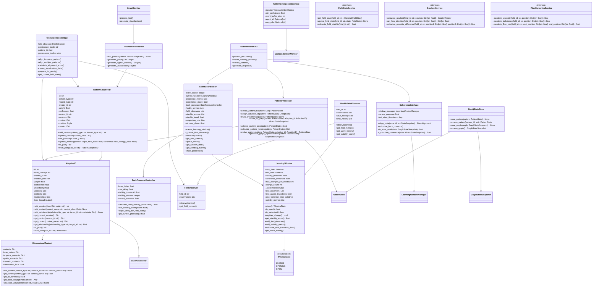

# Habitat Class Diagram

```mermaid
classDiagram
    %% User Layer
    class PatternAwareRAG {
        +process_document()
        +create_learning_window()
        +extract_patterns()
        +generate_response()
    }
    
    class GraphService {
        +process_text()
        +generate_visualization()
    }
    
    %% Processing Layer - Pattern Aware RAG
    class LearningWindow {
        -start_time: datetime
        -end_time: datetime
        -stability_threshold: float
        -coherence_threshold: float
        -max_changes_per_window: int
        -change_count: int
        -_state: WindowState
        -field_observers: List
        -field_aware_transitions: bool
        -next_transition_time: datetime
        -stability_metrics: List
        +state() WindowState
        +is_open() bool
        +is_saturated() bool
        +register_change() bool
        +get_stability_score() float
        +add_field_observer()
        +add_stability_metric()
        +calculate_next_transition_time()
        +get_wave_history()
    }
    
    class WindowState {
        <<enumeration>>
        CLOSED
        OPENING
        OPEN
    }
    
    class BackPressureController {
        -base_delay: float
        -max_delay: float
        -stability_threshold: float
        -stability_window: deque
        -current_pressure: float
        +calculate_delay(stability_score: float) float
        +add_stability_score(score: float)
        +adjust_delay_for_field_state()
        +get_current_pressure() float
    }
    
    class EventCoordinator {
        -event_queue: deque
        -current_window: LearningWindow
        -processed_events: Dict
        -persistence_mode: bool
        -back_pressure: BackPressureController
        -health_service: Any
        -field_observers: List
        -stability_scores: List
        -stability_trend: float
        -adaptation_rate: float
        -window_phase: float
        +create_learning_window()
        +_create_field_observer()
        +observe(context)
        +get_field_metrics()
        +queue_event()
        +get_window_stats()
        +get_pending_events()
        +mark_processed()
    }
    
    class FieldStateNeo4jBridge {
        -field_observer: FieldObserver
        -persistence_mode: str
        -pattern_db: Any
        -provenance_tracker: Any
        +align_incoming_pattern()
        +align_multiple_patterns()
        +calculate_alignment_score()
        +create_visualization_data()
        +prepare_for_neo4j()
        +get_current_field_state()
    }
    
    class FieldObserver {
        -field_id: str
        -observations: List
        +observe(context)
        +get_field_metrics()
    }
    
    class HealthFieldObserver {
        -field_id: str
        -observations: List
        -wave_history: List
        -tonic_history: List
        +observe(context)
        +get_field_metrics()
        +get_wave_history()
        +get_stability_score()
    }
    
    class CoherenceInterface {
        -window_manager: LearningWindowManager
        -current_pressure: float
        -last_state_timestamp: Any
        +align_state(state: GraphStateSnapshot) StateAlignment
        +calculate_back_pressure()
        +is_state_valid(state: GraphStateSnapshot) bool
        +_calculate_coherence(state: GraphStateSnapshot) float
    }
    
    class PatternProcessor {
        +extract_pattern(document: Dict) PatternState
        +assign_adaptive_id(pattern: PatternState) AdaptiveID
        +track_provenance(pattern: PatternState) None
        +store_in_graph(pattern: PatternState, adaptive_id: AdaptiveID) GraphStateSnapshot
        +validate_pattern_state(pattern: PatternState) bool
        +calculate_pattern_metrics(pattern: PatternState) Dict
        +evolve_pattern(pattern: PatternState, adaptive_id: AdaptiveID) PatternState
        +generate_graph_representation(pattern: PatternState) GraphStateSnapshot
    }
    
    %% Adaptive Core
    class AdaptiveID {
        -id: str
        -base_concept: str
        -creator_id: str
        -creation_time: str
        -weight: float
        -confidence: float
        -uncertainty: float
        -versions: Dict
        -contexts: Dict
        -relationships: Dict
        -lock: threading.Lock
        +add_version(data: Dict, origin: str) str
        +add_context(context_name: str, context_data: Dict) None
        +add_relationship(relationship_type: str, target_id: str, metadata: Dict) None
        +get_current_version() Dict
        +get_version(version_id: str) Dict
        +get_context(context_name: str) Dict
        +get_relationship(relationship_type: str, target_id: str) Dict
        +to_json() str
        +from_json(json_str: str) AdaptiveID
    }
    
    class PatternAdaptiveID {
        -id: str
        -pattern_type: str
        -hazard_type: str
        -creator_id: str
        -weight: float
        -confidence: float
        -version_id: str
        -versions: Dict
        -context: Dict
        -position: Tuple
        -metrics: Dict
        +add_version(pattern_type: str, hazard_type: str) str
        +update_context(context_data: Dict)
        +set_position(x: float, y: float)
        +update_metrics(position: Tuple, field_state: float, coherence: float, energy_state: float)
        +to_json() str
        +from_json(json_str: str) PatternAdaptiveID
    }
    
    class DimensionalContext {
        -contexts: Dict
        -base_values: Dict
        -temporal_contexts: Dict
        -spatial_contexts: Dict
        -thematic_contexts: Dict
        -dimensional_lock: Lock
        +add_context(context_type: str, context_name: str, context_data: Dict) None
        +get_context(context_type: str, context_name: str) Dict
        +get_all_contexts() Dict
        +get_base_value(dimension: str) Any
        +set_base_value(dimension: str, value: Any) None
    }
    
    %% Data Layer
    class Neo4jStateStore {
        +store_pattern(pattern: PatternState) None
        +retrieve_pattern(pattern_id: str) PatternState
        +store_graph(graph: GraphStateSnapshot) None
        +retrieve_graph() GraphStateSnapshot
    }
    
    class TestPatternVisualizer {
        +add_pattern(pattern: PatternAdaptiveID) None
        +generate_graph() nx.Graph
        +generate_cypher_queries() List[str]
        +generate_visualization() bytes
    }
    
    %% Interfaces
    class PatternEmergenceInterface {
        -monitor: VectorAttentionMonitor
        -min_confidence: float
        -event_buffer_size: int
        -agent_id: Optional[str]
        -mcp_role: Optional[str]
    }
    
    class FieldStateService {
        <<interface>>
        +get_field_state(field_id: str) Optional[FieldState]
        +update_field_state(field_id: str, state: FieldState) None
        +calculate_field_stability(field_id: str) float
    }
    
    class GradientService {
        <<interface>>
        +calculate_gradient(field_id: str, position: Dict[str, float]) GradientVector
        +get_flow_direction(field_id: str, position: Dict[str, float]) Dict[str, float]
        +calculate_potential_difference(field_id: str, position1: Dict[str, float], position2: Dict[str, float]) float
    }
    
    class FlowDynamicsService {
        <<interface>>
        +calculate_viscosity(field_id: str, position: Dict[str, float]) float
        +calculate_turbulence(field_id: str, position: Dict[str, float]) float
        +calculate_flow_rate(field_id: str, start_position: Dict[str, float], end_position: Dict[str, float]) float
    }
    
    %% Relationships
    LearningWindow --> WindowState
    EventCoordinator --> BackPressureController
    EventCoordinator --> LearningWindow
    PatternAwareRAG --> EventCoordinator
    PatternAwareRAG --> PatternProcessor
    PatternAwareRAG --> CoherenceInterface
    FieldStateNeo4jBridge --> FieldObserver
    HealthFieldObserver --|> FieldObserver
    FieldStateNeo4jBridge --> AdaptiveID
    FieldStateNeo4jBridge --> PatternAdaptiveID
    PatternProcessor --> AdaptiveID
    PatternProcessor --> PatternState
    CoherenceInterface --> LearningWindowManager
    Neo4jStateStore --> PatternState
    Neo4jStateStore --> GraphStateSnapshot
    TestPatternVisualizer --> PatternAdaptiveID
    GraphService --> TestPatternVisualizer
    HealthFieldObserver --> LearningWindow
    AdaptiveID --> DimensionalContext
    PatternEmergenceInterface --> VectorAttentionMonitor
    AdaptiveID --|> BaseAdaptiveID
    PatternAdaptiveID --|> AdaptiveID
```
