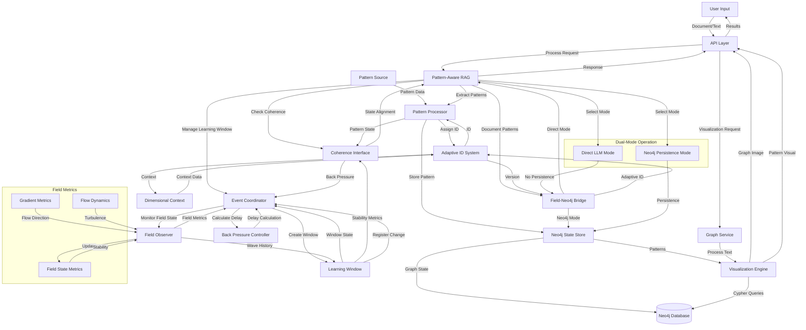

# Habitat DataFlow Diagram

```mermaid
flowchart TD
    %% Data Sources
    USER[User Input] -->|Document/Text| API
    PATTERN_SOURCE[Pattern Source] -->|"Pattern Data"| PATTERN_PROCESSOR
    
    %% User Layer
    API[API Layer] -->|"Process Request"| PATTERN_AWARE_RAG
    API -->|"Visualization Request"| GRAPH_SERVICE
    
    %% Processing Layer
    PATTERN_AWARE_RAG[Pattern-Aware RAG] -->|"Extract Patterns"| PATTERN_PROCESSOR
    PATTERN_AWARE_RAG -->|"Manage Learning Window"| EVENT_COORDINATOR
    PATTERN_AWARE_RAG -->|"Check Coherence"| COHERENCE_INTERFACE
    PATTERN_AWARE_RAG -->|"Document Patterns"| FIELD_NEO4J_BRIDGE
    
    %% Pattern Processing
    PATTERN_PROCESSOR[Pattern Processor] -->|"Pattern State"| COHERENCE_INTERFACE
    PATTERN_PROCESSOR -->|"Assign ID"| ADAPTIVE_ID_SYSTEM
    PATTERN_PROCESSOR -->|"Store Pattern"| NEO4J_STORE
    
    %% Event Management
    EVENT_COORDINATOR[Event Coordinator] -->|"Create Window"| LEARNING_WINDOW
    EVENT_COORDINATOR -->|"Calculate Delay"| BACK_PRESSURE
    EVENT_COORDINATOR -->|"Monitor Field State"| FIELD_OBSERVER
    
    %% Learning Flow
    LEARNING_WINDOW[Learning Window] -->|"Window State"| EVENT_COORDINATOR
    LEARNING_WINDOW -->|"Stability Metrics"| COHERENCE_INTERFACE
    LEARNING_WINDOW -->|"Register Change"| EVENT_COORDINATOR
    
    %% Back Pressure Flow
    BACK_PRESSURE[Back Pressure Controller] -->|"Delay Calculation"| EVENT_COORDINATOR
    FIELD_OBSERVER[Field Observer] -->|"Field Metrics"| EVENT_COORDINATOR
    FIELD_OBSERVER -->|"Wave History"| LEARNING_WINDOW
    
    %% Coherence Flow
    COHERENCE_INTERFACE[Coherence Interface] -->|"State Alignment"| PATTERN_AWARE_RAG
    COHERENCE_INTERFACE -->|"Back Pressure"| EVENT_COORDINATOR
    
    %% Persistence Flow
    FIELD_NEO4J_BRIDGE[Field-Neo4j Bridge] -->|"Neo4j Mode"| NEO4J_STORE
    FIELD_NEO4J_BRIDGE -->|"Direct Mode"| PATTERN_AWARE_RAG
    FIELD_NEO4J_BRIDGE -->|"Adaptive ID"| ADAPTIVE_ID_SYSTEM
    
    %% Data Layer
    NEO4J_STORE[Neo4j State Store] -->|"Patterns"| VISUALIZATION_ENGINE
    GRAPH_SERVICE[Graph Service] -->|"Process Text"| VISUALIZATION_ENGINE
    
    %% Visualization Flow
    VISUALIZATION_ENGINE[Visualization Engine] -->|"Graph Image"| API
    VISUALIZATION_ENGINE -->|"Pattern Visual"| API
    
    %% Adaptive ID System
    ADAPTIVE_ID_SYSTEM[Adaptive ID System] -->|"Context"| DIMENSIONAL_CONTEXT
    ADAPTIVE_ID_SYSTEM -->|"ID"| PATTERN_PROCESSOR
    ADAPTIVE_ID_SYSTEM -->|"Version"| FIELD_NEO4J_BRIDGE
    
    %% Context Flow
    DIMENSIONAL_CONTEXT[Dimensional Context] -->|"Context Data"| ADAPTIVE_ID_SYSTEM
    
    %% Data Repositories
    NEO4J_STORE -->|"Graph State"| DB_STORAGE[(Neo4j Database)]
    VISUALIZATION_ENGINE -->|"Cypher Queries"| DB_STORAGE
    
    %% Response Flow
    PATTERN_AWARE_RAG -->|"Response"| API
    API -->|"Results"| USER
    
    %% Field Metrics Flow
    subgraph "Field Metrics"
        FIELD_STATE_METRICS[Field State Metrics]
        GRADIENT_METRICS[Gradient Metrics]
        FLOW_DYNAMICS[Flow Dynamics]
    end
    
    FIELD_OBSERVER -->|"Update"| FIELD_STATE_METRICS
    FIELD_STATE_METRICS -->|"Stability"| FIELD_OBSERVER
    GRADIENT_METRICS -->|"Flow Direction"| FIELD_OBSERVER
    FLOW_DYNAMICS -->|"Turbulence"| FIELD_OBSERVER
    
    %% Dual-Mode Operation
    subgraph "Dual-Mode Operation"
        NEO4J_MODE[Neo4j Persistence Mode]
        DIRECT_MODE[Direct LLM Mode]
    end
    
    PATTERN_AWARE_RAG -->|"Select Mode"| NEO4J_MODE
    PATTERN_AWARE_RAG -->|"Select Mode"| DIRECT_MODE
    NEO4J_MODE -->|"Persistence"| NEO4J_STORE
    DIRECT_MODE -->|"No Persistence"| FIELD_NEO4J_BRIDGE
```
