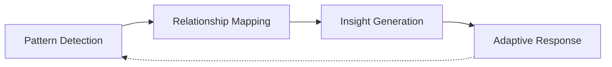
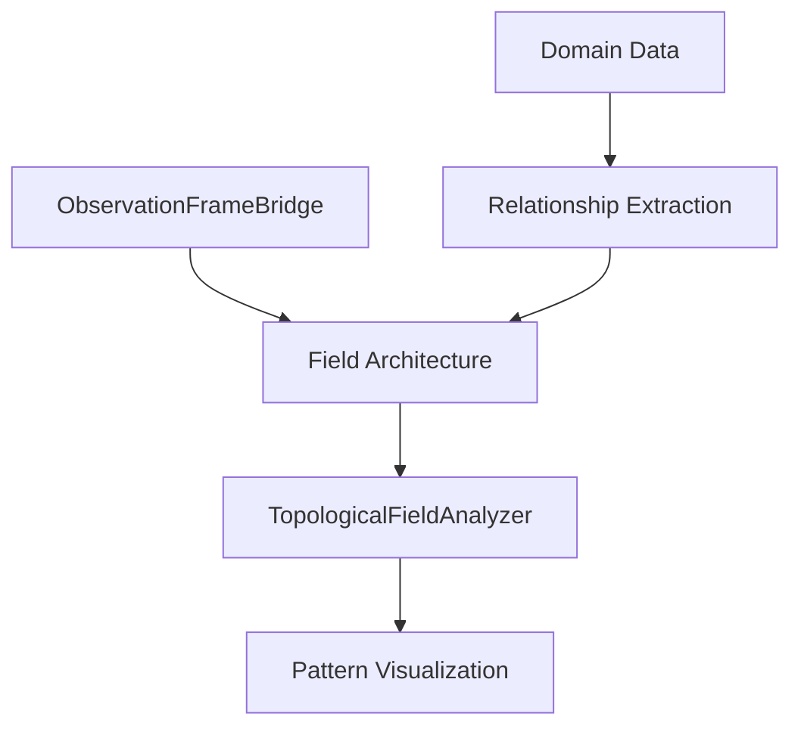
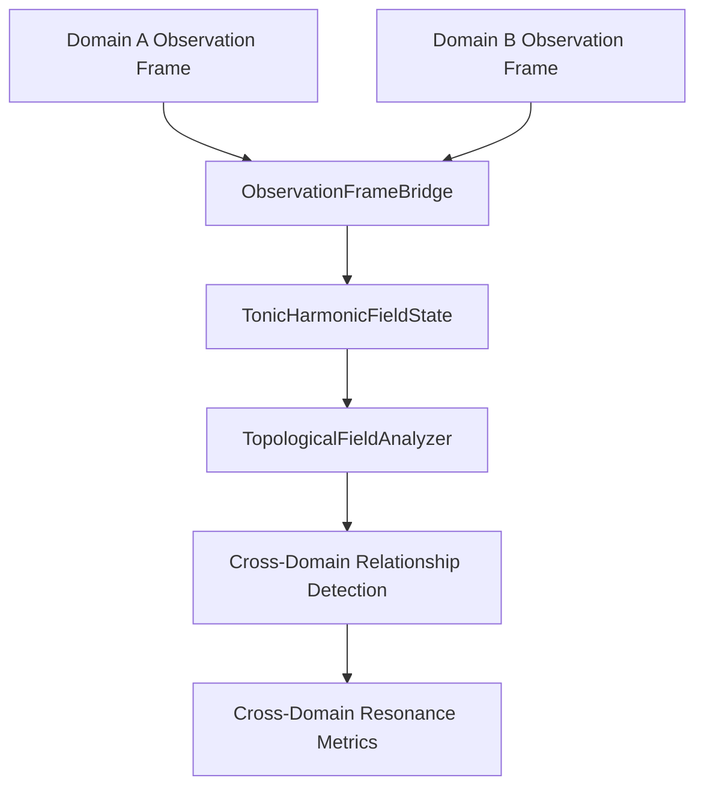
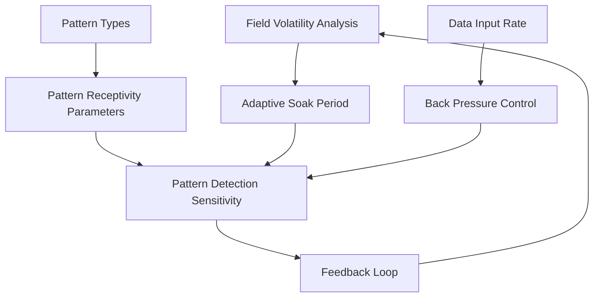
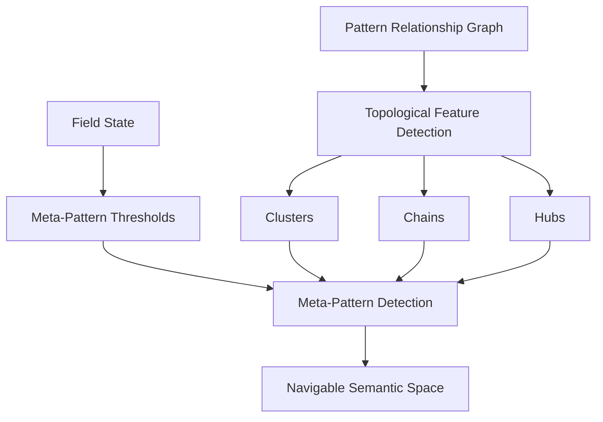
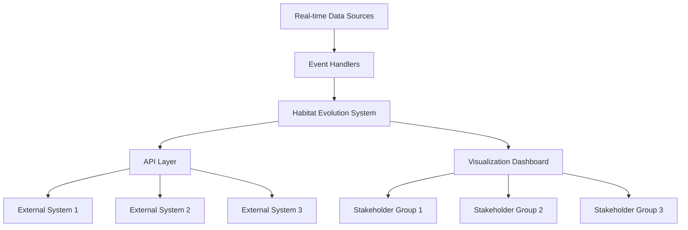
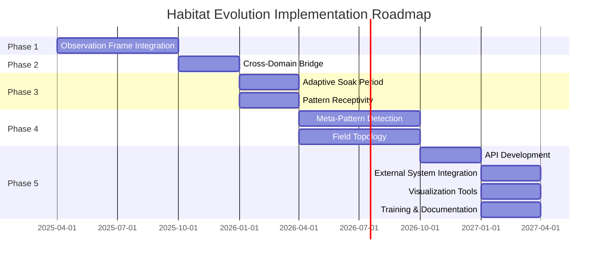

# Habitat Evolution Business Logic

## Core Business Logic

Analyzing the applications, the common business logic across Habitat Evolution implementations can be distilled to:

This core logic applies whether the system is being used for environmental modeling, knowledge management, or complex problem-solving. The fundamental value proposition is enabling organizations to:

1. **Detect patterns** without imposing predefined structures
2. **Map relationships** across traditional domain boundaries
3. **Generate insights** from emerging meta-patterns
4. **Adapt responses** based on evolving field dynamics

## Incremental Implementation Approach

### Phase 1: Observation Frame Integration (3-6 months)

**Objective**: Establish basic pattern detection capabilities within a single domain.

#### Implementation Steps:
1. Deploy the ObservationFrameBridge to integrate a single observation frame with the field architecture
2. Implement basic relationship extraction using the ClimateDataLoader pattern (modified for the target domain)
3. Configure the TopologicalFieldAnalyzer for basic field analysis
4. Develop simple visualization tools to represent detected patterns

**Practical Example**: A coastal management agency could start by focusing solely on physical coastal processes (erosion, flooding, sedimentation). The system would ingest observation data and scientific literature on these processes, detecting patterns within this limited domain.

#### Success Metrics:
- Detection of known causal relationships without explicit modeling
- Identification of at least 3-5 previously unrecognized relationships
- Field stability metrics above 0.6

### Phase 2: Cross-Domain Bridge (6-9 months)

**Objective**: Extend pattern detection across two related domains.

#### Implementation Steps:
1. Add a second observation frame representing an adjacent domain
2. Enhance the TopologicalFieldAnalyzer to detect cross-domain relationships
3. Implement the TonicHarmonicFieldState to maintain field state across domains
4. Develop metrics for cross-domain resonance

**Practical Example**: The coastal management agency would extend the system to incorporate ecological data, enabling detection of relationships between physical coastal processes and ecosystem responses.

#### Success Metrics:
- Identification of cross-domain relationships
- Field coherence metrics above 0.5 when integrating both domains
- Detection of at least 2-3 secondary cascades that cross domain boundaries

### Phase 3: Adaptive Soak Period and Pattern Receptivity (9-12 months)

**Objective**: Implement dynamic sensitivity to different pattern types.

#### Implementation Steps:
1. Implement adaptive soak periods based on field volatility
2. Configure pattern receptivity parameters for primary, secondary, meta, and emergent patterns
3. Develop feedback loops between field state and pattern detection sensitivity
4. Implement basic back pressure control for system stability

**Practical Example**: The system would now dynamically adjust its sensitivity to different types of patterns based on field conditions. During periods of high volatility (e.g., after major storm events), it would extend the soak period to ensure stable pattern detection.

#### Success Metrics:
- Successful adaptation of soak periods based on field volatility
- Differentiation between primary and secondary cascades
- System stability during periods of high data input

### Phase 4: Meta-Pattern Detection and Field Topology (12-18 months)

**Objective**: Enable detection of patterns among patterns and create navigable semantic spaces.

#### Implementation Steps:
1. Implement pattern relationship graph construction
2. Develop topological feature detection for clusters, chains, and hubs
3. Configure field-influenced thresholds for meta-pattern detection
4. Create interfaces for navigating the semantic space

**Practical Example**: The coastal management agency would now be able to detect meta-patterns that represent higher-order relationships between coastal processes and ecosystem responses. They could navigate a semantic space that reveals clusters of related patterns and chains of causality.

#### Success Metrics:
- Detection of at least 3-5 meta-patterns
- Effective dimensionality metrics that indicate a navigable semantic space
- User feedback indicating discovery of non-obvious relationships

### Phase 5: Full Integration with External Systems (18-24 months)

**Objective**: Integrate Habitat with existing decision support and knowledge management systems.

#### Implementation Steps:
1. Develop APIs for bidirectional integration with external systems
2. Implement event handlers for real-time pattern detection
3. Create dashboards and visualization tools for different stakeholder groups
4. Develop training materials and user guides

**Practical Example**: The coastal management agency would integrate Habitat with their existing GIS systems, monitoring networks, and decision support tools. Patterns detected by Habitat would be visualized geospatially, and alerts would be generated when significant new patterns are detected.

#### Success Metrics:
- Successful integration with at least 2-3 external systems
- User adoption metrics showing regular engagement
- Documented cases where Habitat insights influenced decision-making

## Practical Considerations for Implementation

### Data Requirements

| Consideration | Description |
|---------------|-------------|
| Data Sources | Identify existing data sources that can be ingested |
| Data Quality | Assess data quality and preprocessing needs |
| Update Frequency | Determine frequency of updates and real-time requirements |
| Security & Privacy | Address any privacy or security concerns |

### Computational Resources

| Resource Type | Requirements |
|---------------|-------------|
| Memory | Sufficient memory for maintaining field state |
| Processing Power | Processing capacity for topological analysis |
| Storage | Storage for pattern history and field metrics |
| Network | Network capacity for real-time event processing |

### Organizational Readiness

| Factor | Description |
|--------|-------------|
| Use Cases | Clear use cases aligned with organizational priorities |
| Stakeholder Buy-in | Engagement and support across domains |
| Technical Capability | Technical staff capable of supporting the system |
| Decision Processes | Processes for incorporating insights into decision-making |

## Implementation Roadmap

## Conclusion

This incremental approach allows organizations to realize value from Habitat Evolution at each phase while building toward more sophisticated applications. By starting with a focused domain and gradually expanding, organizations can manage technical complexity while developing the organizational capabilities needed to fully leverage the system's potential.

The core business logic remains consistent throughout: detecting patterns without imposing structures, mapping relationships across boundaries, generating insights from emerging patterns, and adapting responses based on evolving dynamics. This represents a fundamental shift from traditional approaches that rely on predefined models and rigid categorization.
