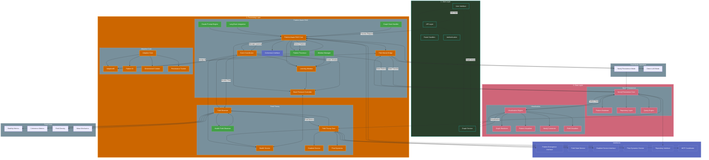

# Full Habitat System Schematic

```mermaid
flowchart TD
    %% Color coding
    classDef userLayer fill:#2A3F2B,color:white,stroke:#26A69A,stroke-width:2px
    classDef processingLayer fill:#cc6600,color:white,stroke:#FFA726,stroke-width:2px
    classDef dataLayer fill:#CF6679,color:white,stroke:#F48FB1,stroke-width:2px
    classDef interface fill:#5C6BC0,color:white,stroke:#7986CB,stroke-width:2px
    classDef core fill:#43A047,color:white,stroke:#66BB6A,stroke-width:2px
    classDef component fill:#78909C,color:white,stroke:#90A4AE,stroke-width:2px
    
    %% User Layer Components
    UI[User Interface]:::userLayer
    API[API Layer]:::userLayer
    GraphService[Graph Service]:::userLayer
    Router[Route Handlers]:::userLayer
    Auth[Authentication]:::userLayer
    
    %% Processing Layer - Pattern Aware RAG
    PAR[Pattern-Aware RAG Core]:::processingLayer
    LW[Learning Window]:::processingLayer
    BPC[Back Pressure Controller]:::processingLayer
    EC[Event Coordinator]:::processingLayer
    FNBRIDGE[Field-Neo4j Bridge]:::processingLayer
    
    %% Processing Layer - Field Theory
    FTC[Field Theory Core]:::processingLayer
    FO[Field Observer]:::processingLayer
    HS[Health Service]:::processingLayer
    GS[Gradient Service]:::processingLayer
    FD[Flow Dynamics]:::processingLayer
    
    %% Processing Layer - Adaptive Core
    AC[Adaptive Core]:::processingLayer
    AID[AdaptiveID]:::processingLayer
    PID[Pattern ID]:::processingLayer
    DC[Dimensional Context]:::processingLayer
    PT[Provenance Tracker]:::processingLayer
    
    %% Data Layer - Neo4j Persistence
    NPC[Neo4j Persistence Core]:::dataLayer
    PDB[Pattern Database]:::dataLayer
    RL[Repository Layer]:::dataLayer
    QE[Query Engine]:::dataLayer
    
    %% Data Layer - Visualization
    VE[Visualization Engine]:::dataLayer
    GR[Graph Renderer]:::dataLayer
    PV[Pattern Visualizer]:::dataLayer
    NC[Neo4j Connector]:::dataLayer
    FV[Field Visualizer]:::dataLayer
    
    %% Interfaces
    CI[Coherence Interface]:::interface
    PEI[Pattern Emergence Interface]:::interface
    FSS[Field State Service]:::interface
    GSI[Gradient Service Interface]:::interface
    FDS[Flow Dynamics Service]:::interface
    RPI[Repository Interface]:::interface
    MCP[MCP Coordinator]:::interface
    
    %% Core Components
    PP[Pattern Processor]:::core
    WM[Window Manager]:::core
    HFO[Health Field Observer]:::core
    CPE[Claude Prompt Engine]:::core
    LCI[LangChain Integration]:::core
    GSH[Graph State Handler]:::core
    
    %% Grouping
    subgraph UserLayer[1. User Layer]
        UI
        API
        GraphService
        Router
        Auth
    end
    
    subgraph ProcessingLayer[2. Processing Layer]
        subgraph PatternAwareRAG[Pattern-Aware RAG]
            PAR
            LW
            BPC
            EC
            FNBRIDGE
            CI
            PP
            WM
            CPE
            LCI
            GSH
        end
        
        subgraph FieldTheory[Field Theory]
            FTC
            FO
            HS
            GS
            FD
            HFO
        end
        
        subgraph AdaptiveCore[Adaptive Core]
            AC
            AID
            PID
            DC
            PT
        end
    end
    
    subgraph DataLayer[3. Data Layer]
        subgraph Persistence[Neo4j Persistence]
            NPC
            PDB
            RL
            QE
        end
        
        subgraph Visualization[Visualization]
            VE
            GR
            PV
            NC
            FV
        end
    end
    
    subgraph Interfaces[Interfaces]
        PEI
        FSS
        GSI
        FDS
        RPI
        MCP
    end

    %% Dual-Mode Operations
    subgraph DualModeOperation[Dual-Mode Operation]
        Neo4jMode[Neo4j Persistence Mode]
        DirectMode[Direct LLM Mode]
    end
    
    %% Field State Flow
    subgraph FieldState[Field State]
        Stability[Stability Metrics]
        Coherence[Coherence Metrics]
        Density[Field Density]
        Waves[Wave Mechanics]
    end
    
    %% System Topology - User Layer
    UI --> API
    UI --> GraphService
    API --> Router
    API --> Auth
    
    %% System Topology - Pattern-Aware RAG
    PAR --> LW
    PAR --> BPC
    PAR --> EC
    PAR --> FNBRIDGE
    PAR --> CI
    PAR --> PP
    LW --> BPC
    EC --> LW
    EC --> BPC
    EC --> HS
    
    %% System Topology - Field Theory
    FTC --> FO
    FTC --> HS
    FTC --> GS
    FTC --> FD
    FO --> HFO
    
    %% System Topology - Adaptive Core
    AC --> AID
    AC --> PID
    AC --> DC
    AC --> PT
    
    %% System Topology - Neo4j Persistence
    NPC --> PDB
    NPC --> RL
    NPC --> QE
    
    %% System Topology - Visualization
    VE --> GR
    VE --> PV
    VE --> NC
    VE --> FV
    
    %% Key Integration Points
    FNBRIDGE <--> NPC
    FNBRIDGE <--> AID
    EC <--> FO
    BPC <--> HS
    GraphService <--> NPC
    VE <--> NPC
    VE <--> FTC
    
    %% Interface Connections
    PAR <--> PEI
    FTC <--> FSS
    FTC <--> GSI
    FTC <--> FDS
    NPC <--> RPI
    PAR <--> MCP
    
    %% Component Connections
    PP --> PAR
    WM --> LW
    HFO --> FO
    CPE --> PAR
    LCI --> PAR
    GSH --> PAR
    
    %% Dual-Mode Operations
    FNBRIDGE --> Neo4jMode
    FNBRIDGE --> DirectMode
    Neo4jMode --> NPC
    DirectMode --> PAR
    
    %% Field State Flow
    FO --> Stability
    FO --> Coherence
    FO --> Density
    FO --> Waves
    
    %% Data Flow Sequence
    UI -->|User Input| API
    API -->|Process Request| PAR
    PAR -->|Extract Patterns| PP
    PP -->|Assign ID| AID
    PP -->|Store Pattern| NPC
    PAR -->|Manage Learning| EC
    EC -->|Create Window| LW
    EC -->|Monitor Field| FO
    FO -->|Field Metrics| FTC
    FNBRIDGE -->|State Transfer| NPC
    NPC -->|Pattern Data| VE
    VE -->|Visualization| GraphService
    GraphService -->|Graph Image| UI

    %% Apply CSS classes to subgraphs
    class UserLayer userLayer
    class ProcessingLayer processingLayer
    class DataLayer dataLayer
    class Interfaces interface
    class PatternAwareRAG component
    class FieldTheory component
    class AdaptiveCore component
    class Persistence component
    class Visualization component
    class DualModeOperation component
    class FieldState component
```
