# Revised Habitat System Schematic

```mermaid
flowchart TD
    %% Color coding
    classDef userLayer fill:#2A3F2B,color:white,stroke:#26A69A,stroke-width:2px
    classDef processingLayer fill:#cc6600,color:white,stroke:#FFA726,stroke-width:2px
    classDef dataLayer fill:#CF6679,color:white,stroke:#F48FB1,stroke-width:2px
    classDef interface fill:#5C6BC0,color:white,stroke:#7986CB,stroke-width:2px
    classDef core fill:#43A047,color:white,stroke:#66BB6A,stroke-width:2px
    classDef component fill:#78909C,color:white,stroke:#90A4AE,stroke-width:2px
    classDef functionLabel fill:none,color:#FFD700,stroke:none,stroke-width:0px
    
    %% User Layer Components
    UI[User Interface]:::userLayer
    API[API Layer]:::userLayer
    GraphService[Graph Service]:::userLayer
    Router[Route Handlers]:::userLayer
    Auth[Authentication]:::userLayer
    
    %% Processing Layer - Pattern Aware RAG
    PAR[Pattern-Aware RAG Core]:::processingLayer
    LW[Learning Window]:::processingLayer
    BPC[Back Pressure Controller]:::processingLayer
    EC[Event Coordinator]:::processingLayer
    FNBRIDGE[Field-Neo4j Bridge]:::processingLayer
    
    %% Processing Layer - Field Theory
    FTC[Field Theory Core]:::processingLayer
    FO[Field Observer]:::processingLayer
    HS[Health Service]:::processingLayer
    GS[Gradient Service]:::processingLayer
    FD[Flow Dynamics]:::processingLayer
    
    %% Processing Layer - Adaptive Core
    AC[Adaptive Core]:::processingLayer
    AID[AdaptiveID]:::processingLayer
    PID[Pattern ID]:::processingLayer
    DC[Dimensional Context]:::processingLayer
    PT[Provenance Tracker]:::processingLayer
    
    %% Data Layer - Field-State Persistence
    FSP[Field-State Persistence]:::dataLayer
    PS[Pattern Store]:::dataLayer
    RS[Relationship Store]:::dataLayer
    QE[Query Engine]:::dataLayer
    
    %% Data Layer - Visualization
    VE[Visualization Engine]:::dataLayer
    GR[Graph Renderer]:::dataLayer
    PV[Pattern Visualizer]:::dataLayer
    FSV[Field-State Visualizer]:::dataLayer
    
    %% Interfaces
    CI[Coherence Interface]:::interface
    PEI[Pattern Emergence Interface]:::interface
    FSS[Field State Service]:::interface
    GSI[Gradient Service Interface]:::interface
    FDS[Flow Dynamics Service]:::interface
    RPI[Repository Interface]:::interface
    MCP[MCP Coordinator]:::interface
    
    %% Core Components
    PP[Pattern Processor]:::core
    WM[Window Manager]:::core
    HFO[Health Field Observer]:::core
    CPE[Claude Prompt Engine]:::core
    LCI[LangChain Integration]:::core
    GSH[Graph State Handler]:::core
    
    %% Field-State Components
    FS[Field State]:::component
    TM[Tonic Measurement]:::component
    HR[Harmonic Resonance]:::component
    FEM[Field Energy Metrics]:::component
    TC[Temporal Coherence]:::component
    
    %% Grouping
    subgraph UserLayer[1. User Layer]
        UI
        API
        GraphService
        Router
        Auth
    end
    
    subgraph ProcessingLayer[2. Processing Layer]
        subgraph PatternAwareRAG[Pattern-Aware RAG]
            PAR
            LW
            BPC
            EC
            FNBRIDGE
            CI
            PP
            WM
            CPE
            LCI
            GSH
        end
        
        subgraph FieldTheory[Field Theory]
            FTC
            FO
            HS
            GS
            FD
            HFO
            FS
            TM
            HR
            FEM
            TC
        end
        
        subgraph AdaptiveCore[Adaptive Core]
            AC
            AID
            PID
            DC
            PT
        end
    end
    
    subgraph DataLayer[3. Data Layer]
        subgraph Persistence[Field-State Persistence]
            FSP
            PS
            RS
            QE
        end
        
        subgraph Visualization[Visualization]
            VE
            GR
            PV
            FSV
        end
    end
    
    subgraph Interfaces[Interfaces]
        PEI
        FSS
        GSI
        FDS
        RPI
        MCP
    end

    %% Dual-Mode Operations
    subgraph DualModeOperation[Dual-Mode Operation]
        FSPMode[Field-State Persistence Mode]
        DirectMode[Direct LLM Mode]
    end
    
    %% Field State Flow
    subgraph FieldStateDynamics[Field State Dynamics]
        Stability[Stability Metrics]
        Coherence[Coherence Metrics]
        Density[Field Density]
        Waves[Wave Mechanics]
        Energy[Energy Gradients]
        Resonance[Tonic-Harmonic Resonance]
    end
    
    %% System Topology - User Layer
    UI --> API
    UI --> GraphService
    API --> Router
    API --> Auth
    
    %% System Topology - Pattern-Aware RAG
    PAR --> LW
    PAR --> BPC
    PAR --> EC
    PAR --> FNBRIDGE
    PAR --> CI
    PAR --> PP
    LW --> BPC
    EC --> LW
    EC --> BPC
    EC --> HS
    
    %% System Topology - Field Theory
    FTC --> FO
    FTC --> HS
    FTC --> GS
    FTC --> FD
    FO --> HFO
    FO --> FS
    FS --> TM
    FS --> HR
    FS --> FEM
    FS --> TC
    
    %% System Topology - Adaptive Core
    AC --> AID
    AC --> PID
    AC --> DC
    AC --> PT
    
    %% System Topology - Field-State Persistence
    FSP --> PS
    FSP --> RS
    FSP --> QE
    
    %% System Topology - Visualization
    VE --> GR
    VE --> PV
    VE --> FSV
    
    %% Key Integration Points
    FNBRIDGE <--> FSP
    FNBRIDGE <--> AID
    EC <--> FO
    BPC <--> HS
    GraphService <--> FSP
    VE <--> FSP
    VE <--> FTC
    
    %% Interface Connections
    PAR <--> PEI
    FTC <--> FSS
    FTC <--> GSI
    FTC <--> FDS
    FSP <--> RPI
    PAR <--> MCP
    
    %% Component Connections
    PP --> PAR
    WM --> LW
    HFO --> FO
    CPE --> PAR
    LCI --> PAR
    GSH --> PAR
    
    %% Dual-Mode Operations
    FNBRIDGE --> FSPMode
    FNBRIDGE --> DirectMode
    FSPMode --> FSP
    DirectMode --> PAR
    
    %% Field State Flow
    FO --> Stability
    FO --> Coherence
    FO --> Density
    FO --> Waves
    FO --> Energy
    FO --> Resonance
    
    %% Function Labels
    InputProcessingLabel[Process User Input]:::functionLabel
    InputProcessingLabel -.-> UI
    
    AuthenticationLabel[Authenticate User]:::functionLabel
    AuthenticationLabel -.-> Auth
    
    PatternExtractionLabel[Extract Patterns]:::functionLabel
    PatternExtractionLabel -.-> PP
    
    AssignIDLabel[Assign Adaptive ID]:::functionLabel
    AssignIDLabel -.-> AID
    
    CreateContextLabel[Create Dimensional Context]:::functionLabel
    CreateContextLabel -.-> DC
    
    TrackProvenanceLabel[Track Provenance]:::functionLabel
    TrackProvenanceLabel -.-> PT
    
    EvolvePatternLabel[Evolve Pattern]:::functionLabel
    EvolvePatternLabel -.-> AC
    
    CreateWindowLabel[Create Learning Window]:::functionLabel
    CreateWindowLabel -.-> LW
    
    CalculateBackPressureLabel[Calculate Back Pressure]:::functionLabel
    CalculateBackPressureLabel -.-> BPC
    
    ObserveFieldLabel[Observe Field State]:::functionLabel
    ObserveFieldLabel -.-> FO
    
    MeasureCoherenceLabel[Measure Coherence]:::functionLabel
    MeasureCoherenceLabel -.-> TC
    
    CalculateDensityLabel[Calculate Field Density]:::functionLabel
    CalculateDensityLabel -.-> FEM
    
    MeasureHarmonicsLabel[Measure Tonic-Harmonic]:::functionLabel
    MeasureHarmonicsLabel -.-> HR
    
    TrackEnergyLabel[Track Energy Gradients]:::functionLabel
    TrackEnergyLabel -.-> Energy
    
    StorePatternLabel[Store Pattern]:::functionLabel
    StorePatternLabel -.-> PS
    
    StoreRelationshipLabel[Store Relationship]:::functionLabel
    StoreRelationshipLabel -.-> RS
    
    StateTransferLabel[State Transfer]:::functionLabel
    StateTransferLabel -.-> FNBRIDGE
    
    VisualizePatternLabel[Visualize Pattern]:::functionLabel
    VisualizePatternLabel -.-> PV
    
    VisualizeFieldLabel[Visualize Field State]:::functionLabel
    VisualizeFieldLabel -.-> FSV
    
    %% Data Flow Sequence
    UI -->|User Input| API
    API -->|Process Request| PAR
    PAR -->|Extract Patterns| PP
    PP -->|Assign ID| AID
    AID -->|Create Context| DC
    PP -->|Store Pattern| FSP
    PAR -->|Manage Learning| EC
    EC -->|Create Window| LW
    EC -->|Monitor Field| FO
    FO -->|Field Metrics| FTC
    FO -->|Measure Tonic| TM
    FO -->|Calculate Harmonics| HR
    FO -->|Measure Coherence| TC
    FNBRIDGE -->|State Transfer| FSP
    FSP -->|Pattern Data| VE
    VE -->|Visualization| GraphService
    GraphService -->|Graph Image| UI
    AID -->|Track Provenance| PT
    FO -->|Track Energy| FEM
    FEM -->|Energy Gradients| Energy
    TC -->|Coherence Metrics| Coherence
    HR -->|Resonance Measures| Resonance
    PP -->|Evolve Pattern| AC
    
    %% Apply CSS classes to subgraphs
    class UserLayer userLayer
    class ProcessingLayer processingLayer
    class DataLayer dataLayer
    class Interfaces interface
    class PatternAwareRAG component
    class FieldTheory component
    class AdaptiveCore component
    class Persistence component
    class Visualization component
    class DualModeOperation component
    class FieldStateDynamics component
```

## Schematic Key Changes

1. **Field-State Architecture**
   - Replaced vector-based components with field-state operations
   - Added explicit field-state components (Tonic Measurement, Harmonic Resonance, etc.)
   - Emphasized natural pattern emergence through field observations

2. **Relationship Handling**
   - Introduced temporal coherence measurements instead of vector similarity
   - Added tonic-harmonic measures for semantic relationships
   - Implemented energy gradient tracking for relationship density

3. **Persistence Model**
   - Renamed Neo4j Persistence to Field-State Persistence for flexibility
   - Separated Pattern Store and Relationship Store explicitly
   - Maintained dual-mode operation capabilities

4. **Function Labels**
   - Added clear function labels for all key operations
   - Emphasized Adaptive Core functions (Assign ID, Create Context, etc.)
   - Included field-state specific functions (Measure Tonic-Harmonic, Track Energy, etc.)

5. **Field Dynamics**
   - Expanded Field State Dynamics with Energy Gradients and Resonance
   - Connected field metrics to appropriate processing components
   - Ensured natural field observation flow
