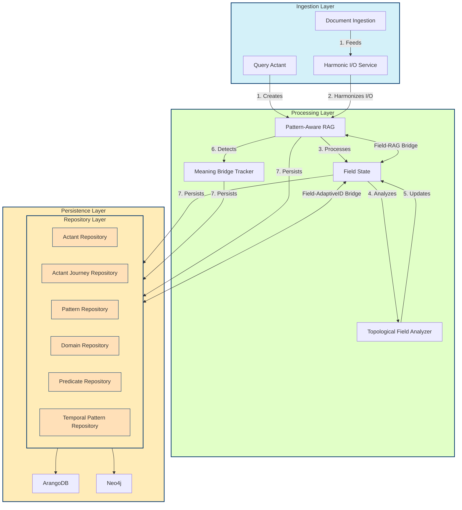

# Habitat System Schematic: Ingestion to Persistence Flow

This schematic visualizes the core components of the Habitat Evolution system, focusing on the flow from data ingestion through processing and persistence. It complements the Pattern Language Green Paper by illustrating the technical implementation of the theoretical framework.

## System Architecture Diagram

## Component Key

### Ingestion Layer
- **Query Actant**: First-class citizen that maintains semantic identity across transformations
- **Document Ingestion**: Process for ingesting documents and extracting semantic content
- **Harmonic I/O Service**: Harmonizes I/O operations with system rhythms to preserve pattern evolution

### Processing Layer
- **Pattern-Aware RAG**: Retrieval Augmented Generation system with pattern awareness
- **Field State**: Maintains the tonic-harmonic field state with versioning and context tracking
- **Topological Field Analyzer**: Analyzes the topological properties of semantic fields
- **Meaning Bridge Tracker**: Detects and tracks meaning bridges between actants

### Persistence Layer
- **ArangoDB**: Document-oriented database for storing actants, journeys, and relationships
- **Neo4j**: Graph database for storing pattern relationships and semantic networks
- **Repository Layer**:
  - **Actant Repository**: Stores actant information
  - **Actant Journey Repository**: Tracks actant journeys across semantic domains
  - **Pattern Repository**: Stores pattern information
  - **Domain Repository**: Manages semantic domain information
  - **Predicate Repository**: Stores predicate information
  - **Temporal Pattern Repository**: Tracks pattern evolution over time

## Data Flow Description

1. **Ingestion**: Queries and documents enter the system through the ingestion layer
   - Queries are treated as first-class actants with adaptive identity
   - Documents are processed through the Harmonic I/O Service to preserve system rhythms

2. **Processing**: Data is processed through multiple components
   - Pattern-Aware RAG processes queries with pattern awareness
   - Field State maintains the tonic-harmonic field representation
   - Topological Field Analyzer examines field properties
   - Meaning Bridge Tracker detects semantic relationships

3. **Persistence**: Processed data is stored in the persistence layer
   - Data is stored in appropriate repositories
   - Repositories interface with ArangoDB and Neo4j
   - Temporal patterns and relationships are preserved

4. **Bidirectional Bridges**: Key bridges enable bidirectional updates
   - Field-RAG Bridge: Connects field state with pattern-aware RAG
   - Field-AdaptiveID Bridge: Links field analysis with adaptive identity

This architecture enables the Habitat Pattern Language framework to maintain semantic identity across transformations, detect emergent patterns, and track the evolution of meaning across domains.
