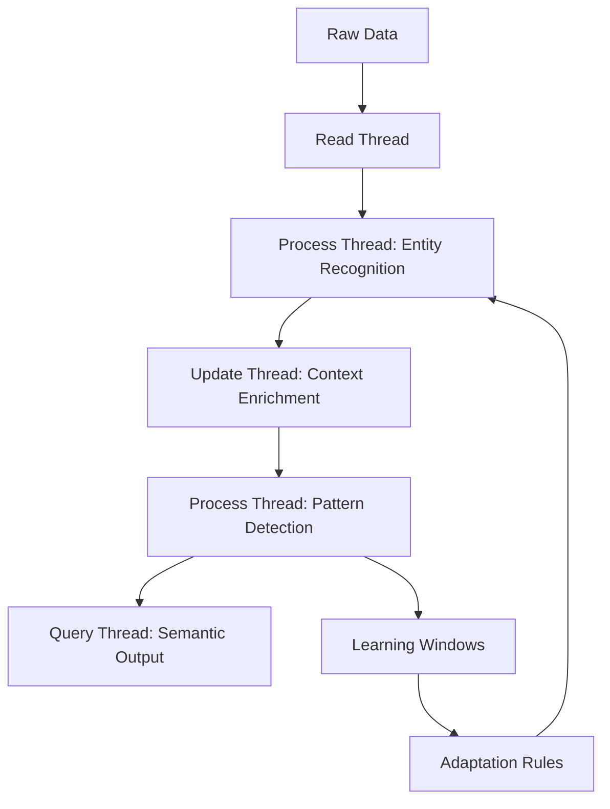

# HarmonicIO Dataflow: Step-by-Step Guide

## Overview

This document provides a concrete, step-by-step explanation of the HarmonicIO dataflow system, focusing on how data transforms as it moves through the system.

## Core Components

1. **Processing Threads**: Dedicated threads for different operations
   - Read Thread: Handles data ingestion
   - Write Thread: Handles data persistence
   - Update Thread: Handles data modification
   - Delete Thread: Handles data removal
   - Query Thread: Handles data retrieval
   - Process Thread: Handles data transformation

2. **Data Transformation Pipeline**: How data flows through the system
   - Raw Data → Entity Recognition → Context Enrichment → Pattern Detection → Semantic Output

3. **Feedback Mechanisms**: How the system evolves
   - Pattern Detection → Learning Windows → Adaptation Rules → Processing Adjustments

## Step-by-Step Dataflow

### Step 1: Data Ingestion (Read Thread)
```
Raw Data → Read Thread → Structured Data
```

The Read Thread:
- Receives raw data (text, JSON, etc.)
- Normalizes it into a standard format
- Adds metadata (timestamp, source, etc.)
- Passes it to the Process Thread

### Step 2: Entity Recognition (Process Thread)
```
Structured Data → Process Thread → Entity Graph
```

The Process Thread:
- Identifies entities (actants) in the data
- Establishes relationships between entities
- Creates an entity graph
- Passes it to the Update Thread

### Step 3: Context Enrichment (Update Thread)
```
Entity Graph → Update Thread → Contextualized Graph
```

The Update Thread:
- Adds temporal context to entities
- Enriches entities with historical data
- Updates AdaptiveIDs for each entity
- Passes it to the Process Thread

### Step 4: Pattern Detection (Process Thread)
```
Contextualized Graph → Process Thread → Pattern Graph
```

The Process Thread:
- Detects patterns in the entity relationships
- Calculates pattern propensities (coherence, capaciousness)
- Creates a pattern graph
- Passes it to the Query Thread

### Step 5: Semantic Output (Query Thread)
```
Pattern Graph → Query Thread → Semantic Output
```

The Query Thread:
- Extracts meaningful insights from the pattern graph
- Formats the output based on the request type
- Returns the semantic output

## Feedback Loop

The system maintains a feedback loop:

1. **Pattern Detection**: The system detects patterns in the data
2. **Learning Windows**: These patterns are observed over time windows
3. **Adaptation Rules**: Rules are updated based on observed patterns
4. **Processing Adjustments**: The processing threads adjust their behavior

## Visualization

The dataflow can be visualized as:



## Example Flow: Climate Risk Document

1. **Input**: Climate risk document about sea level rise
2. **Read Thread**: Parses document into structured format
3. **Process Thread**: Identifies "sea level rise" as an actant
4. **Update Thread**: Adds temporal context, updates AdaptiveID
5. **Process Thread**: Detects pattern of "impact on coastal properties"
6. **Query Thread**: Outputs semantic insight about property risk

## Metrics and Monitoring

The system tracks:
- Processing time for each thread
- Data volume through each thread
- Pattern detection rates
- Adaptation frequency

These metrics help understand the system's performance and evolution over time.

## Conclusion

The HarmonicIO dataflow system provides a powerful framework for semantic processing that:
- Transforms raw data into meaningful patterns
- Maintains identity across transformations
- Evolves based on observed patterns
- Creates a feedback loop for continuous improvement

This concrete implementation demonstrates how the theoretical concepts of the Habitat Pattern Language can be applied to real-world data processing challenges.
