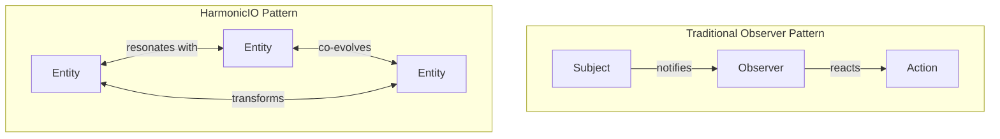

# HarmonicIO: Beyond the Observer Pattern

## A New Paradigm for Information Flow

HarmonicIO represents a fundamental shift in how we think about information flow in computational systems. While inspired by the traditional observer pattern, it transcends its limitations by enabling bidirectional, transformative interactions between components.

## The Limitation of "Observe"

Traditional systems rely on the observer pattern (sometimes called the "prime directive" in certain frameworks), where components passively watch for changes in other components. This creates several limitations:

1. **Passive Observation**: Components can only react, not proactively shape
2. **Unidirectional Flow**: Information flows one way, from observed to observer
3. **Static Boundaries**: Domain boundaries remain fixed and impermeable

## The HarmonicIO Alternative

HarmonicIO replaces passive observation with active participation:



## Core Principles of HarmonicIO

1. **Resonance**: Entities don't just observe each other; they resonate, creating harmonic patterns
2. **Co-evolution**: As entities interact, they shape each other, evolving together
3. **Transformation**: Information doesn't just flow; it transforms as it moves
4. **Emergence**: New patterns emerge from the interaction of entities

## Computational Systems Theory Connection

HarmonicIO extends computational systems theory in several ways:

1. **From Static to Dynamic Boundaries**: Traditional systems theory treats boundaries as fixed; HarmonicIO treats them as permeable and evolving
2. **From Hierarchy to Network**: Instead of rigid hierarchies, HarmonicIO enables network-based interactions
3. **From State to Process**: The focus shifts from system states to transformation processes

## Neuroscience Inspiration

HarmonicIO draws inspiration from how the brain processes information:

1. **Neural Resonance**: Neurons don't just fire in isolation; they create resonant patterns
2. **Neuroplasticity**: Neural pathways adapt and evolve based on experience
3. **Distributed Processing**: Information is processed across networks, not in isolated components
4. **Emergent Cognition**: Consciousness emerges from the interaction of simpler processes

## Implementation in Habitat Evolution

In the Habitat Evolution framework, HarmonicIO is implemented through:

1. **Processing Threads**: Dedicated threads for different operations (read, write, update, delete, query, process)
2. **Event Propagation**: Events propagate through the system, triggering transformations
3. **Adaptive Entities**: Entities adapt to events, evolving their structure and behavior
4. **Pattern Detection**: The system detects emergent patterns across entity interactions

## Code Example: The HarmonicIOService

```python
class HarmonicIOService:
    """
    Service for harmonic input/output operations.
    
    This service provides a way to process data in a way that allows for
    resonance between components, co-evolution of patterns, and emergence
    of new semantic structures.
    """
    
    def __init__(self):
        self.processing_threads = {
            "read": ProcessingThread("read"),
            "write": ProcessingThread("write"),
            "update": ProcessingThread("update"),
            "delete": ProcessingThread("delete"),
            "query": ProcessingThread("query"),
            "process": ProcessingThread("process")
        }
        self.running = False
        
    def start(self):
        """Start the harmonic I/O service."""
        self.running = True
        for thread in self.processing_threads.values():
            thread.start()
            
    def stop(self):
        """Stop the harmonic I/O service."""
        self.running = False
        for thread in self.processing_threads.values():
            thread.stop()
```

## Beyond Computational Metaphors

HarmonicIO isn't just a computational approach; it's a new way of thinking about information itself:

1. **Information as Transformation**: Information isn't just data; it's the process of transformation
2. **Meaning as Resonance**: Meaning emerges from how information resonates across contexts
3. **Intelligence as Harmony**: Intelligence isn't just processing; it's creating harmonic patterns

## Applications Beyond Software

The principles of HarmonicIO can be applied to:

1. **Organizational Design**: Creating organizations that co-evolve with their environment
2. **Knowledge Management**: Building knowledge systems that detect emergent patterns
3. **Human-Computer Interaction**: Designing interfaces that resonate with human cognition
4. **Complex Problem Solving**: Approaching complex problems through pattern transformation

## Getting Started with HarmonicIO

To implement HarmonicIO in your own systems:

1. Replace observer patterns with resonant interactions
2. Design for co-evolution rather than static relationships
3. Focus on transformation processes rather than state changes
4. Create mechanisms for detecting emergent patterns

By embracing these principles, you can create systems that don't just process information but participate in its transformation and evolution.
