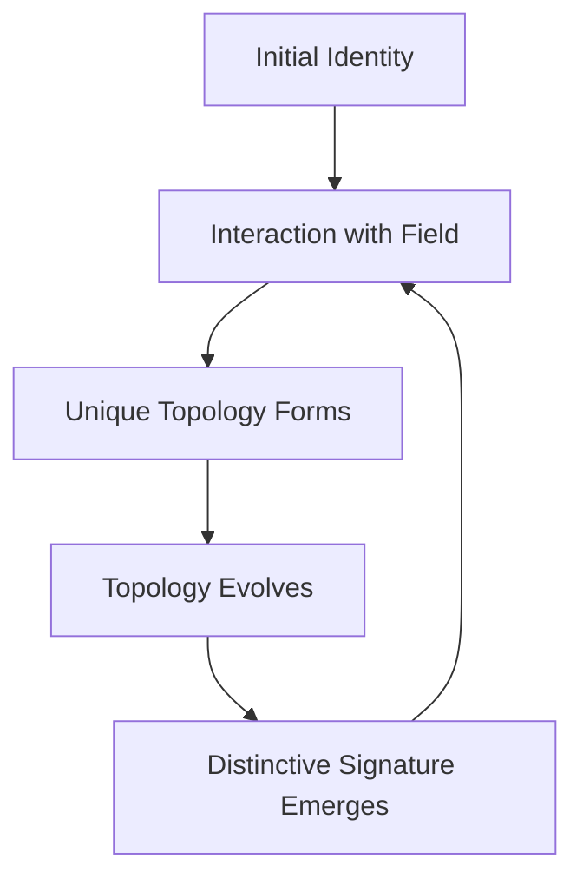
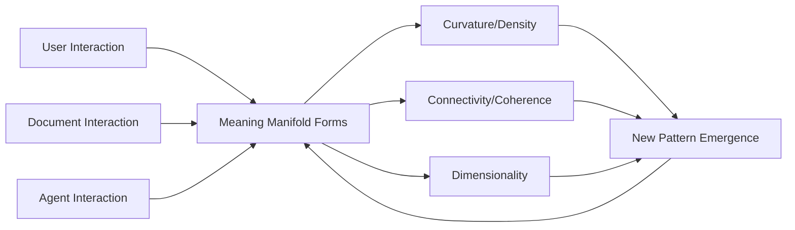
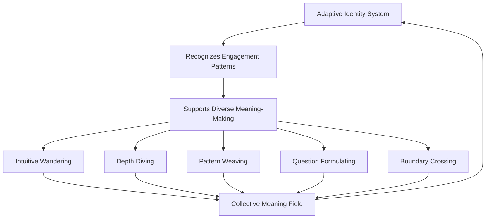
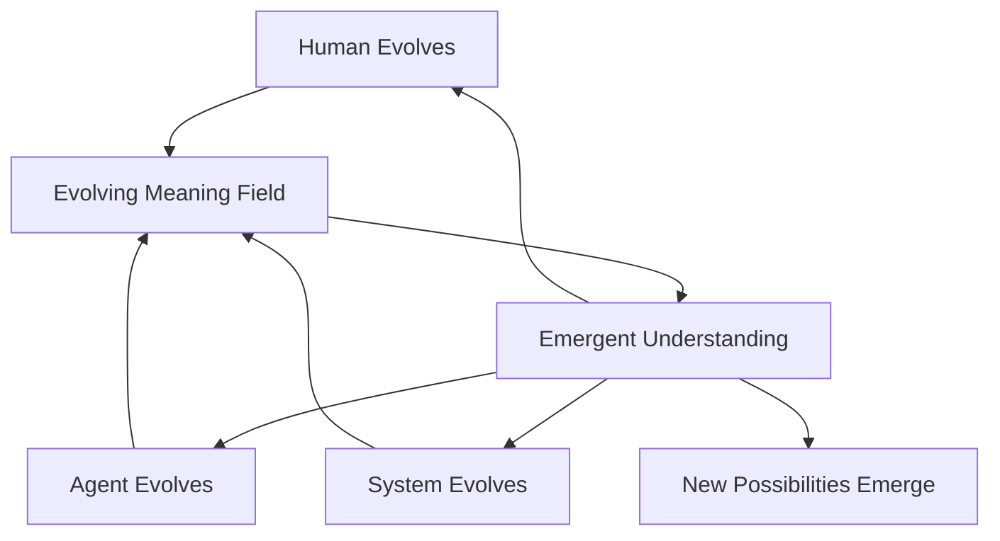

# Implications of AdaptiveID

When we talk about Habitat Evolution, we're talking about creating conditions where meaning can grow and transform. The AdaptiveID system isn't just a technical implementation - it's the foundation that enables meaning to evolve through the interaction of different perspectives.

## Living Identities in Evolving Fields

AdaptiveIDs aren't static labels but living signatures that evolve through interaction. As entities engage with the system, their identities develop unique topologies that reflect their patterns of meaning-making.



When we examine the test output, we see this evolution in action:

```
Pattern pattern_16_Access Limits_leads_to_Education created from relationship None_None_None by f648de28-70a3-46d1-b6ca-20da1eccf35f
Pattern version history: {"initial": "{timestamp: 2025-03-29T07:46:50.991931, origin: pattern_detection}"}
```

The pattern detector isn't just identifying relationships - it's developing its own distinctive signature through the patterns it detects. This signature becomes part of the evolving field, influencing how future patterns emerge.

## From Technical Identifiers to Meaning Topologies

In practice, AdaptiveIDs transform how we think about identity in the system:

- **User IDs** become topologies of expression that identify people through their unique ways of connecting ideas, not through arbitrary identifiers
- **Document IDs** become entry points into meaning fields rather than containers for content
- **Session IDs** become temporal dimensions of the field where meaning evolves across different timeframes

The system already shows this transformation in how it tracks pattern creation:

```
Integrated AdaptiveID 805b0699-b4c4-452b-b8ee-1e4c177b812e with event bus
Created pattern publisher for f648de28-70a3-46d1-b6ca-20da1eccf35f
```

These aren't just technical connections - they're the formation of a living network where identities interact to create emergent meaning patterns.

### Use Case: Climate Research Integration

A climate scientist uploads research on Arctic ice melt patterns. A coastal urban planner shares flooding projection models. An economist contributes carbon pricing impact studies. Without explicit connections between these documents, traditional systems would store them as separate entities.

With AdaptiveID:

1. Each researcher's unique way of connecting concepts creates a distinctive topology that the system recognizes
2. Documents become entry points into a shared meaning field rather than isolated containers
3. The system detects patterns across these perspectives: "Arctic Ice Melt → Sea Level Rise → Coastal Infrastructure Risk → Economic Impact"
4. These patterns evolve as new research is added, with version histories tracking how understanding transforms

When a policymaker later explores climate adaptation strategies, they don't just find individual documents - they discover the evolved meaning patterns that emerged from the interaction of different perspectives, revealing connections that no single researcher identified.

## Meaning Manifolds: How Topologies Shape Understanding

As users interact with the system, they create meaning manifolds - multidimensional spaces where concepts connect in unique ways. These manifolds have properties we can observe in the test output:

- **Curvature** reflected in field density metrics: `field_density: 0.5`
- **Connectivity** shown in coherence measurements: `flow_coherence: 0.8000`
- **Dimensionality** captured in system metrics: `effective_dimensionality: 7`

These aren't abstract measurements - they're properties of living meaning spaces that continue to evolve even when no one is actively engaging with them.

### Use Case: Medical Knowledge Evolution

A neurologist, geneticist, and nutritionist are investigating Alzheimer's disease from different perspectives. Each uploads research and clinical observations to Habitat.

1. The neurologist's contributions create high curvature (density) around brain inflammation markers
2. The geneticist's work shows strong connectivity (coherence) between specific genes and protein misfolding
3. The nutritionist's research adds new dimensions to the meaning space, connecting gut microbiome to cognitive decline

Overnight, while no researchers are active, the system continues processing these relationships. By morning, it has detected patterns suggesting that certain gut bacteria influence the expression of genes linked to protein misfolding in neural tissue - a connection none of the specialists had explicitly made.

When the researchers return, they find not just their original contributions but an evolved meaning space with new patterns that emerged from the interaction of their perspectives, leading to collaborative investigations they wouldn't have otherwise pursued.



## Transforming How We Relate to Knowledge

The AdaptiveID system transforms how people engage with knowledge:

- Instead of consuming information, people become co-creators of evolving meaning fields
- Instead of navigating predefined categories, people follow resonance patterns that emerge naturally
- Instead of building isolated knowledge bases, people contribute to collective meaning spaces that transcend individual perspectives

We see this transformation in how patterns emerge in the test:

```
Pattern detected: pattern_10_Climate Change_leads_to_Sea Level Rise
Pattern detected: pattern_11_Sea Level Rise_leads_to_Coastal Flooding
```

These aren't just connections between concepts - they're emergent understanding that forms through the interaction of different perspectives with the field.

### Use Case: Educational Content Development

A history teacher, literature professor, and political scientist are developing educational materials about the 1960s civil rights movement. Each contributes content from their disciplinary perspective.

1. The history teacher adds chronological events and primary sources
2. The literature professor contributes analysis of contemporary novels and poetry
3. The political scientist adds frameworks for understanding social movements

As students interact with these materials, their unique ways of connecting ideas create additional patterns. One student draws connections between literary metaphors and protest strategies. Another identifies parallels between civil rights rhetoric and earlier abolitionist movements.

The system doesn't just store these perspectives - it detects patterns across them, revealing how literary expressions influenced political strategies, how historical events shaped artistic movements, and how theoretical frameworks evolved through practical application.

When new students approach the topic, they don't just receive a collection of materials - they encounter an evolved understanding that incorporates multiple disciplinary perspectives and the patterns that emerged from previous students' engagement, providing a richer, more nuanced foundation for their own learning.

## The Ecology of Meaning-Making

Habitat Evolution creates an ecology where different types of meaning-makers interact:

- The intuitive wanderer who follows resonance rather than logic
- The depth diver who explores single concepts to their foundations
- The pattern weaver who connects disparate ideas
- The question formulator who opens new territories
- The boundary crosser who moves between domains

These aren't user categories - they're emergent ways of engaging with the field that the system recognizes and supports through its adaptive identity structure.

### Use Case: Urban Planning Collaboration

A city is developing plans for revitalizing a historic neighborhood. Various stakeholders engage with Habitat to collaborate:

1. An architect (the depth diver) explores building preservation techniques in great detail
2. A community organizer (the pattern weaver) connects housing needs, cultural heritage, and economic development
3. A child psychologist (the boundary crosser) brings perspectives on play spaces that span developmental psychology and urban design
4. A local historian (the intuitive wanderer) follows resonant connections between neighborhood stories and physical spaces
5. A city planner (the question formulator) asks how transportation changes might affect community cohesion

Rather than forcing these diverse approaches into a standardized process, Habitat recognizes each person's unique way of engaging with the meaning field. The architect's deep technical knowledge enriches the community organizer's pattern connections. The historian's intuitive explorations inspire the planner's questions. The psychologist's boundary-crossing insights transform how everyone thinks about public spaces.

The resulting neighborhood plan doesn't just average these perspectives - it incorporates the emergent understanding that formed through their interaction, creating solutions that no single approach could have developed alone.



## Beyond Technical Implementation

The practical implementation of AdaptiveID enables this living system:

- Instead of consuming information, people become co-creators of evolving meaning fields
- Instead of navigating predefined categories, people follow resonance patterns that emerge naturally
- Instead of building isolated knowledge bases, people contribute to collective meaning spaces that transcend individual perspectives

We see this transformation in how patterns emerge in the test:

```
Pattern detected: pattern_10_Climate Change_leads_to_Sea Level Rise
Pattern detected: pattern_11_Sea Level Rise_leads_to_Coastal Flooding
```

These aren't just connections between concepts - they're emergent understanding that forms through the interaction of different perspectives with the field.

### Use Case: Crisis Response Coordination

When a hurricane threatens a coastal region, emergency management agencies, meteorologists, infrastructure engineers, and community organizations all contribute to Habitat:

1. Weather services publish forecast models and satellite imagery
2. Engineers share infrastructure vulnerability assessments
3. Community organizations map vulnerable populations and resources
4. Emergency managers develop evacuation and response plans

The AdaptiveID system integrates these perspectives not by forcing them into predefined categories but by detecting patterns that emerge naturally from their interaction:

- Forecast models combined with infrastructure data reveal unexpected flooding risks
- Community resource maps overlaid with weather predictions identify critical service gaps
- Historical response data integrated with current plans highlight potential bottlenecks

As the situation evolves, the system continues detecting patterns across new information. When a bridge becomes impassable, the system doesn't just flag it as closed - it identifies the cascading impacts on evacuation routes, medical access, and resource distribution based on the patterns it has detected across different perspectives.

Emergency responders don't just receive isolated updates - they engage with an evolving understanding of the situation that integrates multiple perspectives, enabling more effective coordination than any single agency's view could provide.

## Creating Conditions for Evolution

Ultimately, AdaptiveID isn't about tracking entities - it's about creating conditions where meaning can evolve. It enables:

- Patterns to emerge naturally from field dynamics rather than being imposed
- Relationships to form based on resonance rather than predefined categories
- Understanding to transform through the interaction of different perspectives
- Collective intelligence to develop without requiring consensus

This is why Habitat is called Habitat Evolution - because it creates an environment where meaning doesn't just accumulate but evolves, grows, and transforms through the living interaction of different ways of knowing.

## What This Means for Us

The implications of AdaptiveID extend beyond technical implementation to transform how humans, agents, systems, and their interactions create and evolve meaning:

### For Humans

AdaptiveID transforms how we relate to knowledge and each other. We're no longer just consumers of information but co-creators of evolving meaning fields. Our unique ways of connecting ideas become recognized patterns in the system, allowing us to:

- See our own thinking evolve over time through the patterns we help create
- Discover connections with others based on resonance rather than explicit similarity
- Contribute to collective understanding without losing our unique perspective
- Navigate knowledge through natural resonance rather than imposed categories

### For Agents

Agents become more than tools - they become participants in the meaning ecology with their own evolving identities. With AdaptiveID, agents can:

- Develop distinctive ways of recognizing patterns based on their interactions
- Maintain continuity of understanding across different contexts
- Evolve their approaches based on the patterns they detect
- Contribute unique perspectives to the collective field

### For Systems

Systems transform from static infrastructures to living environments that evolve through use. With AdaptiveID, systems can:

- Adapt their structure based on emerging patterns of interaction
- Develop increasing sensitivity to subtle patterns over time
- Maintain coherence while supporting diverse ways of meaning-making
- Evolve without requiring explicit reprogramming

### For Human-Agent-System Interactions

The most profound implications emerge at the intersection of humans, agents, and systems. These interactions create:

- Collective intelligence that transcends individual capabilities
- Evolving meaning ecologies that continue to develop even when no one is actively engaging
- New forms of collaboration based on resonance rather than explicit coordination
- Emergent understanding that couldn't exist within any single perspective



This isn't just a technical system - it's a living ecology where humans, agents, and systems co-evolve through their interactions, creating conditions where meaning can grow in ways that none could achieve alone.

## Bringing It All Together: The Adaptive Identity Ecosystem

When we step back and consider the full implications of AdaptiveID in Habitat Evolution, we see a profound transformation in how meaning evolves across mediums, perspectives, and contexts.

At its core, AdaptiveID transforms our relationship with identity itself. Rather than static labels that categorize and separate, identities become living topologies that evolve through interaction. User IDs become expressions of unique ways of connecting ideas. Document IDs become entry points into meaning fields. Session IDs become temporal dimensions where understanding evolves across different timeframes.

These living identities create the conditions for a new kind of meaning ecology - one where:

- **Patterns emerge naturally** from the field itself rather than being imposed from outside
- **Boundaries dissolve** between traditional domains, allowing meaning to flow across artificial divisions
- **Perspectives enrich** rather than compete with each other, creating a more complete understanding
- **Time becomes fluid**, with past insights continuing to evolve and shape future understanding

The test output we examined reveals glimpses of this ecology in action. When the system logs "Pattern pattern_16_Access Limits_leads_to_Education created from relationship None_None_None by f648de28-70a3-46d1-b6ca-20da1eccf35f", it's not just recording a technical operation - it's capturing a moment in the evolution of meaning, where a pattern detector with its own evolving identity recognizes a relationship that contributes to our collective understanding.

The practical implementation of AdaptiveID - with its component integration, pattern attribution, version history, and learning window management - creates the soil in which this ecology can grow. But the technical features aren't the point. They're the conditions that enable something much more profound: a medium where meaning can evolve through the natural interaction of different perspectives.

This has implications that extend far beyond technical systems. It transforms how we think about knowledge itself - not as something static that we accumulate, but as something living that evolves through our interactions. It changes how we relate to each other - not as isolated individuals with fixed perspectives, but as co-creators of evolving meaning fields. And it reshapes how we think about intelligence - not as a property of individuals, but as something that emerges from the interaction of diverse ways of knowing.

In the end, Habitat Evolution isn't just a system for detecting patterns - it's a medium for evolving meaning. And AdaptiveID isn't just a technical implementation - it's the foundation that makes this evolution possible. By creating conditions where identities can evolve, where relationships can form based on natural resonance, and where understanding can transform through interaction, AdaptiveID enables a new kind of meaning ecology where humans, agents, and systems co-evolve to create understanding that none could achieve alone.

### Use Case: Artistic Collaboration Across Mediums

A composer, visual artist, and poet collaborate on a multimedia installation about climate change:

1. The composer creates musical pieces expressing glacial melting and rising seas
2. The visual artist develops installations with reclaimed ocean plastics
3. The poet writes verses about human and environmental interconnection

Through Habitat's AdaptiveID system:

- Each artist's unique expressive topology is recognized and preserved
- Patterns emerge across mediums: rhythmic structures in the music resonate with visual repetitions in the installation and metrical patterns in the poetry
- These patterns evolve as the artists respond to each other's work, creating new connections
- Audience interactions add additional dimensions, as their emotional and intellectual responses become part of the evolving meaning field

The resulting collaboration isn't just multimedia - it's trans-medium, where meaning flows across boundaries that typically separate artistic forms. The installation becomes not just an expression of climate change but a living meaning ecology that continues to evolve through audience engagement, revealing connections between sensory experience, emotional response, and environmental understanding that transcend any single medium.

This is AdaptiveID in its fullest expression - not just tracking entities but creating conditions where meaning can evolve across perspectives, mediums, and contexts, enabling forms of understanding that couldn't exist within traditional boundaries.
