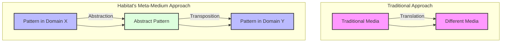
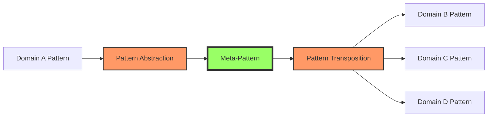
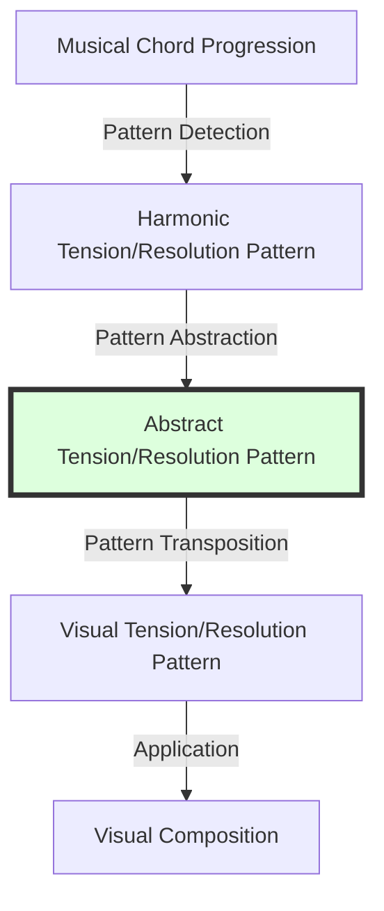
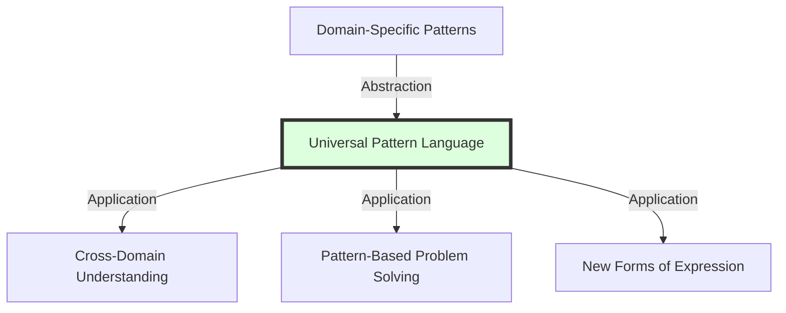
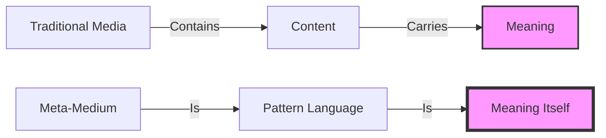
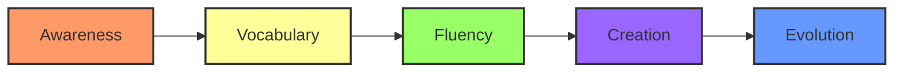
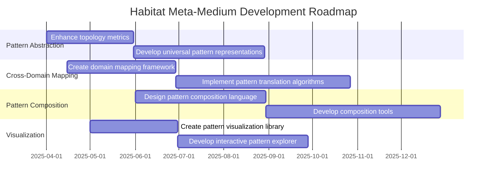

# Pattern Language as a Meta-Medium

## Executive Summary

Habitat Evolution is evolving beyond a pattern detection system toward becoming a "meta-medium" for patterns themselves. This document explores how Habitat's approach enables pattern abstraction, representation, and transposition across domains, creating a foundation for a new kind of literacy and understanding.



## From Media Translation to Pattern Transposition

### Traditional Media Translation

Traditional systems convert content between media while attempting to preserve meaning:

| Translation Type | Description | Example |
|------------------|-------------|---------|
| Text-to-Image | Converting textual descriptions into visual representations | DALL-E generating an image from a text prompt |
| Image-to-Music | Transforming visual patterns into auditory experiences | Converting color patterns to musical notes |
| Text-to-Speech | Converting written words into spoken language | Screen readers for accessibility |

These approaches operate at the level of the content and its representation, not at the level of underlying patterns.

### Habitat's Pattern Transposition

Habitat operates at a fundamentally different level:



Rather than translating content, Habitat:
1. Identifies patterns within a domain
2. Abstracts these patterns to a medium-agnostic representation
3. Transposes patterns across domains while preserving essential relationships

## Pattern Language as a Meta-Medium

### Core Concepts

Habitat's approach is evolving toward what we might call a "pattern language as a meta-medium":

1. **Pattern Abstraction**: Habitat doesn't just recognize patterns within a medium; it abstracts patterns to a level where they're no longer bound to their original medium. The pattern becomes the primary entity, not its manifestation.

2. **Medium-Agnostic Representation**: Through its topology metrics and harmonic analysis, Habitat creates representations of patterns that are fundamentally medium-agnostic. A pattern of "convergent influence" or "causal cascade" can exist in text, images, music, or social behaviors.

3. **Pattern Transposition**: Rather than translating content, Habitat could transpose patterns from one domain to another while preserving their essential structure and relationships.

### Technical Implementation

Habitat implements this meta-medium approach through several key components:

```python
# Example of pattern abstraction in Habitat
def abstract_pattern(pattern_data, domain_context):
    """Abstract a pattern from its domain-specific context to a universal representation"""
    # Extract topology metrics
    resonance_centers = extract_resonance_centers(pattern_data)
    interference_patterns = extract_interference_patterns(pattern_data)
    flow_vectors = extract_flow_vectors(pattern_data)
    
    # Determine pattern type based on topology
    if is_convergent_pattern(flow_vectors):
        pattern_type = "convergent_influence"
    elif is_cascade_pattern(flow_vectors, interference_patterns):
        pattern_type = "causal_cascade"
    elif is_evolutionary_pattern(resonance_centers, time_series_data):
        pattern_type = "object_evolution"
    
    # Create medium-agnostic representation
    universal_pattern = {
        "type": pattern_type,
        "topology": {
            "resonance_centers": normalize_centers(resonance_centers),
            "interference_patterns": normalize_patterns(interference_patterns),
            "flow_vectors": normalize_vectors(flow_vectors),
            "effective_dimensionality": calculate_dimensionality(pattern_data)
        },
        "metrics": {
            "coherence": calculate_coherence(pattern_data),
            "stability": calculate_stability(pattern_data),
            "complexity": calculate_complexity(pattern_data)
        }
    }
    
    return universal_pattern
```

## Concrete Examples of Pattern Transposition

To make this concept tangible, consider these potential applications:

| Source Domain | Target Domain | Pattern Type | Example |
|---------------|---------------|--------------|---------|
| Musical Harmony | Visual Composition | Resonance | Transposing harmonic progressions into visual composition principles |
| Social Networks | Narrative Structure | Causal Cascade | Converting social influence patterns into story arcs |
| Natural Ecosystems | Organizational Design | Convergent Influence | Applying ecosystem resilience patterns to team structures |
| Mathematical Structures | Emotional Experiences | Object Evolution | Transforming mathematical sequences into emotional progressions |

### Case Study: Musical Harmony to Visual Composition



1. **Pattern Detection**: Habitat analyzes a musical piece and identifies patterns of tension and resolution in chord progressions.
2. **Pattern Abstraction**: These patterns are abstracted to their essential structure: build-up, climax, release.
3. **Pattern Transposition**: The abstract pattern is transposed to visual principles.
4. **Application**: The visual composition embodies the same tension/resolution pattern but in a visual medium.

## The Significance of This Shift

This paradigm shift has profound implications:

### Universal Pattern Language



A universal pattern language would allow us to:
- Recognize the same patterns across different domains
- Develop a vocabulary for discussing patterns independent of their manifestation
- Create a taxonomy of patterns based on their essential structures

### Cross-Domain Innovation

| Innovation Type | Description | Example |
|-----------------|-------------|---------|
| Biomimicry | Applying biological patterns to engineering | Velcro inspired by plant burrs |
| Organizational Design | Applying natural patterns to human systems | Self-organizing teams inspired by ant colonies |
| Artistic Creation | Applying scientific patterns to art | Music based on DNA sequences |
| Problem Solving | Applying solution patterns across domains | Using network theory to solve social challenges |

## Theoretical Foundations

This concept connects to several theoretical frameworks:

| Framework | Originator | Relevance to Habitat |
|-----------|------------|----------------------|
| Pattern Language | Christopher Alexander | Habitat extends this by making patterns dynamic and evolvable |
| Analogical Thinking | Douglas Hofstadter | Habitat automates and extends the process of mapping patterns across domains |
| Metamedia Theory | Lev Manovich | Habitat's pattern language becomes a form of metamedia |
| General Systems Theory | Ludwig von Bertalanffy | Habitat identifies isomorphic patterns across different systems |

## Meaning as Sustenance

In the meta-medium approach, meaning itself—in the form of patterns—becomes the primary substance we work with:



It's like the difference between:
- Walking in the woods and noticing specific trees, rocks, and animals
- Walking in the woods and perceiving the patterns of growth, decay, and interdependence that transcend any individual element

## Pattern Literacy: The Next Frontier

### Elements of Pattern Literacy

Pattern literacy includes several key competencies:

| Competency | Description | Habitat's Role |
|------------|-------------|----------------|
| Pattern Recognition | Identifying recurring structures across contexts | Makes patterns visible through extraction and visualization |
| Pattern Abstraction | Extracting essential elements from specific manifestations | Provides abstraction mechanisms through topology metrics |
| Pattern Transposition | Applying patterns across domains | Enables mapping of patterns between domains |
| Pattern Composition | Combining patterns to create new ones | Provides tools for pattern manipulation |
| Pattern Critique | Evaluating patterns for coherence and applicability | Offers metrics for assessing pattern quality |

### The Journey Toward Pattern Literacy



Like any form of literacy, pattern literacy develops gradually:

1. **Awareness**: Recognizing that patterns exist across domains and can be abstracted
2. **Vocabulary**: Developing a shared language for discussing patterns
3. **Fluency**: Becoming comfortable with recognizing and working with patterns
4. **Creation**: Using pattern literacy as a creative and problem-solving tool
5. **Evolution**: Continuously refining our understanding of patterns

## Implications for Society

The emergence of pattern literacy could transform society:

| Area | Current Approach | Pattern Literacy Approach |
|------|------------------|---------------------------|
| Education | Subject-based learning in silos | Cross-disciplinary pattern recognition |
| Innovation | Domain-specific expertise | Cross-domain pattern transposition |
| Communication | Medium-specific expression | Pattern-based expression across media |
| Problem-Solving | Domain-specific solutions | Pattern-based solutions applicable across domains |
| Collective Intelligence | Aggregation of domain knowledge | Integration through shared pattern understanding |

## Next Steps for Habitat

To fully realize this vision, Habitat might develop:

1. **Pattern Abstraction Mechanisms**: Methods to further abstract patterns from their original contexts
2. **Cross-Domain Mapping**: Techniques for mapping patterns across domains
3. **Pattern Composition Language**: A formal language for composing patterns
4. **Interpretable Visualizations**: Ways to visualize patterns that reveal cross-domain applications



## Conclusion

Habitat's evolution toward a pattern language as a meta-medium represents a profound shift in how we understand and work with information. By abstracting patterns from their specific manifestations and enabling their transposition across domains, Habitat creates the foundation for a new kind of literacy and understanding.

This approach could fundamentally change how we understand and work with information, enabling new forms of creativity, problem-solving, and knowledge transfer that transcend traditional domain boundaries. It's not just a new tool; it's potentially a new way of thinking about and interacting with the patterns that underlie our world.

---

*Document created: March 27, 2025*
