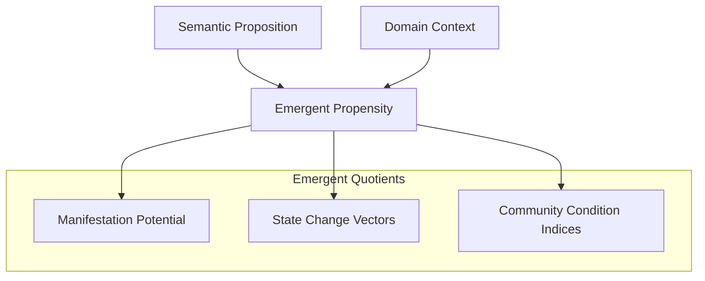
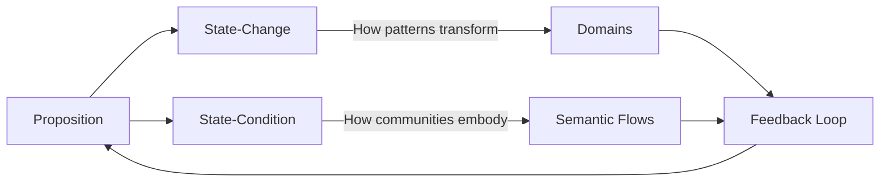
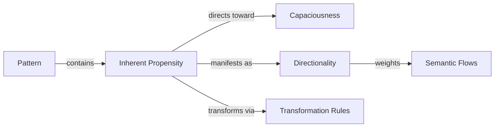
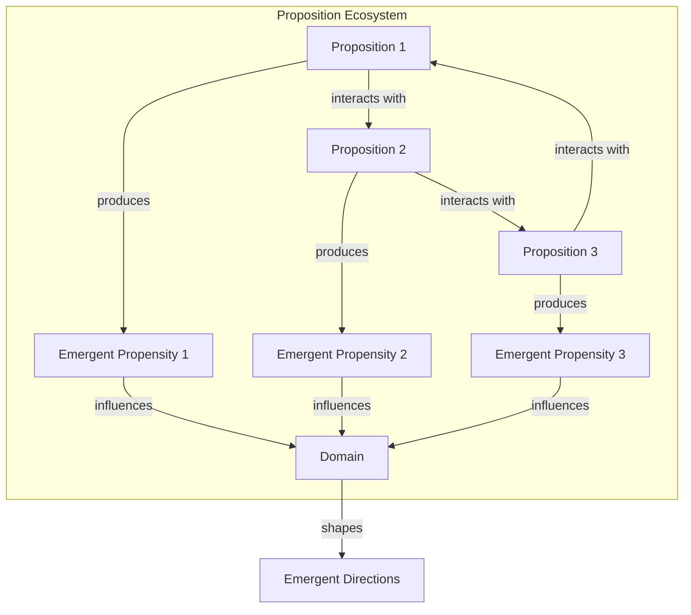
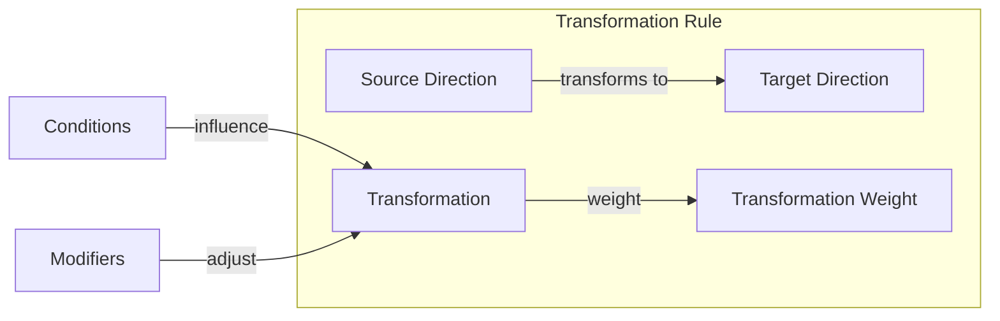
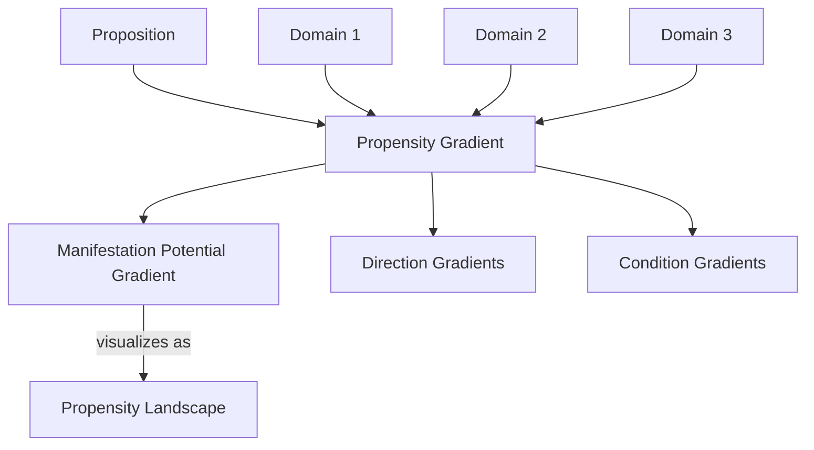
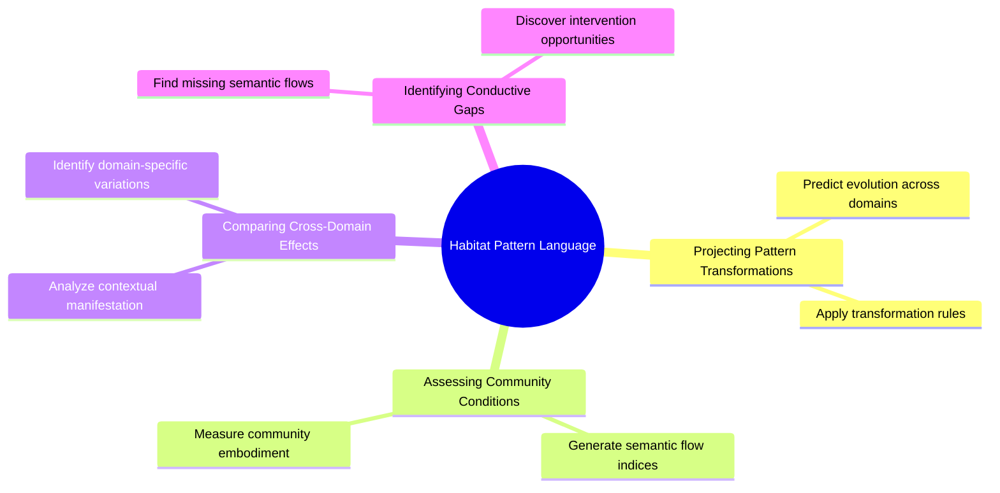
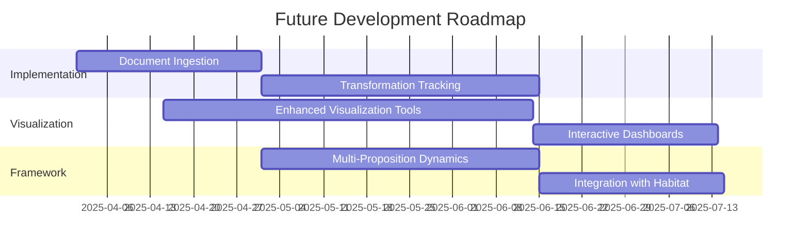

# Habitat Pattern Language: A Framework for Semantic Emergence

## Abstract

This green paper introduces the Habitat Pattern Language, a novel computational framework for modeling the emergence of meaning across semantic domains. By formalizing the dynamics of semantic propositions as they transform across contexts, we enable the detection and tracking of emergent patterns that transcend individual domains. The framework introduces a set of emergent quotients, state-change/state-condition duality mechanisms, and propensity modeling that together form a comprehensive language for describing semantic emergence. This approach allows for the projection of pattern transformations, assessment of community conditions, cross-domain effect analysis, and identification of conductive gaps in semantic flows. The paper demonstrates the framework's implementation through code examples and test results, highlighting its potential applications in complex semantic analysis tasks.

## 1. Introduction: The Need for an Emergence Language

Traditional approaches to semantic analysis often treat meaning as static, focusing on classification, clustering, or embedding of concepts within fixed taxonomies or vector spaces. However, meaning in real-world contexts is inherently dynamic and emergent - it transforms as it moves across domains, carried by actants (entities that perform semantic actions) and shaped by the contexts it encounters.

The Habitat Pattern Language addresses this limitation by providing a formal framework for modeling how meaning emerges, transforms, and propagates across semantic domains. This framework is built on three core principles:

1. **Pattern Evolution**: Semantic patterns evolve as they move across domains, adapting to new contexts while maintaining core elements of their identity.
2. **Co-Evolution**: Patterns and domains co-evolve, with patterns shaping domains and domains shaping patterns in a continuous feedback loop.
3. **Observable Semantic Change**: By tracking how actants carry predicates across domain boundaries, we can observe semantic change as it happens.

## 2. Core Components of the Emergence Language



### 2.1 Emergent Quotients

At the heart of our framework are emergent quotients - variables that themselves emerge from the interaction between propositions and domains. These include:

```python
# From EmergentPropensity class
def __init__(self, source_proposition: SemanticProposition, domain_context: Dict[str, Any]):
    self.source_proposition = source_proposition
    self.domain_context = domain_context
    self.capaciousness = source_proposition.capaciousness
    self.directionality = source_proposition.directionality.copy()
    
    # Emergent properties - these are the emergent quotients
    self.manifestation_potential = self._calculate_manifestation_potential()
    self.state_change_vectors = self._calculate_state_change_vectors()
    self.community_condition_indices = self._calculate_community_condition_indices()
```

These quotients capture:

- **Manifestation Potential**: How strongly a pattern wants to manifest in a specific context
- **State Change Vectors**: How patterns transform across domains
- **Community Condition Indices**: How communities embody certain semantic flows

Test output demonstrates these quotients in action:

```text
=== Testing Emergent Propensities ===

Manifestation Potentials:
  Community-Policy Pattern:
    Coastal: 0.69
    Urban: 0.69
    Rural: 0.55
  Economic-Infrastructure Pattern:
    Coastal: 0.36
    Urban: 0.66
    Rural: 0.36
```

### 2.2 State-Change vs. State-Condition Duality



Our framework formalizes the dual nature of propositions:

1. **State-Changes of Patterns**: How patterns transform across domains
2. **State-Conditions of Communities**: How communities embody certain semantic flows

This duality is implemented through the interplay between `EmergentPropensity` and `DomainChangeVector` classes:

```python
# From DomainChangeVector class
def __init__(self, domain_context: Dict[str, Any]):
    self.original_domain = copy.deepcopy(domain_context)
    self.changes = {
        "actants": {},       # Actant presence changes
        "emphasis": {},      # Emphasis changes
        "semantic_flows": {}, # Semantic flow changes
        "predicates": []     # New predicates
    }
```

The feedback loop between these components is captured in the `FeedbackLoop` class, which models how instantiated propositions affect their domains over time:

```text
=== Testing Feedback Loops ===

Feedback Loop Summary:
  Steps: 10
  Feedback Type: complex

Domain Changes:
  Emphasis Changes:
    resource_management: +0.00
    community_engagement: +0.13
    adaptation: +0.00
    community_resilience: +0.00
    social_cohesion: +0.28
  Semantic Flow Changes:
    adapts: +0.00
    supports: +0.22
    depends: +0.00
```

### 2.3 Propensities "Of" Patterns



Rather than just describing patterns, we capture the inherent propensities within them - the "supposing" within meaning itself that indicates where semantic flows want to move toward greater capaciousness.

```python
# From EmergentPropensity class
def _calculate_manifestation_potential(self) -> float:
    """
    Calculate the potential for this propensity to manifest in the domain.
    
    This is an emergent quotient representing how strongly the pattern
    wants to manifest in this specific context.
    """
    # Base potential from capaciousness
    potential = self.capaciousness * 0.5
    
    # Adjust based on domain context compatibility
    context_compatibility = self._assess_context_compatibility()
    potential *= (1.0 + context_compatibility)
    
    # Adjust based on actant presence
    actant_presence = self._assess_actant_presence()
    potential *= (0.5 + actant_presence)
    
    return min(potential, 1.0)
```

This allows us to model how patterns carry inherent directionality, as shown in the transformation rules test:

```text
=== Testing Transformation Rules ===

Original State Change Vectors:
  adapts: 0.41
  supports: 0.55
  fails: 0.04

Applicable Rules for 'adapts':
  adaptation_leads_to_support (base weight: 0.40)
    Condition: Community is present
    Modifier: Stronger when adaptation is emphasized
  adaptation_may_fail (base weight: 0.25)
    Condition: Economy is absent (insufficient resources)
```

## 3. Multi-Proposition Dynamics



Real-world semantic environments involve multiple propositions interacting in complex ways. Our framework models these interactions through the `PropositionEcosystem` class:

```python
# From PropositionEcosystem class
def __init__(self, domain_context: Dict[str, Any]):
    self.domain_context = domain_context
    self.propositions = []
    self.interactions = []
    self.interaction_network = nx.DiGraph()
```

This enables the analysis of emergent behaviors that arise from proposition interactions:

```text
=== Testing Multi-Proposition Dynamics ===

Ecosystem Summary:
  Proposition Count: 3
  Interaction Count: 6
  Stability Index: 0.40
  Capaciousness Index: 0.59

Emergent Directions:
  adapts: 0.14
  supports: 0.20
  fails: 0.09
  funds: 0.19
  invests: 0.14
  threatens: 0.15
  protects: 0.10

Dominant Propositions:
  Community-policy pattern (score: 0.79)
  Vulnerability-threat pattern (score: 0.67)
  Economic-infrastructure pattern (score: 0.47)

Interaction Types:
  reinforcing: 0
  conflicting: 2
  catalyzing: 0
  inhibiting: 0
  transforming: 4
  neutral: 0
```

## 4. Transformation Rules: The Grammar of Emergence



Our framework includes a sophisticated system of transformation rules that capture how semantic directions transform across domains:

```python
# From TransformationRule class
def __init__(self, source_direction: str, target_direction: str, 
             base_weight: float = 0.3, name: str = None):
    self.source_direction = source_direction
    self.target_direction = target_direction
    self.base_weight = base_weight
    self.name = name or f"{source_direction}_to_{target_direction}"
    self.conditions = []
    self.modifiers = []
```

These rules form the grammar of our emergence language, specifying how meaning evolves as it moves between contexts:

```text
Applicable Rules for 'adapts':
  adaptation_leads_to_support (base weight: 0.40)
    Condition: Community is present
    Modifier: Stronger when adaptation is emphasized
  adaptation_may_fail (base weight: 0.25)
    Condition: Economy is absent (insufficient resources)
```

## 5. Propensity Gradients and Landscapes



To visualize how propensities vary across different contexts, we implement the `PropensityGradient` class:

```python
# From PropensityGradient class
def __init__(self, proposition: SemanticProposition, domains: List[Dict[str, Any]]):
    self.proposition = proposition
    self.domains = domains
    self.propensities = []
    
    # Calculate propensities for each domain
    for domain in domains:
        propensity = EmergentPropensity(proposition, domain)
        self.propensities.append(propensity)
```

This allows us to create propensity landscapes that show how patterns manifest across different domains:

```text
=== Testing Propensity Gradients ===

Propensity Gradient Summary:
  Proposition: Community-policy pattern
  Domain Count: 5

Manifestation Gradient:
  Min: 0.69
  Max: 0.69
  Mean: 0.69
  Range: 0.00

Direction Gradients:
  adapts:
    Min: 0.41
    Max: 0.41
    Mean: 0.41
    Range: 0.00
  fails:
    Min: 0.04
    Max: 0.04
    Mean: 0.04
    Range: 0.00
  supports:
    Min: 0.55
    Max: 0.55
    Mean: 0.55
    Range: 0.00
```

## 6. Applications and Capabilities



The Habitat Pattern Language enables several powerful capabilities:

### 6.1 Projecting Pattern Transformations

By applying transformation rules to patterns as they move across domains, we can predict how patterns will transform when they manifest in different contexts:

```python
# From TransformationRuleRegistry class
def transform_direction(self, direction: str, weight: float, domain_context: Dict[str, Any]):
    """
    Transform a direction according to applicable rules.
    
    Args:
        direction: The source direction
        weight: The original weight
        domain_context: The domain context
        
    Returns:
        Dictionary mapping transformed directions to weights
    """
```

### 6.2 Assessing Community Conditions

We can generate indices that represent how communities might embody certain semantic flows:

```python
# From EmergentPropensity class
def _calculate_community_condition_indices(self) -> Dict[str, float]:
    """
    Calculate indices representing community conditions.
    
    These indices represent how the community embodies certain
    semantic flows - the state-condition aspect of propensities.
    """
```

### 6.3 Comparing Cross-Domain Effects

We can analyze how the same proposition manifests differently across domains, revealing the contextual nature of meaning:

```text
Manifestation Potentials:
  Community-Policy Pattern:
    Coastal: 0.69
    Urban: 0.69
    Rural: 0.55
  Economic-Infrastructure Pattern:
    Coastal: 0.36
    Urban: 0.66
    Rural: 0.36
```

### 6.4 Identifying Conductive Gaps

We can find places where semantic flows are expected but absent, creating potential for meaning to flow into:

```python
# This capability emerges from comparing expected flows (based on transformation rules)
# with actual flows observed in domains
def identify_conductive_gaps(expected_flows, actual_flows):
    gaps = {}
    for direction, weight in expected_flows.items():
        if direction not in actual_flows or actual_flows[direction] < weight * 0.5:
            gaps[direction] = weight
    return gaps
```

## 7. Integration with Predicate Transformation Visualization

```mermaid
flowchart TB
    HPL[Habitat Pattern Language] --- PTV[Predicate Transformation Visualization]
    HPL --> |provides theory for| PTV
    PTV --> |visualizes| HPL
    
    subgraph "Theoretical Foundation"
        PE[Pattern Evolution]
        CE[Co-Evolution]
        SC[Semantic Change]
    end
    
    HPL --- Theoretical Foundation
    
    subgraph "Visualization Approach"
        PS[Pattern Showing]
        MP[Multiple Perspectives]
        IE[Interactive Exploration]
        TD[Temporal Dimensions]
        EP[Emergent Properties]
    end
    
    PTV --- Visualization Approach
```

The Habitat Pattern Language complements the predicate transformation visualization work by providing a theoretical foundation for understanding what those transformations mean and how they manifest in different contexts.

The visualization approach emphasizes:
- Showing patterns without imposing semantic framing
- Providing multiple perspectives
- Enabling interactive exploration
- Including temporal dimensions
- Highlighting emergent properties

This aligns perfectly with our core principles of pattern evolution and co-evolution, enabling the observation of semantic change across the system by tracking how actants carry predicates across domain boundaries.

## 8. Conclusion and Future Work



The Habitat Pattern Language represents a significant advancement in understanding semantic emergence, moving from description to proposition. By codifying variables that are themselves emergent, formalizing the dual nature of propositions, and capturing the inherent propensities within patterns, we've created a powerful framework for modeling how meaning emerges and transforms across domains.

Future work will focus on:

1. Implementing document ingestion to extract domains and predicates from real-world data
2. Enhancing transformation tracking across both vector and resonance boundaries
3. Developing more sophisticated visualization tools for emergent propensities
4. Expanding the framework to handle more complex multi-proposition dynamics

## References

1. Lakoff, G., & Johnson, M. (1980). Metaphors We Live By. University of Chicago Press.

2. Latour, B. (2005). Reassembling the Social: An Introduction to Actor-Network-Theory. Oxford University Press.

3. Holland, J. H. (1998). Emergence: From Chaos to Order. Perseus Books.

4. Alexander, C. (1977). A Pattern Language: Towns, Buildings, Construction. Oxford University Press.

5. Deleuze, G., & Guattari, F. (1987). A Thousand Plateaus. University of Minnesota Press.

6. Hofstadter, D. R. (1979). Gödel, Escher, Bach: An Eternal Golden Braid. Basic Books.

7. Varela, F. J., Thompson, E., & Rosch, E. (1991). The Embodied Mind: Cognitive Science and Human Experience. MIT Press.

8. Barad, K. (2007). Meeting the Universe Halfway: Quantum Physics and the Entanglement of Matter and Meaning. Duke University Press.
