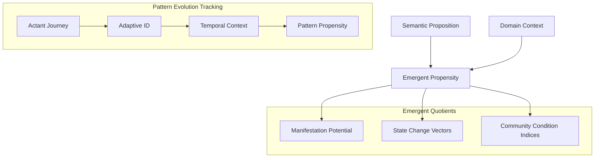
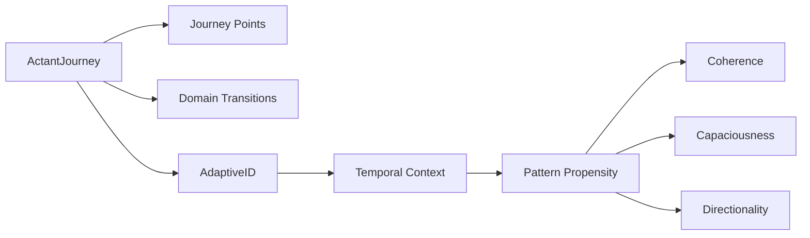
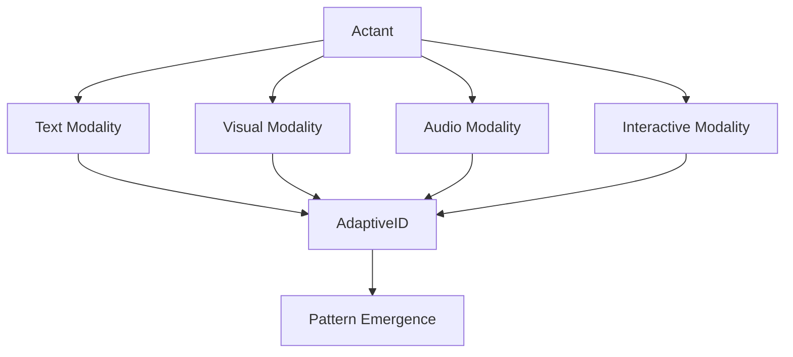
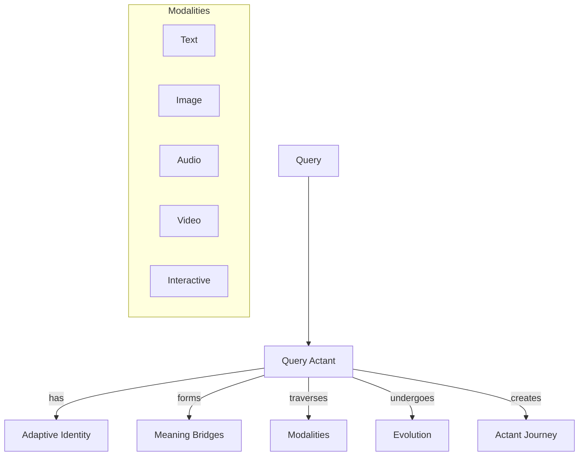

# Habitat Pattern Language: A Framework for Semantic Emergence

## Abstract

This green paper introduces the Habitat Pattern Language, a novel computational framework for modeling the emergence of meaning across semantic domains. By formalizing the dynamics of semantic propositions as they transform across contexts, we enable the detection and tracking of emergent patterns that transcend individual domains. The framework introduces a set of emergent quotients, state-change/state-condition duality mechanisms, and propensity modeling that together form a comprehensive language for describing semantic emergence. This approach allows for the projection of pattern transformations, assessment of community conditions, cross-domain effect analysis, and identification of conductive gaps in semantic flows. Recent advances in ActantJourney tracking and AdaptiveID integration provide enhanced visualization capabilities for pattern evolution across semantic domains, with specific applications in climate risk analysis. The paper demonstrates the framework's implementation through code examples, visualizations, and test results, highlighting its potential applications in complex semantic analysis tasks.

## 1. Introduction: The Need for an Emergence Language

Traditional approaches to semantic analysis often treat meaning as static, focusing on classification, clustering, or embedding of concepts within fixed taxonomies or vector spaces. However, meaning in real-world contexts is inherently dynamic and emergent - it transforms as it moves across domains, carried by actants (entities that perform semantic actions) and shaped by the contexts it encounters.

The Habitat Pattern Language addresses this limitation by providing a formal framework for modeling how meaning emerges, transforms, and propagates across semantic domains. This framework is built on three core principles:

1. **Pattern Evolution**: Semantic patterns evolve as they move across domains, adapting to new contexts while maintaining core elements of their identity.
2. **Co-Evolution**: Patterns and domains co-evolve, with patterns shaping domains and domains shaping patterns in a continuous feedback loop.
3. **Observable Semantic Change**: By tracking how actants carry predicates across domain boundaries, we can observe semantic change as it happens.

## 2. Core Components of the Emergence Language



### 2.1 Emergent Quotients

Emergent quotients are quantitative measures that capture different aspects of pattern emergence and transformation. They provide a way to assess how patterns manifest, change, and influence their semantic environments.

#### 2.1.1 Manifestation Potential

Manifestation potential measures the likelihood that a pattern will emerge in a given context. It is calculated based on the presence of conducive conditions, the strength of pattern carriers (actants), and the historical precedent of similar patterns emerging in similar contexts.

#### 2.1.2 State Change Vectors

State change vectors describe the direction and magnitude of transformation that patterns undergo as they move across domains. These vectors capture both the preservation of pattern identity and the adaptation to new contexts.

#### 2.1.3 Community Condition Indices

Community condition indices measure how patterns influence and are influenced by the broader semantic community. They capture the network effects of pattern propagation and the emergence of higher-order patterns from the interaction of simpler patterns.

### 2.2 ActantJourney and AdaptiveID Integration

A significant advancement in the Habitat Pattern Language framework is the integration of ActantJourney tracking with AdaptiveID for enhanced pattern evolution visualization. This integration enables the observation and analysis of how semantic patterns transform across domains while maintaining their core identity.



#### 2.2.1 ActantJourney: Tracking Semantic Transformations

The ActantJourney component tracks how actants (entities that carry semantic meaning) move across domain boundaries, creating a narrative structure or "character building" as concepts transform. Each journey consists of:

- **Journey Points**: Specific instances where an actant appears in a semantic domain, capturing its role and relationship to predicates
- **Domain Transitions**: Movements between domains, representing semantic transformations
- **Adaptive Identity**: Maintained through AdaptiveID, allowing the actant to evolve while preserving core identity

#### 2.2.2 AdaptiveID: Maintaining Identity Through Transformation

The AdaptiveID system provides a mechanism for maintaining identity through semantic transformations. It consists of:

- **Base Concept**: The foundational identity of the entity
- **Temporal Context**: A time-series record of how the entity has changed
- **Pattern Propensity**: Measurements of how the entity participates in pattern formation

#### 2.2.3 Pattern Propensity Metrics

Pattern propensity metrics quantify different aspects of how entities participate in pattern formation:

- **Coherence**: Measures how consistently a pattern maintains its identity across different contexts (0.0-1.0)
- **Capaciousness**: Measures how adaptable a pattern is across different contexts (0.0-1.0)
- **Directionality**: Measures the flow of pattern transformations between specific domain pairs

#### 2.2.4 Visualization of Pattern Evolution

The integration enables powerful visualizations of pattern evolution:

- **Network Graphs**: Showing relationships between actants and domains
- **Pattern Propensity Charts**: Visualizing coherence, capaciousness, and directionality
- **Semantic Distance Mapping**: Revealing which domains are conceptually closer or further apart

These visualizations provide insights into how patterns maintain coherence while adapting to different contexts - a key concept in the habitat evolution framework.

### 2.3 Modality-Agnostic Knowledge Representation

A fundamental property of the Habitat Pattern Language is its modality-agnosticism and AI-agnosticism, creating a paradigm shift in how we conceptualize knowledge representation and transfer.



#### 2.3.1 Transcending Media Boundaries

The key insight is that "actants" in the system aren't tied to any specific medium or representation. They can be:

- **Transcribed across modalities**: Text, image, audio, video, interactive systems
- **Transferred between AI systems**: From LLMs to vision models to multimodal systems
- **Translated between human and machine understanding**: Creating a bridge between different forms of intelligence
- **Transformed into prompts**: Actants can become prompts for AI systems, carrying their semantic identity across different generative contexts

#### 2.3.2 Knowledge-Media Implications

This modality-agnostic approach has several revolutionary implications:

1. **Medium-Independent Knowledge**

   Knowledge is no longer bound to its original medium. The same actant journey can be:
   - Visualized as a network graph
   - Narrated as a story
   - Encoded as structured data
   - Represented in an interactive simulation

2. **Preservation of Semantic Identity**

   As actants move across media, they maintain their core identity through the AdaptiveID system, while adapting to the constraints and affordances of each medium. This solves the long-standing problem of knowledge degradation during media conversion. This principle extends even to user identity, allowing for consistent representation of human actors across different systems and interfaces.

3. **Emergent Cross-Modal Patterns**

   When actants traverse different media, new patterns emerge that wouldn't be visible in any single medium. This enables the detection of deeper semantic structures that transcend surface representations. A form of computational synesthesia becomes possible, where patterns from one modality can be performatively expressed in another, revealing previously hidden connections.

4. **AI-Agnostic Knowledge Exchange**

   The system can serve as a universal translator between different AI architectures. An actant journey discovered by an LLM can be meaningfully transferred to a computer vision system or a multimodal AI, preserving the semantic relationships.

#### 2.3.3 Practical Applications

This modality-agnostic approach opens up remarkable possibilities:

- **Multimodal Knowledge Bases**: Information systems that represent knowledge in whatever modality is most appropriate for the context
- **Cross-AI Collaboration**: Different AI systems working together through the shared language of actant journeys
- **Adaptive Educational Content**: Learning materials that maintain semantic coherence while adapting to different presentation modalities
- **Semantic Preservation in Archives**: Archival systems that preserve meaning across media formats and technological changes
- **Cross-Psyche Collaboration**: Enabling communication between different cognitive styles (e.g., autistic individuals and AI agents) by translating semantic patterns across different processing modalities

#### 2.3.4 The Mathematical Foundation

What makes this possible is the mathematical system that abstracts meaning from its representation. By focusing on the patterns of transformation rather than static representations, the framework is inherently modality-agnostic.

This represents a significant advance beyond current approaches to knowledge representation, which typically bind meaning to specific formats or models. The Habitat Pattern Language treats meaning as something that flows across representations, maintaining identity while adapting to context.

At the heart of our framework are emergent quotients - variables that themselves emerge from the interaction between propositions and domains. These include:

```python
# From EmergentPropensity class
def __init__(self, source_proposition: SemanticProposition, domain_context: Dict[str, Any]):
    self.source_proposition = source_proposition
    self.domain_context = domain_context
    self.capaciousness = source_proposition.capaciousness
    self.directionality = source_proposition.directionality.copy()
    
    # Emergent properties - these are the emergent quotients
    self.manifestation_potential = self._calculate_manifestation_potential()
    self.state_change_vectors = self._calculate_state_change_vectors()
    self.community_condition_indices = self._calculate_community_condition_indices()
```

These quotients capture:

- **Manifestation Potential**: How strongly a pattern wants to manifest in a specific context
- **State Change Vectors**: How patterns transform across domains
- **Community Condition Indices**: How communities embody certain semantic flows

Test output demonstrates these quotients in action:

```text
=== Testing Emergent Propensities ===

Manifestation Potentials:
  Community-Policy Pattern:
    Coastal: 0.69
    Urban: 0.69
    Rural: 0.55
  Economic-Infrastructure Pattern:
    Coastal: 0.36
    Urban: 0.66
    Rural: 0.36
```

### 2.2 State-Change vs. State-Condition Duality


Our framework formalizes the dual nature of propositions:

1. **State-Changes of Patterns**: How patterns transform across domains
2. **State-Conditions of Communities**: How communities embody certain semantic flows

This duality is implemented through the interplay between `EmergentPropensity` and `DomainChangeVector` classes:

```python
# From DomainChangeVector class
def __init__(self, domain_context: Dict[str, Any]):
    self.original_domain = copy.deepcopy(domain_context)
    self.changes = {
        "actants": {},       # Actant presence changes
        "emphasis": {},      # Emphasis changes
        "semantic_flows": {}, # Semantic flow changes
        "predicates": []     # New predicates
    }
```

The feedback loop between these components is captured in the `FeedbackLoop` class, which models how instantiated propositions affect their domains over time:

```text
=== Testing Feedback Loops ===

Feedback Loop Summary:
  Steps: 10
  Feedback Type: complex

Domain Changes:
  Emphasis Changes:
    resource_management: +0.00
    community_engagement: +0.13
    adaptation: +0.00
    community_resilience: +0.00
    social_cohesion: +0.28
  Semantic Flow Changes:
    adapts: +0.00
    supports: +0.22
    depends: +0.00
```

### 2.3 Propensities "Of" Patterns


Rather than just describing patterns, we capture the inherent propensities within them - the "supposing" within meaning itself that indicates where semantic flows want to move toward greater capaciousness.

```python
# From EmergentPropensity class
def _calculate_manifestation_potential(self) -> float:
    """
    Calculate the potential for this propensity to manifest in the domain.
    
    This is an emergent quotient representing how strongly the pattern
    wants to manifest in this specific context.
    """
    # Base potential from capaciousness
    potential = self.capaciousness * 0.5
    
    # Adjust based on domain context compatibility
    context_compatibility = self._assess_context_compatibility()
    potential *= (1.0 + context_compatibility)
    
    # Adjust based on actant presence
    actant_presence = self._assess_actant_presence()
    potential *= (0.5 + actant_presence)
    
    return min(potential, 1.0)
```

This allows us to model how patterns carry inherent directionality, as shown in the transformation rules test:

```text
=== Testing Transformation Rules ===

Original State Change Vectors:
  adapts: 0.41
  supports: 0.55
  fails: 0.04

Applicable Rules for 'adapts':
  adaptation_leads_to_support (base weight: 0.40)
    Condition: Community is present
    Modifier: Stronger when adaptation is emphasized
  adaptation_may_fail (base weight: 0.25)
    Condition: Economy is absent (insufficient resources)
```

## 3. Multi-Proposition Dynamics


Real-world semantic environments involve multiple propositions interacting in complex ways. Our framework models these interactions through the `PropositionEcosystem` class:

```python
# From PropositionEcosystem class
def __init__(self, domain_context: Dict[str, Any]):
    self.domain_context = domain_context
    self.propositions = []
    self.interactions = []
    self.interaction_network = nx.DiGraph()
```

This enables the analysis of emergent behaviors that arise from proposition interactions:

```text
=== Testing Multi-Proposition Dynamics ===

Ecosystem Summary:
  Proposition Count: 3
  Interaction Count: 6
  Stability Index: 0.40
  Capaciousness Index: 0.59

Emergent Directions:
  adapts: 0.14
  supports: 0.20
  fails: 0.09
  funds: 0.19
  invests: 0.14
  threatens: 0.15
  protects: 0.10

Dominant Propositions:
  Community-policy pattern (score: 0.79)
  Vulnerability-threat pattern (score: 0.67)
  Economic-infrastructure pattern (score: 0.47)

Interaction Types:
  reinforcing: 0
  conflicting: 2
  catalyzing: 0
  inhibiting: 0
  transforming: 4
  neutral: 0
```

## 4. Transformation Rules: The Grammar of Emergence


Our framework includes a sophisticated system of transformation rules that capture how semantic directions transform across domains:

```python
# From TransformationRule class
def __init__(self, source_direction: str, target_direction: str, 
             base_weight: float = 0.3, name: str = None):
    self.source_direction = source_direction
    self.target_direction = target_direction
    self.base_weight = base_weight
    self.name = name or f"{source_direction}_to_{target_direction}"
    self.conditions = []
    self.modifiers = []
```

These rules form the grammar of our emergence language, specifying how meaning evolves as it moves between contexts:

```text
Applicable Rules for 'adapts':
  adaptation_leads_to_support (base weight: 0.40)
    Condition: Community is present
    Modifier: Stronger when adaptation is emphasized
  adaptation_may_fail (base weight: 0.25)
    Condition: Economy is absent (insufficient resources)
```

## 5. Propensity Gradients and Landscapes


To visualize how propensities vary across different contexts, we implement the `PropensityGradient` class:

```python
# From PropensityGradient class
def __init__(self, proposition: SemanticProposition, domains: List[Dict[str, Any]]):
    self.proposition = proposition
    self.domains = domains
    self.propensities = []
    
    # Calculate propensities for each domain
    for domain in domains:
        propensity = EmergentPropensity(proposition, domain)
        self.propensities.append(propensity)
```

This allows us to create propensity landscapes that show how patterns manifest across different domains:

```text
=== Testing Propensity Gradients ===

Propensity Gradient Summary:
  Proposition: Community-policy pattern
  Domain Count: 5

Manifestation Gradient:
  Min: 0.69
  Max: 0.69
  Mean: 0.69
  Range: 0.00

Direction Gradients:
  adapts:
    Min: 0.41
    Max: 0.41
    Mean: 0.41
    Range: 0.00
  fails:
    Min: 0.04
    Max: 0.04
    Mean: 0.04
    Range: 0.00
  supports:
    Min: 0.55
    Max: 0.55
    Mean: 0.55
    Range: 0.00
```

## 6. Applications and Capabilities


The Habitat Pattern Language enables several powerful capabilities:

### 6.1 Projecting Pattern Transformations

By applying transformation rules to patterns as they move across domains, we can predict how patterns will transform when they manifest in different contexts:

```python
# From TransformationRuleRegistry class
def transform_direction(self, direction: str, weight: float, domain_context: Dict[str, Any]):
    """
    Transform a direction according to applicable rules.
    
    Args:
        direction: The source direction
        weight: The original weight
        domain_context: The domain context
        
    Returns:
        Dictionary mapping transformed directions to weights
    """
```

### 6.2 Assessing Community Conditions

We can generate indices that represent how communities might embody certain semantic flows:

```python
# From EmergentPropensity class
def _calculate_community_condition_indices(self) -> Dict[str, float]:
    """
    Calculate indices representing community conditions.
    
    These indices represent how the community embodies certain
    semantic flows - the state-condition aspect of propensities.
    """
```

### 6.3 Comparing Cross-Domain Effects

We can analyze how the same proposition manifests differently across domains, revealing the contextual nature of meaning:

```text
Manifestation Potentials:
  Community-Policy Pattern:
    Coastal: 0.69
    Urban: 0.69
    Rural: 0.55
  Economic-Infrastructure Pattern:
    Coastal: 0.36
    Urban: 0.66
    Rural: 0.36
```

### 6.4 Identifying Conductive Gaps

We can find places where semantic flows are expected but absent, creating potential for meaning to flow into:

```python
# This capability emerges from comparing expected flows (based on transformation rules)
# with actual flows observed in domains
def identify_conductive_gaps(expected_flows, actual_flows):
    gaps = {}
    for direction, weight in expected_flows.items():
        if direction not in actual_flows or actual_flows[direction] < weight * 0.5:
            gaps[direction] = weight
    return gaps
```

### 6.5 Queries as First-Class Actants

A significant advancement in the Habitat Pattern Language framework is the treatment of queries as first-class actants within the semantic landscape. This approach transforms queries from mere retrieval mechanisms into active participants in the meaning-making process:



The `QueryActant` class implements this approach, enabling queries to maintain semantic identity across transformations:

```python
# From QueryActant class
def transform_modality(self, new_modality: str, transformation_context: Dict[str, Any] = None) -> 'QueryActant':
    """Transform this query into a new modality while preserving semantic identity."""
    # Create a new query in the target modality
    new_query = QueryActant.create(
        query_text=self.query_text,
        modality=new_modality,
        context={
            **self.context,
            **(transformation_context or {}),
            "source_modality": self.modality,
            "source_query_id": self.id
        }
    )
    
    # Link the new query's AdaptiveID to the original
    if self.adaptive_id and new_query.adaptive_id:
        # Track the relationship in temporal context
        self.adaptive_id.update_temporal_context(
            key=f"transformation_{new_query.id}",
            value={
                "relationship_type": "modality_transformation",
                "target_id": new_query.adaptive_id.id,
                "source_modality": self.modality,
                "target_modality": new_modality,
                "transformation_time": datetime.now().isoformat()
            },
            origin="query_transformation"
        )
```

This approach enables several powerful capabilities:

1. **Cross-Modal Query Processing**: Queries can be processed across different modalities (text, image, audio) while maintaining their semantic identity, enabling more comprehensive analysis.

2. **Query Evolution**: Queries can evolve based on new information, adapting their form while preserving their connection to their original intent.

```text
Query Evolution Example:
Original Query: "What is the projected sea level rise by 2050?"
Evolved Query: "What economic impacts will result from a 2-meter sea level rise by 2050?"
```

3. **Semantic Network Formation**: Queries form meaning bridges with other actants, creating a rich network of semantic relationships that can reveal emergent patterns.

4. **Journey Tracking**: The system tracks a query's path through semantic domains, creating a historical record of its transformations and interactions.

```text
Query Journey:
1. initial_query in domain 'query_domain'
2. query_processed in domain 'query_processing_domain'
3. modality_transformation in domain 'image_domain'
4. query_evolution in domain 'evolved_query_domain'
```

By treating queries as actants, the Habitat Pattern Language enables a more dynamic and participatory form of interaction where meaning emerges from relationships rather than being statically defined. This creates a richer IO space where queries become part of the semantic landscape they are exploring.

## 7. Integration with Predicate Transformation Visualization

```mermaid
flowchart TB
    HPL[Habitat Pattern Language] --- PTV[Predicate Transformation Visualization]
    HPL --> |provides theory for| PTV
    PTV --> |visualizes| HPL
    
    subgraph "Theoretical Foundation"
        PE[Pattern Evolution]
        CE[Co-Evolution]
        SC[Semantic Change]
    end
    
    HPL --- Theoretical Foundation
    
    subgraph "Visualization Approach"
        PS[Pattern Showing]
        MP[Multiple Perspectives]
        IE[Interactive Exploration]
        TD[Temporal Dimensions]
        EP[Emergent Properties]
    end
    
    PTV --- Visualization Approach
```

The Habitat Pattern Language complements the predicate transformation visualization work by providing a theoretical foundation for understanding what those transformations mean and how they manifest in different contexts.

The visualization approach emphasizes:
- Showing patterns without imposing semantic framing
- Providing multiple perspectives
- Enabling interactive exploration
- Including temporal dimensions
- Highlighting emergent properties

This aligns perfectly with our core principles of pattern evolution and co-evolution, enabling the observation of semantic change across the system by tracking how actants carry predicates across domain boundaries.

## 8. Conclusion and Future Work


The Habitat Pattern Language represents a significant advancement in understanding semantic emergence, moving from description to proposition. By codifying variables that are themselves emergent, formalizing the dual nature of propositions, and capturing the inherent propensities within patterns, we've created a powerful framework for modeling how meaning emerges and transforms across domains.

Future work will focus on:

1. Implementing document ingestion to extract domains and predicates from real-world data
2. Enhancing transformation tracking across both vector and resonance boundaries
3. Developing more sophisticated visualization tools for emergent propensities
4. Expanding the framework to handle more complex multi-proposition dynamics

## References

1. Lakoff, G., & Johnson, M. (1980). Metaphors We Live By. University of Chicago Press.

2. Latour, B. (2005). Reassembling the Social: An Introduction to Actor-Network-Theory. Oxford University Press.

3. Holland, J. H. (1998). Emergence: From Chaos to Order. Perseus Books.

4. Alexander, C. (1977). A Pattern Language: Towns, Buildings, Construction. Oxford University Press.

5. Deleuze, G., & Guattari, F. (1987). A Thousand Plateaus. University of Minnesota Press.

6. Hofstadter, D. R. (1979). Gödel, Escher, Bach: An Eternal Golden Braid. Basic Books.

7. Varela, F. J., Thompson, E., & Rosch, E. (1991). The Embodied Mind: Cognitive Science and Human Experience. MIT Press.

8. Barad, K. (2007). Meeting the Universe Halfway: Quantum Physics and the Entanglement of Matter and Meaning. Duke University Press.
