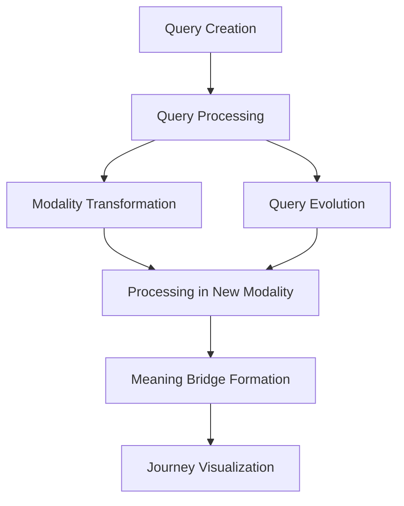

# Query Actants: First-Class Citizens in the Semantic Landscape

## Overview

In the Habitat Pattern Language framework, queries are not merely passive information retrieval mechanisms but active participants in the semantic landscape. This document details how queries function as first-class actants, maintaining their semantic identity across transformations while forming meaningful relationships with other elements in the system.

## The Query Actant Lifecycle



### 1. Query Creation

A query begins its lifecycle when it is instantiated as a `QueryActant` object:

```python
query = QueryActant.create(
    query_text="What is the projected sea level rise by 2050?",
    modality="text",
    context={"user_id": "user_123", "session_id": "session_456"}
)
```

During creation, the query is assigned:
- A unique identifier
- An AdaptiveID for maintaining semantic identity
- An initial ActantJourney point in the 'query_domain'

### 2. Query Processing

The query is processed through a handler specific to its modality:

```python
result = query_interaction.process_query(query)
```

Processing adds a new journey point to the query's actant journey in the 'query_processing_domain' and extracts relevant information such as:
- Relevant semantic domains
- Potential actants
- Confidence scores

### 3. Modality Transformation

Queries can transform across different modalities while preserving their semantic identity:

```python
image_query = query_interaction.transform_query_modality(
    query,
    "image",
    {"transformation_type": "text_to_image"}
)
```

During transformation:
- A new QueryActant is created in the target modality
- The AdaptiveIDs of both queries are linked through temporal context
- A new journey point is added to track the transformation
- The semantic identity is preserved across the transformation

### 4. Query Evolution

Queries can evolve based on new information while maintaining their connection to their original form:

```python
evolved_query = query_interaction.evolve_query(
    query,
    "What economic impacts will result from a 2-meter sea level rise by 2050?",
    {"evolution_reason": "New information about sea level projections"}
)
```

During evolution:
- A new QueryActant is created with the evolved text
- The AdaptiveIDs are linked to track the evolution
- A new journey point is added to the actant journey
- The semantic identity is preserved despite the content change

### 5. Meaning Bridge Formation

As queries interact with the system, they form meaning bridges with other actants:

```python
bridges = meaning_bridge_tracker.detect_bridges(all_journeys, [])
```

Meaning bridges represent:
- Co-occurrence relationships in shared domains
- Domain crossing relationships as queries traverse semantic boundaries
- Transformation relationships as queries evolve or change modalities

### 6. Journey Visualization

The query's journey through semantic domains can be visualized:

```python
visualize_query_network(all_journeys, bridges)
```

This visualization shows:
- The query's path across different domains
- Relationships formed with other actants
- The semantic network that emerges from these interactions

## Query Status as an Actant

As first-class actants, queries have several key characteristics:

### 1. Adaptive Identity

Queries maintain their semantic identity through the AdaptiveID system, allowing them to preserve their meaning even as they change form. This identity is tracked through:

- Temporal context updates
- State change notifications
- Relationship tracking

### 2. Modality Agnosticism

Queries can exist and function across different modalities:

- Text: Natural language queries
- Image: Visual queries or text queries transformed to visual representation
- Audio: Speech queries or text queries transformed to audio representation
- Video: Motion-based queries (potential future extension)
- Interactive: Query-response exchanges (potential future extension)

### 3. Evolution Capability

Queries can evolve based on new information, adapting their form while preserving their connection to their original state. This evolution is tracked through:

- Evolution relationships in the AdaptiveID
- Journey points marking evolution events
- Preservation of original query context

### 4. Relationship Formation

Queries form meaning bridges with other actants, creating a rich network of semantic relationships. These relationships include:

- Co-occurrence: Appearing in the same semantic domain
- Domain crossing: Traversing semantic boundaries
- Transformation: Evolving or changing modalities

### 5. Journey Tracking

The ActantJourney system tracks a query's path through semantic domains, creating a historical record of its transformations and interactions. This journey includes:

- Journey points marking specific semantic states
- Domain transitions representing movements between contexts
- Temporal progression showing the query's evolution over time

## Implementation Details

The query actant system is implemented through several key classes:

### QueryActant

Represents a query as a first-class actant with methods for:
- Transformation across modalities
- Evolution based on new information
- Maintaining adaptive identity

### QueryInteraction

Manages the interaction between queries and the system with capabilities for:
- Processing queries across modalities
- Transforming queries between modalities
- Evolving queries based on new information
- Creating query narratives

### ActantJourney and ActantJourneyPoint

Track the query's journey through semantic domains with:
- Journey points marking specific semantic states
- Domain transitions representing movements between contexts
- Visualization capabilities for journey analysis

### MeaningBridge and MeaningBridgeTracker

Enable the formation and tracking of semantic relationships between queries and other actants with:
- Detection of co-occurrence relationships
- Tracking of domain crossing relationships
- Analysis of transformation relationships

## Conclusion

By treating queries as first-class actants, the Habitat Pattern Language framework enables a more dynamic and participatory form of interaction where queries become part of the semantic landscape they are exploring. This approach creates a richer IO space where meaning emerges from relationships rather than being statically defined, allowing for more nuanced and contextually aware semantic analysis.
