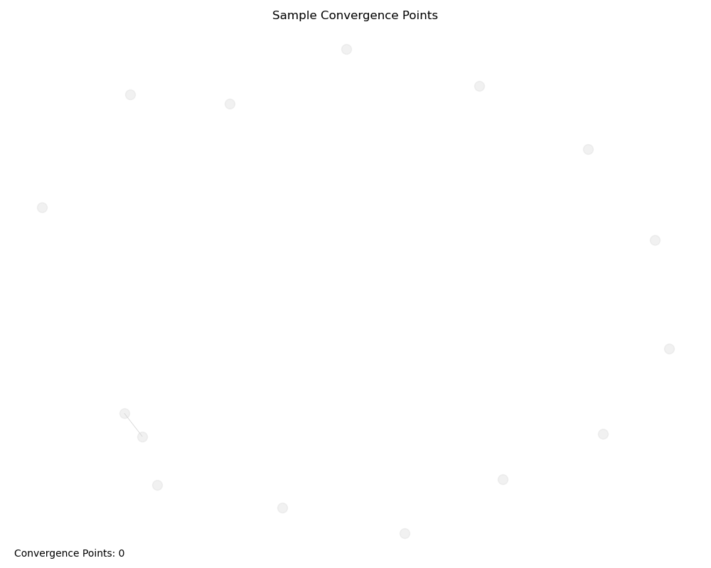

# Tonic-Harmonic Resonance Visualization

## Overview

The tonic-harmonic resonance visualization tools provide a way to observe and understand the emergent patterns and relationships within Habitat's semantic network. These visualizations help reveal how concepts resonate, cascade, and converge across different domains, allowing for the natural emergence of meaning through resonance.

The visualization tools maintain an observational stance, aligning with Habitat's principles of pattern evolution and co-evolution. They provide insights into how semantic domains interact and evolve without imposing predefined structures.

## Visualization Types

### 1. Resonance Network Visualization

The resonance network visualization displays the connections between semantic domains based on their resonance strength. This visualization helps identify clusters of related concepts and the strength of their relationships.

**Key Features:**
- Nodes represent semantic domains, with size based on frequency
- Node color represents amplitude
- Edge width and color represent resonance strength
- Convergence points are highlighted with red borders
- Interactive colorbar shows the scale of resonance strength


### 2. Resonance Cascade Visualization

The resonance cascade visualization shows how resonance propagates through the semantic network along specific paths. This helps track the flow of meaning and identify influential domains.

**Key Features:**
- Linear layout showing the progression of the cascade
- Node color represents position in the cascade
- Edge width represents resonance strength
- Includes cascade strength and length information

### 3. Harmonic Waves Visualization

The harmonic waves visualization displays the wave properties of different domains, showing how they interact and potentially resonate with each other.

**Key Features:**
- Each domain is represented as a wave
- Wave amplitude and frequency reflect domain properties
- Phase relationships between waves indicate potential resonance
- Color-coded for easy domain identification


### 4. Resonance Animation

The resonance animation shows the dynamic interaction of harmonic waves over time, providing a temporal dimension to understanding resonance patterns.

**Key Features:**
- Animated waves showing phase relationships evolving over time
- Color-coded for easy domain identification
- Configurable animation speed and duration
- Helps identify moments of constructive and destructive interference

### 5. Convergence Points Visualization

The convergence points visualization highlights areas where multiple resonance cascades converge, indicating potential semantic hubs or important conceptual intersections.

**Key Features:**
- Highlights convergence points in red
- Node size indicates the number of independent sources
- Incoming edges to convergence points are emphasized
- Provides count of total convergence points



## Using the Visualization Tools

The visualization tools are implemented in the `ResonanceVisualizer` class, which provides methods for each type of visualization. The class is designed to be flexible and configurable, allowing for customization of visual parameters.

### Configuration Options

The `ResonanceVisualizer` class accepts the following configuration parameters:

```python
config = {
    "node_size_factor": 300,      # Factor for node size scaling
    "edge_width_factor": 2,       # Factor for edge width scaling
    "color_map": "viridis",       # Color map for visualization
    "figsize": (10, 8),           # Figure size
    "dpi": 100,                   # Figure DPI
    "animation_frames": 30,       # Number of frames for animations
    "animation_interval": 100     # Interval between frames in ms
}
```

### Example Usage

```python
from habitat_evolution.adaptive_core.visualization.resonance_visualizer import ResonanceVisualizer
from habitat_evolution.adaptive_core.resonance.resonance_cascade_tracker import ResonanceCascadeTracker

# Initialize components
cascade_tracker = ResonanceCascadeTracker()
visualizer = ResonanceVisualizer()

# Generate visualization data
visualization_data = cascade_tracker.generate_cascade_visualization(resonance_network)

# Create network visualization
network_viz = visualizer.visualize_resonance_network(visualization_data, "Sample Resonance Network")

# Create cascade visualization
cascade_viz = visualizer.visualize_resonance_cascade(visualization_data, cascade_id, "Sample Resonance Cascade")

# Create harmonic waves visualization
waves_viz = visualizer.visualize_harmonic_waves(domains, "Sample Harmonic Waves")

# Create resonance animation
anim_viz = visualizer.create_resonance_animation(domains, "Sample Resonance Animation")

# Create convergence points visualization
convergence_viz = visualizer.visualize_convergence_points(visualization_data, "Sample Convergence Points")
```

## Testing and Demonstration

A comprehensive test script is available at `tests/field/test_resonance_visualization.py`, which demonstrates all visualization capabilities using sample data. The script generates sample domains with wave properties, creates a resonance network, and produces all types of visualizations.

To run the demonstration:

```bash
python tests/field/test_resonance_visualization.py
```

The visualizations will be saved to the `tests/field/visualization_output/` directory, along with metadata in JSON format.

## Integration with Habitat

These visualization tools integrate with existing components like `WaveResonanceAnalyzer`, `ResonanceCascadeTracker`, and `TonicHarmonicMetrics` to provide a comprehensive view of the tonic-harmonic resonance capabilities within Habitat.

The visualizations help observe:
- How semantic domains form resonance relationships
- How resonance cascades propagate through the network
- Where convergence points emerge
- How harmonic waves interact over time

This observational approach aligns with Habitat's goal of detecting and evolving coherent patterns while enabling the observation of semantic change across the system.
