# Habitat System Architecture

You can view this diagram in Mermaid viewers:

1. **Use the standalone Mermaid file**: [habitat_architecture.mmd](habitat_architecture.mmd)
2. **Copy the code below** directly into https://mermaidviewer.com or https://mermaid.live:

```mermaid
%%{init: {'theme': 'dark', 'themeVariables': { 'primaryColor': '#2A3F2B', 'primaryTextColor': '#fff', 'primaryBorderColor': '#7C9D7F', 'lineColor': '#7C9D7F', 'secondaryColor': '#2A3F2B', 'tertiaryColor': '#212121'}}}%%

flowchart TD
    classDef tested fill:#2A3F2B,stroke:#7C9D7F,color:#fff
    classDef inprocess fill:#cc6600,stroke:#7C9D7F,color:#fff
    classDef untested fill:#CF6679,stroke:#7C9D7F,color:#212121
    
    %% Top-level user interface
    USER(["User Interface"])
    
    %% API Layer - Entry point to the system
    subgraph API_Layer["API Layer"]
        API["REST API\n(server.py)"]
        API_ROUTES["Route Handlers"]
        API_AUTH["Authentication"]
        API_GS["Graph Service"]
    end
    
    %% Core Processing Layers
    subgraph Core_Processing["Core Processing"]
        %% Pattern-Aware RAG - Central processing
        subgraph Pattern-Aware_RAG["Pattern-Aware RAG"]
            PAR["Pattern-Aware RAG"]
            PAR_LW["Learning Window"]
            PAR_BP["Back Pressure\nController"]
            PAR_EC["Event Coordinator"]
            PAR_FN["Field-Neo4j Bridge"]
        end
        
        %% Field Theory - Theoretical foundation
        subgraph Field_Theory["Field Theory"]
            FIELD["Field Theory Core"]
            FIELD_OBS["Field Observer"]
            FIELD_HS["Health Service"]
            FIELD_GS["Gradient Service"]
            FIELD_FS["Flow Dynamics"]
        end
        
        %% Adaptive Core - Identity and evolution
        subgraph Adaptive_Core["Adaptive Core"]
            ADAPT["Adaptive Core"]
            ADAPT_ID["AdaptiveID"]
            ADAPT_PAT["Pattern ID"]
            ADAPT_DIM["Dimensional Context"]
            ADAPT_PROV["Provenance Tracker"]
        end
    end
    
    %% Persistence and Visualization Layers
    subgraph Data_Layers["Persistence & Visualization"]
        %% Neo4j Persistence - Data storage
        subgraph Neo4j_Persistence["Neo4j Persistence"]
            NEO["Neo4j Persistence"]
            NEO_DB["Pattern Database"]
            NEO_REPO["Repository Layer"]
            NEO_QUERY["Query Engine"]
        end
        
        %% Visualization - Presenting data to users
        subgraph Visualization["Visualization"]
            VIS["Visualization Engine"]
            VIS_GRAPH["Graph Renderer"]
            VIS_PAT["Pattern Visualizer"]
            VIS_NEO["Neo4j Connector"]
            VIS_FIELD["Field Visualizer"]
        end
    end
    
    %% Main flow connections - Connect across major components
    USER --> API
    API --> PAR
    API_GS --> NEO
    
    %% Pattern-Aware RAG connections - Core processing flow
    PAR --> FIELD
    PAR --> ADAPT
    PAR_FN --> NEO
    
    %% Visualization connections
    API --> VIS
    VIS --> NEO
    VIS --> FIELD
    
    %% Internal connections within API
    API --> API_ROUTES
    API --> API_AUTH
    API --> API_GS
    
    %% Internal connections within Pattern-Aware RAG
    PAR --> PAR_LW
    PAR --> PAR_BP
    PAR --> PAR_EC
    PAR --> PAR_FN
    PAR_LW --> FIELD_OBS
    PAR_BP --> FIELD_HS
    
    %% Internal connections within Field Theory
    FIELD --> FIELD_OBS
    FIELD --> FIELD_HS
    FIELD --> FIELD_GS
    FIELD --> FIELD_FS
    
    %% Internal connections within Adaptive Core
    ADAPT --> ADAPT_ID
    ADAPT --> ADAPT_PAT
    ADAPT --> ADAPT_DIM
    ADAPT --> ADAPT_PROV
    
    %% Internal connections within Visualization
    VIS --> VIS_GRAPH
    VIS --> VIS_PAT
    VIS --> VIS_NEO
    VIS --> VIS_FIELD
    
    %% Internal connections within Neo4j
    NEO --> NEO_DB
    NEO --> NEO_REPO
    NEO --> NEO_QUERY
    
    %% Apply styles to tested components
    class PAR,PAR_LW,PAR_BP,PAR_EC,FIELD,FIELD_OBS,FIELD_HS,ADAPT,ADAPT_ID,ADAPT_PAT tested;
    
    %% Apply styles to in-process components
    class VIS,VIS_GRAPH,VIS_PAT,VIS_NEO,VIS_FIELD,API_AUTH,NEO,NEO_DB,NEO_REPO,NEO_QUERY,PAR_FN,API,API_ROUTES,API_GS,FIELD_GS,FIELD_FS,ADAPT_DIM,ADAPT_PROV inprocess;
    
    %% Apply styles to untested/unintegrated components
    class NEO,NEO_DB,NEO_REPO,NEO_QUERY untested;
```

## Legend

- **Green** (#2A3F2B) - Fully tested and integrated components
- **Orange** (#cc6600) - Partially tested/in-process components 
- **Red** (#CF6679) - Untested or unintegrated components

### Main Components

- **User Interface**: Entry point for human interaction with the system
- **API Layer**: Provides programmatic access to Habitat functionality
- **Pattern-Aware RAG**: Core engine for pattern detection and retrieval
- **Field Theory**: Foundation for field-based pattern emergence
- **Adaptive Core**: Manages adaptive IDs and concept evolution
- **Neo4j Persistence**: Graph database for pattern storage and relationships
- **Visualization Engine**: Visual representation of patterns and fields

### API Layer

- **REST API**: Entry point for client applications
- **Route Handlers**: API endpoint implementations
- **Authentication**: Security and access control
- **Graph Service**: Graph data services

### Pattern-Aware RAG

- **Learning Window**: Controls pattern observation periods
- **Back Pressure Controller**: Manages system stability
- **Event Coordinator**: Coordinates state transitions
- **Field-Neo4j Bridge**: Integrates field theory with Neo4j persistence

### Field Theory

- **Field Observer**: Monitors field metrics and state
- **Health Service**: System health monitoring
- **Gradient Service**: Calculates field gradients
- **Flow Dynamics**: Analyzes flow within fields

### Adaptive Core

- **AdaptiveID**: Core ID management
- **Pattern ID**: Pattern-specific ID implementation
- **Dimensional Context**: Multi-dimensional context tracking
- **Provenance Tracker**: Tracks origin and evolution

### Neo4j Persistence

- **Pattern Database**: Core database implementation
- **Repository Layer**: Data access abstraction
- **Query Engine**: Custom queries and search

### Visualization

- **Graph Renderer**: Renders graph relationships
- **Pattern Visualizer**: Visualizes pattern attributes
- **Neo4j Connector**: Connects to Neo4j for data
- **Field Visualizer**: Visualizes field states and metrics
