# Habitat System Architecture

```mermaid
%%{init: {'theme': 'dark', 'themeVariables': { 'primaryColor': '#2A3F2B', 'primaryTextColor': '#fff', 'primaryBorderColor': '#7C9D7F', 'lineColor': '#7C9D7F', 'secondaryColor': '#2A3F2B', 'tertiaryColor': '#212121'}}}%%

flowchart TB
    classDef tested fill:#2A3F2B,stroke:#7C9D7F,color:#fff
    classDef untested fill:#CF6679,stroke:#7C9D7F,color:#212121
    classDef partial fill:#4F6F52,stroke:#7C9D7F,color:#fff
    
    %% Main System Components
    USER(["User Interface"])
    API["REST API\n(server.py)"]
    PAR["Pattern-Aware RAG"]
    FIELD["Field Theory Core"]
    NEO["Neo4j Persistence"]
    ADAPT["Adaptive Core"]
    VIS["Visualization Engine"]

    %% Pattern-Aware RAG Subcomponents
    PAR_LW["Learning Window"]
    PAR_BP["Back Pressure\nController"]
    PAR_EC["Event Coordinator"]
    PAR_FN["Field-Neo4j Bridge"]
    
    %% Field Theory Subcomponents
    FIELD_OBS["Field Observer"]
    FIELD_HS["Health Service"]
    FIELD_GS["Gradient Service"]
    FIELD_FS["Flow Dynamics"]
    
    %% Adaptive Core Subcomponents
    ADAPT_ID["AdaptiveID"]
    ADAPT_PAT["Pattern ID"]
    ADAPT_DIM["Dimensional Context"]
    ADAPT_PROV["Provenance Tracker"]
    
    %% Visualization Subcomponents
    VIS_GRAPH["Graph Renderer"]
    VIS_PAT["Pattern Visualizer"]
    VIS_NEO["Neo4j Connector"]
    VIS_FIELD["Field Visualizer"]
    
    %% Neo4j Subcomponents
    NEO_DB["Pattern Database"]
    NEO_REPO["Repository Layer"]
    NEO_QUERY["Query Engine"]
    
    %% API Subcomponents
    API_ROUTES["Route Handlers"]
    API_AUTH["Authentication"]
    API_GS["Graph Service"]
    
    %% Main component relationships
    USER --> API
    API --> PAR
    API --> VIS
    PAR --> FIELD
    PAR --> NEO
    PAR --> ADAPT
    VIS --> NEO
    VIS --> FIELD
    
    %% Pattern-Aware RAG internal structure
    PAR --> PAR_LW
    PAR --> PAR_BP
    PAR --> PAR_EC
    PAR --> PAR_FN
    PAR_FN --> NEO
    PAR_LW --> FIELD_OBS
    PAR_BP --> FIELD_HS
    
    %% Field Theory internal structure
    FIELD --> FIELD_OBS
    FIELD --> FIELD_HS
    FIELD --> FIELD_GS
    FIELD --> FIELD_FS
    
    %% Adaptive Core internal structure
    ADAPT --> ADAPT_ID
    ADAPT --> ADAPT_PAT
    ADAPT --> ADAPT_DIM
    ADAPT --> ADAPT_PROV
    
    %% Visualization internal structure
    VIS --> VIS_GRAPH
    VIS --> VIS_PAT
    VIS --> VIS_NEO
    VIS --> VIS_FIELD
    
    %% Neo4j internal structure
    NEO --> NEO_DB
    NEO --> NEO_REPO
    NEO --> NEO_QUERY
    
    %% API internal structure
    API --> API_ROUTES
    API --> API_AUTH
    API --> API_GS
    API_GS --> NEO
    
    %% Apply styles to tested components
    class PAR,PAR_LW,PAR_BP,PAR_EC,FIELD,FIELD_OBS,FIELD_HS,ADAPT,ADAPT_ID,ADAPT_PAT tested;
    
    %% Apply styles to untested/unintegrated components
    class VIS,VIS_GRAPH,VIS_PAT,VIS_NEO,VIS_FIELD,API_AUTH untested;
    
    %% Apply styles to partially tested components
    class NEO,NEO_DB,NEO_REPO,NEO_QUERY,PAR_FN,API,API_ROUTES,API_GS,FIELD_GS,FIELD_FS,ADAPT_DIM,ADAPT_PROV partial;
    
    %% Add subgraphs for logical grouping
    subgraph Pattern-Aware_RAG
        PAR
        PAR_LW
        PAR_BP
        PAR_EC
        PAR_FN
    end
    
    subgraph Field_Theory
        FIELD
        FIELD_OBS
        FIELD_HS
        FIELD_GS
        FIELD_FS
    end
    
    subgraph Adaptive_Core
        ADAPT
        ADAPT_ID
        ADAPT_PAT
        ADAPT_DIM
        ADAPT_PROV
    end
    
    subgraph Visualization
        VIS
        VIS_GRAPH
        VIS_PAT
        VIS_NEO
        VIS_FIELD
    end
    
    subgraph Neo4j_Persistence
        NEO
        NEO_DB
        NEO_REPO
        NEO_QUERY
    end
    
    subgraph API_Layer
        API
        API_ROUTES
        API_AUTH
        API_GS
    end
```

## Legend

- **Green** - Fully tested and integrated components
- **Light Green** - Partially tested components
- **Orange** - Untested or unintegrated components

## Component Descriptions

### Main Components

- **REST API**: Entry point for client applications
- **Pattern-Aware RAG**: Core engine for pattern detection and retrieval
- **Field Theory Core**: Foundation for field-based pattern emergence
- **Neo4j Persistence**: Graph database for pattern storage and relationships
- **Adaptive Core**: Manages adaptive IDs and concept evolution
- **Visualization Engine**: Visual representation of patterns and fields

### Pattern-Aware RAG

- **Learning Window**: Controls pattern observation periods
- **Back Pressure Controller**: Manages system stability
- **Event Coordinator**: Coordinates state transitions
- **Field-Neo4j Bridge**: Integrates field theory with Neo4j persistence

### Field Theory

- **Field Observer**: Monitors field metrics and state
- **Health Service**: System health monitoring
- **Gradient Service**: Calculates field gradients
- **Flow Dynamics**: Analyzes flow within fields

### Adaptive Core

- **AdaptiveID**: Core ID management
- **Pattern ID**: Pattern-specific ID implementation
- **Dimensional Context**: Multi-dimensional context tracking
- **Provenance Tracker**: Tracks origin and evolution

### Visualization

- **Graph Renderer**: Renders graph relationships
- **Pattern Visualizer**: Visualizes pattern attributes
- **Neo4j Connector**: Connects to Neo4j for data
- **Field Visualizer**: Visualizes field states and metrics

### Neo4j Persistence

- **Pattern Database**: Core database implementation
- **Repository Layer**: Data access abstraction
- **Query Engine**: Custom queries and search

### API Layer

- **Route Handlers**: API endpoint implementations
- **Authentication**: Security and access control
- **Graph Service**: Graph data services
