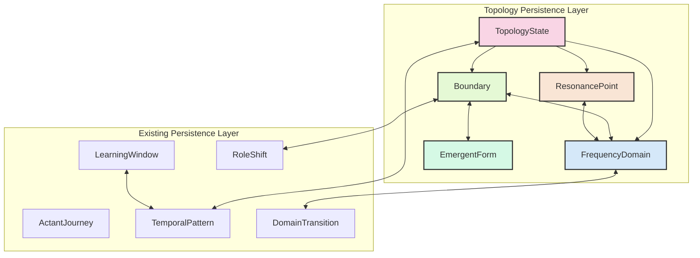
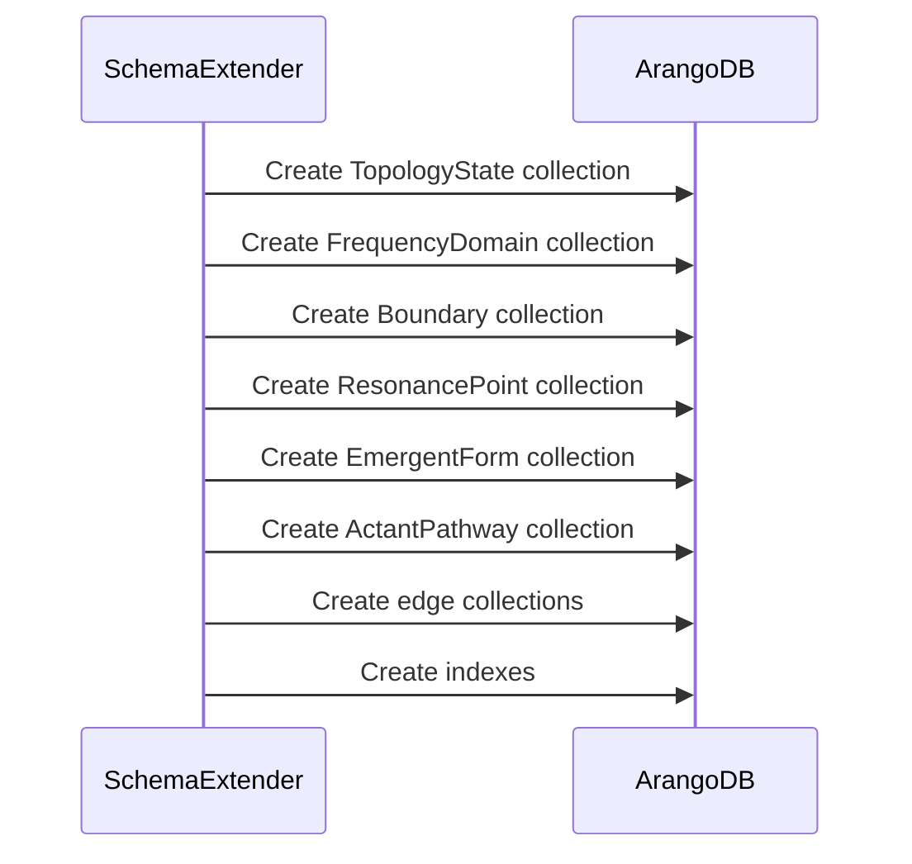
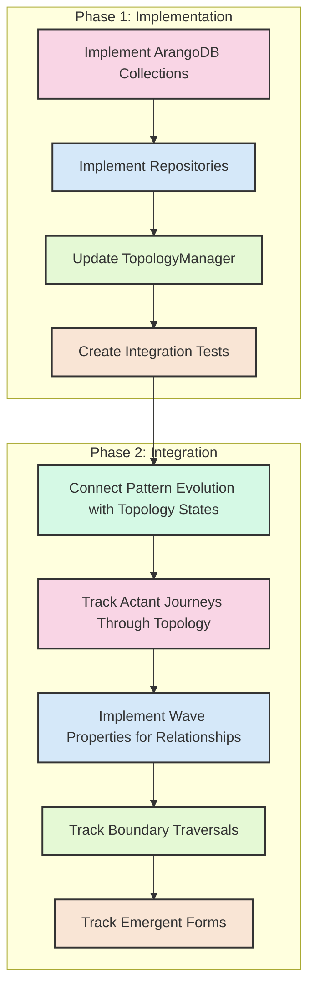

# Topology Persistence Layer with Resonant Oscillator Model

This document outlines the design of a topology persistence layer for the Habitat Evolution system, implementing a field-first approach using ArangoDB as the storage backend. The design aligns with the existing repository pattern while embracing the advanced predicate/resonance approach that treats relationships as resonant oscillators rather than static connections.

## Overview



## Existing ArangoDB Collections

The current ArangoDB implementation includes these key collections:

### Document Collections

- **ActantJourney**: Tracks actant journeys across domains
- **LearningWindow**: Stores learning window states
- **TemporalPattern**: Stores patterns emerging over time
- **RoleShift**: Captures actant role shifts
- **DomainTransition**: Tracks domain transitions

### Edge Collections

- **PredicateTransformsTo**: Represents predicate transformations
- **PatternEvolvesTo**: Represents pattern evolution
- **WindowContainsPattern**: Links windows to patterns
- **ActantHasJourney**: Links actants to journeys

## Proposed Topology Collections

To implement the topology persistence layer in ArangoDB while maintaining the resonant oscillator model, we propose adding these collections:

### Document Collections

```python
topology_collections = [
    ("TopologyState", "Stores complete topology states with eigenspace properties"),
    ("FrequencyDomain", "Represents coherent regions in the semantic landscape"),
    ("Boundary", "Represents interfaces between frequency domains with oscillatory properties"),
    ("ResonancePoint", "Represents points of high coherence with attractor properties"),
    ("EmergentForm", "Stores concepts that emerge at domain boundaries"),
    ("ActantPathway", "Tracks actant movement through the topology")
]
```

### Edge Collections

```python
topology_edge_collections = [
    ("HasDomain", "Links topology states to frequency domains"),
    ("HasBoundary", "Links topology states to boundaries"),
    ("HasResonance", "Links topology states to resonance points"),
    ("Connects", "Links boundaries to frequency domains with oscillatory properties"),
    ("ResonatesWith", "Links patterns with resonance relationships"),
    ("ActantTraverses", "Links actants to boundaries they traverse"),
    ("ActantShapesTopology", "Represents how actants influence topology")
]
```

## Implementation Classes

### 1. TopologySchemaExtender

```python
class TopologySchemaExtender:
    """Extends ArangoDB schema with topology collections."""
    
    def extend_schema(self):
        # Define topology document collections
        topology_collections = [
            ("TopologyState", "Stores complete topology states with eigenspace properties"),
            ("FrequencyDomain", "Represents coherent regions in the semantic landscape"),
            ("Boundary", "Represents interfaces between frequency domains with oscillatory properties"),
            ("ResonancePoint", "Represents points of high coherence with attractor properties"),
            ("EmergentForm", "Stores concepts that emerge at domain boundaries"),
            ("ActantPathway", "Tracks actant movement through the topology")
        ]
        
        # Define topology edge collections
        topology_edge_collections = [
            ("HasDomain", "Links topology states to frequency domains"),
            ("HasBoundary", "Links topology states to boundaries"),
            ("HasResonance", "Links topology states to resonance points"),
            ("Connects", "Links boundaries to frequency domains with oscillatory properties"),
            ("ResonatesWith", "Links patterns with resonance relationships"),
            ("ActantTraverses", "Links actants to boundaries they traverse"),
            ("ActantShapesTopology", "Represents how actants influence topology")
        ]
        
        # Create collections
        schema_extender = ArangoDBSchemaExtender()
        for name, description in topology_collections:
            schema_extender._create_collection(name, is_edge=False, description=description)
            
        for name, description in topology_edge_collections:
            schema_extender._create_collection(name, is_edge=True, description=description)
```

### 2. TopologyRepository

```python
class TopologyRepository(ArangoDBBaseRepository):
    """
    Repository for persisting topology states in ArangoDB with resonant properties.
    
    Handles the storage and retrieval of topology constructs as resonant oscillators
    rather than static entities, enabling emergent forms and feedback loops.
    """
    
    def __init__(self):
        super().__init__()
        self.collection_name = "TopologyState"
        
    def persist_topology_state(self, state: TopologyState) -> str:
        """Persist a topology state with resonant properties."""
        # Convert to document properties
        state_doc = self._to_document_properties(state)
        
        # Add additional eigenspace properties
        state_doc.update({
            "coherence": state.field_metrics.coherence,
            "entropy": state.field_metrics.entropy,
            "adaptation_rate": state.field_metrics.adaptation_rate,
            "effective_dimensionality": state.effective_dimensionality,
            "eigenvalues": state.eigenvalues,
            "eigenvectors": state.eigenvectors,
            "wave_properties": {
                "amplitude": state.wave_properties.amplitude,
                "frequency": state.wave_properties.frequency,
                "phase": state.wave_properties.phase,
                "harmonics": state.wave_properties.harmonics
            }
        })
        
        # Insert or update topology state
        db = self.connection_manager.get_db()
        db.collection(self.collection_name).insert(state_doc, overwrite=True)
        
        # Persist frequency domains with oscillatory properties
        self._persist_frequency_domains_with_resonance(state)
        
        # Persist boundaries as transformation edges with emergent forms
        self._persist_boundaries_with_transformations(state)
        
        # Persist resonance points with feedback loop detection
        self._persist_resonance_points_with_feedback(state)
        
        return state.id
        
    def _persist_frequency_domains_with_resonance(self, state: TopologyState):
        """Persist frequency domains with their resonant properties."""
        db = self.connection_manager.get_db()
        
        for domain in state.frequency_domains:
            # Create domain document
            domain_doc = {
                "_key": domain.id,
                "name": domain.name,
                "coherence": domain.coherence,
                "density": domain.density,
                "stability": domain.stability,
                "resonance_frequency": domain.resonance_frequency,
                "created_at": datetime.now().isoformat()
            }
            
            # Insert domain
            db.collection("FrequencyDomain").insert(domain_doc, overwrite=True)
            
            # Create edge from topology state to domain
            edge_doc = {
                "_from": f"TopologyState/{state.id}",
                "_to": f"FrequencyDomain/{domain.id}",
                "weight": domain.coherence,
                "created_at": datetime.now().isoformat()
            }
            
            db.collection("HasDomain").insert(edge_doc, overwrite=True)
    
    def _persist_boundaries_with_transformations(self, state: TopologyState):
        """Persist boundaries with their transformation properties."""
        db = self.connection_manager.get_db()
        
        for boundary in state.boundaries:
            # Create boundary document with oscillatory properties
            boundary_doc = {
                "_key": boundary.id,
                "name": boundary.name,
                "permeability": boundary.permeability,
                "conductivity": boundary.conductivity,
                "oscillatory_properties": {
                    "amplitude": boundary.oscillatory_properties.amplitude,
                    "frequency": boundary.oscillatory_properties.frequency,
                    "phase": boundary.oscillatory_properties.phase,
                    "harmonics": boundary.oscillatory_properties.harmonics
                },
                "created_at": datetime.now().isoformat()
            }
            
            # Insert boundary
            db.collection("Boundary").insert(boundary_doc, overwrite=True)
            
            # Create edge from topology state to boundary
            edge_doc = {
                "_from": f"TopologyState/{state.id}",
                "_to": f"Boundary/{boundary.id}",
                "weight": boundary.conductivity,
                "created_at": datetime.now().isoformat()
            }
            
            db.collection("HasBoundary").insert(edge_doc, overwrite=True)
            
            # Create edges between boundary and domains
            for domain_id in boundary.connected_domains:
                connect_edge = {
                    "_from": f"Boundary/{boundary.id}",
                    "_to": f"FrequencyDomain/{domain_id}",
                    "conductivity": boundary.conductivity,
                    "oscillatory_properties": boundary.oscillatory_properties,
                    "created_at": datetime.now().isoformat()
                }
                
                db.collection("Connects").insert(connect_edge, overwrite=True)
            
            # Persist emergent forms at this boundary
            for form in boundary.emergent_forms:
                form_doc = {
                    "_key": form.id,
                    "name": form.name,
                    "coherence": form.coherence,
                    "stability": form.stability,
                    "created_at": datetime.now().isoformat()
                }
                
                db.collection("EmergentForm").insert(form_doc, overwrite=True)
                
                # Create edge from boundary to emergent form
                emergent_edge = {
                    "_from": f"Boundary/{boundary.id}",
                    "_to": f"EmergentForm/{form.id}",
                    "created_at": datetime.now().isoformat()
                }
                
                db.collection("EmergentAt").insert(emergent_edge, overwrite=True)
```

### 3. BoundaryRepository with Oscillatory Properties

```python
class BoundaryRepository(ArangoDBBaseRepository):
    """
    Repository for persisting boundaries with oscillatory properties.
    
    Treats boundaries as resonant oscillators with amplitude, frequency,
    phase, and harmonics, enabling emergent forms at transition points.
    """
    
    def __init__(self):
        super().__init__()
        self.collection_name = "Boundary"
        self.is_edge_collection = False
        
    def save_with_oscillatory_properties(self, boundary, oscillatory_properties, emergent_forms=None):
        """
        Save a boundary with oscillatory properties and emergent forms.
        
        Args:
            boundary: The boundary to save
            oscillatory_properties: Dict with amplitude, frequency, phase, harmonics
            emergent_forms: List of emergent forms at this boundary
        """
        # Convert to document properties
        boundary_doc = self._to_document_properties(boundary)
        
        # Add oscillatory properties
        boundary_doc["oscillatory_properties"] = oscillatory_properties
        
        # Add emergent forms if provided
        if emergent_forms:
            boundary_doc["emergent_forms"] = [
                form.id for form in emergent_forms
            ]
            
        # Save to ArangoDB
        db = self.connection_manager.get_db()
        db.collection(self.collection_name).insert(boundary_doc, overwrite=True)
        
        # Save emergent forms as separate documents if provided
        if emergent_forms:
            self._save_emergent_forms(boundary.id, emergent_forms)
            
        return boundary.id
        
    def _save_emergent_forms(self, boundary_id, emergent_forms):
        """Save emergent forms and link them to the boundary."""
        db = self.connection_manager.get_db()
        
        for form in emergent_forms:
            # Create form document
            form_doc = {
                "_key": form.id,
                "name": form.name,
                "coherence": form.coherence,
                "stability": form.stability,
                "created_at": datetime.now().isoformat()
            }
            
            # Insert form
            db.collection("EmergentForm").insert(form_doc, overwrite=True)
            
            # Create edge from boundary to form
            edge_doc = {
                "_from": f"Boundary/{boundary_id}",
                "_to": f"EmergentForm/{form.id}",
                "created_at": datetime.now().isoformat()
            }
            
            db.collection("EmergentAt").insert(edge_doc, overwrite=True)
```

### 4. ActantPathwayRepository

```python
class ActantPathwayRepository(ArangoDBBaseRepository):
    """
    Repository for tracking actant pathways through the topology.
    
    Captures how actants move through and influence the topology,
    creating a feedback loop between actant journeys and field evolution.
    """
    
    def __init__(self):
        super().__init__()
        self.collection_name = "ActantPathway"
        
    def record_actant_traversal(self, actant_id, boundary_id, direction, influence_metrics):
        """
        Record an actant traversing a boundary.
        
        Args:
            actant_id: ID of the actant
            boundary_id: ID of the boundary being traversed
            direction: Direction of traversal (inbound/outbound)
            influence_metrics: Metrics of how the actant influenced the boundary
        """
        # Create traversal document
        traversal_id = f"{actant_id}_{boundary_id}_{int(time.time())}"
        traversal_doc = {
            "_key": traversal_id,
            "actant_id": actant_id,
            "boundary_id": boundary_id,
            "direction": direction,
            "influence_metrics": influence_metrics,
            "timestamp": datetime.now().isoformat()
        }
        
        # Save traversal
        db = self.connection_manager.get_db()
        db.collection(self.collection_name).insert(traversal_doc, overwrite=True)
        
        # Create edge from actant to boundary
        edge_doc = {
            "_from": f"Actant/{actant_id}",
            "_to": f"Boundary/{boundary_id}",
            "direction": direction,
            "influence": influence_metrics.get("influence_strength", 0.5),
            "timestamp": datetime.now().isoformat()
        }
        
        db.collection("ActantTraverses").insert(edge_doc, overwrite=True)
        
        # Update topology based on actant influence
        self._update_topology_from_actant_influence(
            actant_id, 
            boundary_id, 
            influence_metrics
        )
        
        return traversal_id
        
    def _update_topology_from_actant_influence(self, actant_id, boundary_id, influence_metrics):
        """Update topology based on actant influence."""
        db = self.connection_manager.get_db()
        
        # Create edge representing actant's influence on topology
        edge_doc = {
            "_from": f"Actant/{actant_id}",
            "_to": f"TopologyState/current",  # Assuming a current topology state
            "boundary_id": boundary_id,
            "influence_type": influence_metrics.get("influence_type", "resonance"),
            "influence_strength": influence_metrics.get("influence_strength", 0.5),
            "timestamp": datetime.now().isoformat()
        }
        
        db.collection("ActantShapesTopology").insert(edge_doc, overwrite=True)
```

### 5. Integration with Predicate Transformation

```python
class TopologyPredicateIntegrator:
    """
    Integrates topology boundaries with predicate transformations.
    
    Ensures that topology boundaries properly reflect the oscillatory nature
    of predicate transformations and captures emergent forms at transition points.
    """
    
    def __init__(self, event_bus):
        self.event_bus = event_bus
        self.topology_repository = TopologyRepository()
        self.boundary_repository = BoundaryRepository()
        self.predicate_transformation_detector = PredicateTransformationDetector()
        
        # Register event handlers
        self._register_event_handlers()
    
    def _register_event_handlers(self):
        """Register event handlers for predicate transformations."""
        self.event_bus.subscribe(
            "predicate.transformation.detected", 
            self._on_predicate_transformation_detected
        )
    
    def _on_predicate_transformation_detected(self, event):
        """
        Handle predicate transformation detection events.
        
        Updates topology boundaries to reflect the oscillatory properties
        of the detected transformation.
        """
        transformation = event.data["transformation"]
        
        # Extract oscillatory properties
        oscillatory_properties = {
            "amplitude": transformation.amplitude,
            "frequency": transformation.frequency,
            "phase": transformation.phase,
            "harmonics": transformation.harmonics
        }
        
        # Extract emergent forms
        emergent_forms = transformation.emergent_forms
        
        # Create or update boundary with oscillatory properties
        self._create_or_update_boundary(
            transformation.source_id,
            transformation.target_id,
            oscillatory_properties,
            emergent_forms,
            transformation.role_pattern
        )
        
    def _create_or_update_boundary(self, source_id, target_id, oscillatory_properties, 
                                  emergent_forms, role_pattern):
        """Create or update a boundary between domains."""
        # Generate boundary ID
        boundary_id = f"boundary_{source_id}_{target_id}"
        
        # Create boundary object
        boundary = {
            "id": boundary_id,
            "source_domain_id": source_id,
            "target_domain_id": target_id,
            "connected_domains": [source_id, target_id],
            "role_pattern": role_pattern,
            "permeability": oscillatory_properties.get("amplitude", 0.5),
            "conductivity": oscillatory_properties.get("frequency", 0.5)
        }
        
        # Save boundary with oscillatory properties
        self.boundary_repository.save_with_oscillatory_properties(
            boundary, 
            oscillatory_properties,
            emergent_forms
        )
```

## Migration Strategy

Since there's no data worth saving in Neo4j, we can implement a clean migration strategy:

### Schema Extension

1. Extend the ArangoDB schema with the new topology collections
2. Create necessary indexes for efficient queries



### Repository Implementation

1. Implement the new repositories following the existing patterns
2. Ensure they integrate with the ArangoDBBaseRepository base class

### TopologyManager Update

1. Update the TopologyManager to use the new ArangoDB repositories
2. Replace Neo4j-specific code with ArangoDB equivalents

### Integration Tests

1. Create tests that verify the oscillatory properties are preserved
2. Ensure emergent forms are correctly detected at boundaries

## Benefits of This Implementation

- **Field-First Philosophy**: Treats the topology as an emergent property of the field rather than a static structure
- **Oscillatory Relationship Model**: Preserves the resonant oscillator approach to relationships
- **Emergent Form Detection**: Captures concepts that emerge at domain boundaries
- **Feedback Loop Support**: Detects circular patterns of influence
- **Wave Properties for Relationships**: Relationships have amplitude, frequency, phase, and harmonics
- **Actant Journey Tracking**: Tracks how actants move through and shape the topology
- **Boundary Traversal Tracking**: Captures the oscillatory nature of boundary crossings
- **Integration with Existing Components**: Works with the current ArangoDB implementation

## Temporal | Topological Integration Path

The implementation provides a clear path for integrating temporal pattern evolution with spatial/relational topology:



This implementation aligns with the field-first philosophy and advanced understanding of predicates as resonant oscillators, while ensuring a clean integration with the existing ArangoDB repositories.
