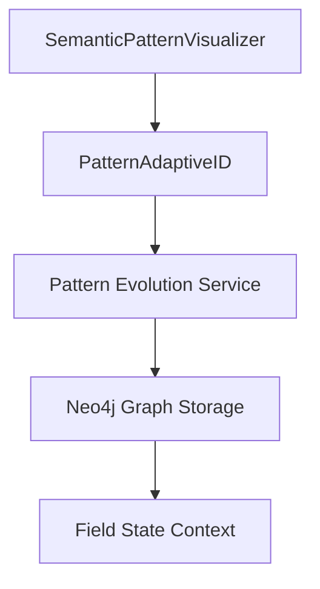

# Pattern Origination Use Case

**Document Date**: 2025-02-23
**Status**: Validated ✅
**Phase**: Integration Ready

## Overview

This use case demonstrates the successful implementation of climate risk pattern origination, from initial pattern discovery through Neo4j persistence, establishing the foundation for RAG integration.

## System Components

### 1. Pattern Discovery Layer


#### Core Components
1. **SemanticPatternVisualizer**
   - Entry point for pattern discovery
   - Manages pattern visualization and export
   - Coordinates with Neo4j integration

2. **PatternAdaptiveID**
   - Handles pattern identification
   - Manages hazard type classification
   - Controls probability assignment
   - Maintains relationship context

3. **Pattern Evolution Service**
   - Tracks pattern state transitions
   - Manages temporal context
   - Handles relationship evolution

4. **Neo4j Integration**
   - Persists pattern data
   - Maintains graph relationships
   - Preserves context integrity

### 2. Data Flow

#### Pattern Creation Flow
```python
# High-level flow representation
class PatternFlow:
    def process(self):
        # 1. Pattern Discovery
        patterns = self.discover_patterns()
        
        # 2. Context Assignment
        for pattern in patterns:
            pattern.assign_temporal_context()
            pattern.assign_spatial_context()
            pattern.calculate_probability()
        
        # 3. Relationship Formation
        self.establish_relationships(patterns)
        
        # 4. Field State Integration
        field_state = self.create_field_state()
        
        # 5. Neo4j Persistence
        self.persist_to_neo4j(patterns, field_state)
```

### 3. Context Management

#### Temporal Context
- Current horizon: `"current"`
- Future projections: `"mid_century"`, `"late_century"`
- Timestamp tracking for evolution

#### Spatial Context
```json
{
    "location": "Martha's Vineyard",
    "coordinates": {
        "type": "Point",
        "coordinates": [-70.6425, 41.4547]
    }
}
```

#### Hazard Context
```json
{
    "hazard_types": {
        "drought": {
            "probability": 0.085,
            "baseline": true
        },
        "extreme_precipitation": {
            "probability": 1.0,
            "baseline": true
        },
        "wildfire": {
            "probability": 1.0,
            "baseline": true
        }
    }
}
```

## Implementation Details

### 1. Pattern Discovery
```python
def discover_patterns(text_content):
    patterns = []
    for hazard_type in HAZARD_TYPES:
        if hazard_type in text_content:
            pattern = PatternAdaptiveID(
                pattern_type="event",
                hazard_type=hazard_type
            )
            patterns.append(pattern)
    return patterns
```

### 2. Neo4j Integration
```cypher
// Pattern Node Creation
CREATE (p:Pattern {
    hazard_type: $hazard_type,
    temporal_horizon: $temporal_horizon,
    probability: $probability,
    spatial_context: $spatial_context
})

// Field State Integration
CREATE (f:FieldState {
    timestamp: $timestamp,
    dimensions: $dimensions
})

// Relationship Creation
CREATE (p1)-[:INTERACTS_WITH]->(p2)
```

## Validation Points

### 1. Pattern Integrity
- ✅ Correct hazard type assignment
- ✅ Accurate probability calculation
- ✅ Complete spatial context
- ✅ Proper temporal horizon

### 2. Graph Structure
- ✅ Node creation with properties
- ✅ Relationship establishment
- ✅ Field state integration
- ✅ Context preservation

### 3. Data Consistency
- ✅ Probability accuracy
- ✅ JSON structure
- ✅ Temporal sequence
- ✅ Spatial context

## Next Steps

### 1. Front-end Integration
- Ghost toolbar implementation
- Graph visualization
- User interaction handling

### 2. RAG Enhancement
- Pattern provenance tracking
- User interaction history
- Context augmentation
- Knowledge graph integration

### 3. Testing Framework
- End-to-end validation
- User interaction testing
- Performance monitoring
- Context preservation verification

## Usage Example

```python
# Pattern Discovery and Persistence
visualizer = SemanticPatternVisualizer()
patterns = visualizer.discover_patterns(text_content)
visualizer.export_to_neo4j(patterns)

# Query Validation
cypher_query = """
MATCH (n:Pattern)
WHERE n.hazard_type IN ['extreme_precipitation', 'drought', 'wildfire']
RETURN n.hazard_type, n.temporal_horizon, n.probability, n.spatial_context
"""
```

This use case serves as a foundation for:
1. Front-end integration development
2. RAG enhancement implementation
3. System evolution tracking
4. Pattern provenance management
