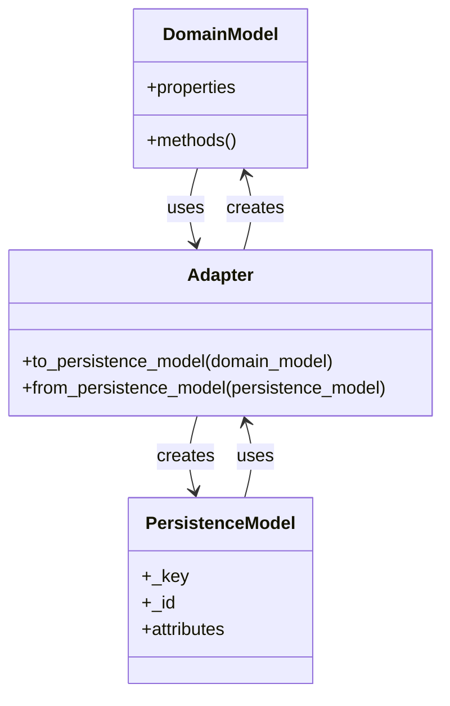

# Vector-Tonic Persistence Adapters

This document details the adapter implementations for the Vector-Tonic Persistence Integration. Adapters serve as the bridge between the Vector-Tonic Window system and the ArangoDB persistence layer, translating between domain models and persistence models.

## Adapter Pattern Overview



## Pattern Adapter

The Pattern Adapter translates between pattern objects from the Vector-Tonic Window system and the persistence model used by the Pattern Repository.

```python
# pattern_adapter.py
from typing import Dict, Any, List, Optional
from src.habitat_evolution.adaptive_core.id.adaptive_id import AdaptiveID

class PatternAdapter:
    """
    Adapts patterns from the vector-tonic-window system to the persistence layer.
    
    This adapter handles the translation between the domain model of patterns
    and the persistence model used by the Pattern Repository.
    """
    
    def to_persistence_model(self, pattern: Any) -> Dict[str, Any]:
        """
        Convert a pattern to a persistence model.
        
        Args:
            pattern: The pattern object from the vector-tonic-window system.
            
        Returns:
            A dictionary representing the persistence model of the pattern.
        """
        return {
            "_key": getattr(pattern, "id", None),
            "name": getattr(pattern, "name", None),
            "description": getattr(pattern, "description", None),
            "version_history": getattr(pattern, "version_history", {}),
            "relationships": self._extract_relationships(pattern),
            "metadata": getattr(pattern, "metadata", {}),
            "coherence": getattr(pattern, "coherence", 0.0),
            "stability": getattr(pattern, "stability", 0.0),
            "resonance": getattr(pattern, "resonance", 0.0),
            "detection_timestamp": getattr(pattern, "detection_timestamp", None),
            "last_updated": getattr(pattern, "last_updated", None)
        }
    
    def from_persistence_model(self, persistence_model: Dict[str, Any]) -> AdaptiveID:
        """
        Convert a persistence model to a pattern.
        
        Args:
            persistence_model: The persistence model from the Pattern Repository.
            
        Returns:
            An AdaptiveID object representing the pattern.
        """
        adaptive_id = AdaptiveID(
            base_concept=persistence_model.get("name", "unknown"),
            creator_id=persistence_model.get("metadata", {}).get("creator_id", "system")
        )
        
        # Add version history
        for version_name, version_data in persistence_model.get("version_history", {}).items():
            adaptive_id.add_version(version_name, version_data)
        
        # Add temporal context
        if "detection_timestamp" in persistence_model:
            adaptive_id.temporal_context["detection_timestamp"] = persistence_model["detection_timestamp"]
        
        # Add metadata
        for key, value in persistence_model.get("metadata", {}).items():
            if key not in adaptive_id.temporal_context:
                adaptive_id.temporal_context[key] = value
            
        return adaptive_id
    
    def _extract_relationships(self, pattern: Any) -> List[Dict[str, Any]]:
        """
        Extract relationships from a pattern.
        
        Args:
            pattern: The pattern object from the vector-tonic-window system.
            
        Returns:
            A list of dictionaries representing the relationships in the pattern.
        """
        relationships = []
        
        # Extract relationships based on pattern type
        if hasattr(pattern, "relationships"):
            for rel in pattern.relationships:
                relationships.append({
                    "source": getattr(rel, "source", None),
                    "predicate": getattr(rel, "predicate", None),
                    "target": getattr(rel, "target", None),
                    "confidence": getattr(rel, "confidence", 0.0),
                    "metadata": getattr(rel, "metadata", {})
                })
        
        return relationships
```

## Field State Adapter

The Field State Adapter translates between field state objects from the Vector-Tonic Window system and the persistence model used by the Field State Repository.

```python
# field_state_adapter.py
from typing import Dict, Any, List, Optional
from datetime import datetime

class FieldStateAdapter:
    """
    Adapts field states from the vector-tonic-window system to the persistence layer.
    
    This adapter handles the translation between the domain model of field states
    and the persistence model used by the Field State Repository.
    """
    
    def to_persistence_model(self, field_state: Any) -> Dict[str, Any]:
        """
        Convert a field state to a persistence model.
        
        Args:
            field_state: The field state object from the vector-tonic-window system.
            
        Returns:
            A dictionary representing the persistence model of the field state.
        """
        # Extract metrics
        metrics = {}
        if hasattr(field_state, "metrics"):
            metrics = field_state.metrics
        elif hasattr(field_state, "get_metrics"):
            metrics = field_state.get_metrics()
        else:
            # Extract individual metrics if available
            for metric_name in ["density", "turbulence", "coherence", "stability"]:
                if hasattr(field_state, metric_name):
                    metrics[metric_name] = getattr(field_state, metric_name)
        
        # Extract topology metrics
        topology_metrics = {}
        if hasattr(field_state, "topology_metrics"):
            topology_metrics = field_state.topology_metrics
        elif hasattr(field_state, "get_topology_metrics"):
            topology_metrics = field_state.get_topology_metrics()
        else:
            # Extract individual topology metrics if available
            for metric_name in [
                "pattern_count", "meta_pattern_count", "resonance_density",
                "interference_complexity", "flow_coherence", "stability_trend",
                "effective_dimensionality"
            ]:
                if hasattr(field_state, metric_name):
                    topology_metrics[metric_name] = getattr(field_state, metric_name)
        
        # Extract system state metrics
        system_metrics = {}
        if hasattr(field_state, "system_metrics"):
            system_metrics = field_state.system_metrics
        elif hasattr(field_state, "get_system_metrics"):
            system_metrics = field_state.get_system_metrics()
        else:
            # Extract individual system metrics if available
            for metric_name in [
                "eigenspace_stability", "pattern_coherence",
                "resonance_level", "system_load"
            ]:
                if hasattr(field_state, metric_name):
                    system_metrics[metric_name] = getattr(field_state, metric_name)
        
        # Create the persistence model
        return {
            "_key": getattr(field_state, "id", str(datetime.now().timestamp())),
            "timestamp": getattr(field_state, "timestamp", datetime.now().isoformat()),
            "metrics": metrics,
            "topology_metrics": topology_metrics,
            "system_metrics": system_metrics,
            "parameters": getattr(field_state, "parameters", {}),
            "metadata": getattr(field_state, "metadata", {})
        }
    
    def from_persistence_model(self, persistence_model: Dict[str, Any]) -> Dict[str, Any]:
        """
        Convert a persistence model to a field state.
        
        Args:
            persistence_model: The persistence model from the Field State Repository.
            
        Returns:
            A dictionary representing the field state.
        """
        # Create a simplified field state representation
        field_state = {
            "id": persistence_model.get("_key"),
            "timestamp": persistence_model.get("timestamp"),
            "metrics": persistence_model.get("metrics", {}),
            "topology_metrics": persistence_model.get("topology_metrics", {}),
            "system_metrics": persistence_model.get("system_metrics", {}),
            "parameters": persistence_model.get("parameters", {}),
            "metadata": persistence_model.get("metadata", {})
        }
        
        return field_state
```

## Relationship Adapter

The Relationship Adapter translates between relationship objects from the Vector-Tonic Window system and the persistence model used by the Relationship Repository.

```python
# relationship_adapter.py
from typing import Dict, Any, List, Optional
from datetime import datetime

class RelationshipAdapter:
    """
    Adapts relationships from the vector-tonic-window system to the persistence layer.
    
    This adapter handles the translation between the domain model of relationships
    and the persistence model used by the Relationship Repository.
    """
    
    def to_persistence_model(self, relationship: Any) -> Dict[str, Any]:
        """
        Convert a relationship to a persistence model.
        
        Args:
            relationship: The relationship object from the vector-tonic-window system.
            
        Returns:
            A dictionary representing the persistence model of the relationship.
        """
        return {
            "source_id": getattr(relationship, "source_id", None),
            "predicate": getattr(relationship, "predicate", None),
            "target_id": getattr(relationship, "target_id", None),
            "confidence": getattr(relationship, "confidence", 0.0),
            "detection_timestamp": getattr(relationship, "detection_timestamp", datetime.now().isoformat()),
            "metadata": getattr(relationship, "metadata", {})
        }
    
    def from_persistence_model(self, persistence_model: Dict[str, Any]) -> Dict[str, Any]:
        """
        Convert a persistence model to a relationship.
        
        Args:
            persistence_model: The persistence model from the Relationship Repository.
            
        Returns:
            A dictionary representing the relationship.
        """
        return {
            "source_id": persistence_model.get("source_id"),
            "predicate": persistence_model.get("predicate"),
            "target_id": persistence_model.get("target_id"),
            "confidence": persistence_model.get("confidence", 0.0),
            "detection_timestamp": persistence_model.get("detection_timestamp"),
            "metadata": persistence_model.get("metadata", {})
        }
    
    def extract_relationship_from_event(self, event: Any) -> Dict[str, Any]:
        """
        Extract a relationship from an event.
        
        Args:
            event: The event object from the event bus.
            
        Returns:
            A dictionary representing the relationship.
        """
        event_data = getattr(event, "data", {})
        
        # Extract relationship data from the event
        relationship = {
            "source_id": event_data.get("source_id"),
            "predicate": event_data.get("predicate"),
            "target_id": event_data.get("target_id"),
            "confidence": event_data.get("confidence", 0.0),
            "detection_timestamp": event_data.get("detection_timestamp", datetime.now().isoformat()),
            "metadata": event_data.get("metadata", {})
        }
        
        return relationship
```

## AdaptiveID Adapter

The AdaptiveID Adapter translates between AdaptiveID objects and the persistence model used by the AdaptiveID Repository.

```python
# adaptive_id_adapter.py
from typing import Dict, Any, List, Optional
from datetime import datetime
from src.habitat_evolution.adaptive_core.id.adaptive_id import AdaptiveID

class AdaptiveIDAdapter:
    """
    Adapts AdaptiveID objects to the persistence layer.
    
    This adapter handles the translation between AdaptiveID objects
    and the persistence model used by the AdaptiveID Repository.
    """
    
    def to_persistence_model(self, adaptive_id: AdaptiveID) -> Dict[str, Any]:
        """
        Convert an AdaptiveID to a persistence model.
        
        Args:
            adaptive_id: The AdaptiveID object.
            
        Returns:
            A dictionary representing the persistence model of the AdaptiveID.
        """
        return {
            "_key": adaptive_id.id,
            "base_concept": adaptive_id.base_concept,
            "creator_id": adaptive_id.creator_id,
            "versions": adaptive_id.versions,
            "temporal_context": adaptive_id.temporal_context,
            "spatial_context": adaptive_id.spatial_context
        }
    
    def from_persistence_model(self, persistence_model: Dict[str, Any]) -> AdaptiveID:
        """
        Convert a persistence model to an AdaptiveID.
        
        Args:
            persistence_model: The persistence model from the AdaptiveID Repository.
            
        Returns:
            An AdaptiveID object.
        """
        adaptive_id = AdaptiveID(
            base_concept=persistence_model.get("base_concept", "unknown"),
            creator_id=persistence_model.get("creator_id", "system")
        )
        
        # Set the ID
        adaptive_id.id = persistence_model.get("_key", adaptive_id.id)
        
        # Add versions
        for version_name, version_data in persistence_model.get("versions", {}).items():
            adaptive_id.add_version(version_name, version_data)
        
        # Add temporal context
        for key, value in persistence_model.get("temporal_context", {}).items():
            adaptive_id.temporal_context[key] = value
        
        # Add spatial context
        for key, value in persistence_model.get("spatial_context", {}).items():
            adaptive_id.spatial_context[key] = value
        
        return adaptive_id
```

## Testing Adapters

Each adapter should be thoroughly tested to ensure it correctly translates between domain models and persistence models. Here's an example of how to test the Pattern Adapter:

```python
# test_pattern_adapter.py
import unittest
from datetime import datetime
from src.habitat_evolution.integration.vector_tonic_persistence.adapters.pattern_adapter import PatternAdapter
from src.habitat_evolution.adaptive_core.id.adaptive_id import AdaptiveID

class MockPattern:
    def __init__(self):
        self.id = "pattern_123"
        self.name = "Test Pattern"
        self.description = "A test pattern"
        self.version_history = {"initial": {"timestamp": "2025-04-01T12:00:00", "origin": "test"}}
        self.relationships = []
        self.metadata = {"creator": "test_user"}
        self.coherence = 0.8
        self.stability = 0.7
        self.resonance = 0.9
        self.detection_timestamp = "2025-04-01T12:00:00"
        self.last_updated = "2025-04-01T12:00:00"

class TestPatternAdapter(unittest.TestCase):
    def setUp(self):
        self.adapter = PatternAdapter()
        self.pattern = MockPattern()
    
    def test_to_persistence_model(self):
        # Convert the pattern to a persistence model
        persistence_model = self.adapter.to_persistence_model(self.pattern)
        
        # Check that the conversion was correct
        self.assertEqual(persistence_model["_key"], self.pattern.id)
        self.assertEqual(persistence_model["name"], self.pattern.name)
        self.assertEqual(persistence_model["description"], self.pattern.description)
        self.assertEqual(persistence_model["version_history"], self.pattern.version_history)
        self.assertEqual(persistence_model["relationships"], [])
        self.assertEqual(persistence_model["metadata"], self.pattern.metadata)
        self.assertEqual(persistence_model["coherence"], self.pattern.coherence)
        self.assertEqual(persistence_model["stability"], self.pattern.stability)
        self.assertEqual(persistence_model["resonance"], self.pattern.resonance)
        self.assertEqual(persistence_model["detection_timestamp"], self.pattern.detection_timestamp)
        self.assertEqual(persistence_model["last_updated"], self.pattern.last_updated)
    
    def test_from_persistence_model(self):
        # Create a persistence model
        persistence_model = {
            "_key": "pattern_123",
            "name": "Test Pattern",
            "description": "A test pattern",
            "version_history": {"initial": {"timestamp": "2025-04-01T12:00:00", "origin": "test"}},
            "relationships": [],
            "metadata": {"creator": "test_user"},
            "coherence": 0.8,
            "stability": 0.7,
            "resonance": 0.9,
            "detection_timestamp": "2025-04-01T12:00:00",
            "last_updated": "2025-04-01T12:00:00"
        }
        
        # Convert the persistence model to a pattern
        adaptive_id = self.adapter.from_persistence_model(persistence_model)
        
        # Check that the conversion was correct
        self.assertEqual(adaptive_id.base_concept, persistence_model["name"])
        self.assertEqual(adaptive_id.creator_id, "system")  # Default value
        self.assertEqual(adaptive_id.versions["initial"]["timestamp"], "2025-04-01T12:00:00")
        self.assertEqual(adaptive_id.versions["initial"]["origin"], "test")
        self.assertEqual(adaptive_id.temporal_context["detection_timestamp"], persistence_model["detection_timestamp"])

if __name__ == "__main__":
    unittest.main()
```

For more detailed adapter implementations and tests, see the additional documentation:

- [Pattern Adapter Tests](./vector_tonic_persistence_pattern_adapter_tests.md)
- [Field State Adapter Tests](./vector_tonic_persistence_field_state_adapter_tests.md)
- [Relationship Adapter Tests](./vector_tonic_persistence_relationship_adapter_tests.md)
