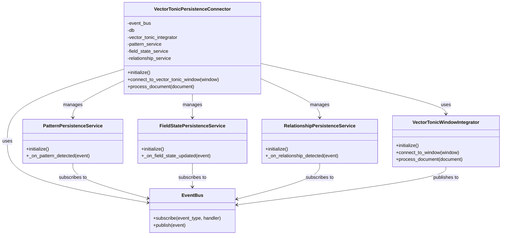

# Vector-Tonic Persistence Connector

This document details the connector implementation for the Vector-Tonic Persistence Integration. The connector orchestrates the integration between the Vector-Tonic Window system and the ArangoDB persistence layer, ensuring that patterns, field states, and relationships are properly captured and persisted.

## Connector Architecture



## Connector Implementation

```python
# connector.py
from typing import Dict, Any, Optional

from src.habitat_evolution.core.services.event_bus import LocalEventBus
from src.habitat_evolution.adaptive_core.persistence.arangodb.connection import ArangoDBConnectionManager
from src.habitat_evolution.adaptive_core.emergence.vector_tonic_window_integration import VectorTonicWindowIntegrator

from src.habitat_evolution.integration.vector_tonic_persistence.services.pattern_service import PatternPersistenceService
from src.habitat_evolution.integration.vector_tonic_persistence.services.field_state_service import FieldStatePersistenceService
from src.habitat_evolution.integration.vector_tonic_persistence.services.relationship_service import RelationshipPersistenceService

from src.habitat_evolution.integration.vector_tonic_persistence.adapters.pattern_adapter import PatternAdapter
from src.habitat_evolution.integration.vector_tonic_persistence.adapters.field_state_adapter import FieldStateAdapter
from src.habitat_evolution.integration.vector_tonic_persistence.adapters.relationship_adapter import RelationshipAdapter
from src.habitat_evolution.integration.vector_tonic_persistence.adapters.adaptive_id_adapter import AdaptiveIDAdapter

from src.habitat_evolution.pattern_aware_rag.persistence.arangodb.pattern_repository import PatternRepository
from src.habitat_evolution.pattern_aware_rag.persistence.arangodb.field_state_repository import TonicHarmonicFieldStateRepository
from src.habitat_evolution.pattern_aware_rag.persistence.arangodb.predicate_relationship_repository import PredicateRelationshipRepository
from src.habitat_evolution.adaptive_core.persistence.arangodb.adaptive_id_repository import AdaptiveIDRepository

class VectorTonicPersistenceConnector:
    """
    Connector between the vector-tonic-window system and the persistence layer.
    
    This class ensures that events from the vector-tonic-window system are properly
    captured and persisted in ArangoDB. It handles the bidirectional flow of information
    between the pattern detection system and the persistence infrastructure.
    
    The connector uses dependency injection to allow for flexible configuration and testing.
    It orchestrates the interaction between the vector-tonic-window system and the
    persistence services, ensuring that patterns, field states, and relationships are
    properly captured and persisted.
    """
    
    def __init__(self, 
                 event_bus=None, 
                 db=None, 
                 vector_tonic_integrator=None,
                 pattern_repository=None,
                 field_state_repository=None,
                 relationship_repository=None,
                 adaptive_id_repository=None):
        """
        Initialize the Vector-Tonic Persistence Connector.
        
        Args:
            event_bus: The event bus to use for communication between components.
                       If None, a new LocalEventBus will be created.
            db: The ArangoDB database connection to use for persistence.
                If None, a new connection will be created.
            vector_tonic_integrator: The integrator to use for connecting to the vector-tonic-window system.
                                    If None, a new VectorTonicWindowIntegrator will be created.
            pattern_repository: The repository to use for persisting patterns.
                               If None, a new PatternRepository will be created.
            field_state_repository: The repository to use for persisting field states.
                                   If None, a new TonicHarmonicFieldStateRepository will be created.
            relationship_repository: The repository to use for persisting relationships.
                                    If None, a new PredicateRelationshipRepository will be created.
            adaptive_id_repository: The repository to use for persisting AdaptiveIDs.
                                   If None, a new AdaptiveIDRepository will be created.
        """
        # Use provided dependencies or create defaults
        self.event_bus = event_bus or LocalEventBus()
        self.db = db or ArangoDBConnectionManager().get_db()
        self.vector_tonic_integrator = vector_tonic_integrator or VectorTonicWindowIntegrator(self.event_bus)
        
        # Create adapters
        self.pattern_adapter = PatternAdapter()
        self.field_state_adapter = FieldStateAdapter()
        self.relationship_adapter = RelationshipAdapter()
        self.adaptive_id_adapter = AdaptiveIDAdapter()
        
        # Create repositories if not provided
        self.pattern_repository = pattern_repository or PatternRepository(self.db)
        self.field_state_repository = field_state_repository or TonicHarmonicFieldStateRepository(self.db)
        self.relationship_repository = relationship_repository or PredicateRelationshipRepository(self.db)
        self.adaptive_id_repository = adaptive_id_repository or AdaptiveIDRepository(self.db)
        
        # Create services with injected dependencies
        self.pattern_service = PatternPersistenceService(
            self.event_bus, 
            self.pattern_repository, 
            self.pattern_adapter
        )
        
        self.field_state_service = FieldStatePersistenceService(
            self.event_bus, 
            self.field_state_repository, 
            self.field_state_adapter
        )
        
        self.relationship_service = RelationshipPersistenceService(
            self.event_bus, 
            self.relationship_repository, 
            self.adaptive_id_repository,
            self.relationship_adapter
        )
    
    def initialize(self):
        """
        Initialize all components of the connector.
        
        This method initializes the services and the vector-tonic integrator,
        ensuring that they are properly subscribed to events and ready to
        handle data from the vector-tonic-window system.
        """
        # Initialize services
        self.pattern_service.initialize()
        self.field_state_service.initialize()
        self.relationship_service.initialize()
        
        # Initialize vector-tonic integrator if needed
        if hasattr(self.vector_tonic_integrator, 'initialize'):
            self.vector_tonic_integrator.initialize()
            
        print("Vector-Tonic Persistence Connector initialized")
    
    def connect_to_vector_tonic_window(self, vector_tonic_window):
        """
        Connect to a specific vector-tonic window.
        
        Args:
            vector_tonic_window: The vector-tonic window to connect to.
            
        Returns:
            The connector instance for method chaining.
        """
        self.vector_tonic_integrator.connect_to_window(vector_tonic_window)
        print(f"Connected to vector-tonic window: {vector_tonic_window}")
        return self
        
    def process_document(self, document):
        """
        Process a document through the vector-tonic-window system.
        
        This method passes the document to the vector-tonic-window system,
        which will generate events for patterns, field states, and relationships.
        These events will be handled by the persistence services, which will
        persist the data in ArangoDB.
        
        Args:
            document: The document to process.
            
        Returns:
            The result of processing the document.
        """
        print(f"Processing document: {document.get('id', 'unknown')}")
        result = self.vector_tonic_integrator.process_document(document)
        print(f"Document processed: {document.get('id', 'unknown')}")
        return result
    
    def get_pattern_by_id(self, pattern_id):
        """
        Get a pattern by its ID.
        
        Args:
            pattern_id: The ID of the pattern to retrieve.
            
        Returns:
            The pattern if found, None otherwise.
        """
        persistence_model = self.pattern_repository.find_by_id(pattern_id)
        if not persistence_model:
            return None
        
        return self.pattern_adapter.from_persistence_model(persistence_model)
    
    def get_field_state_by_timestamp(self, timestamp):
        """
        Get field states by their timestamp.
        
        Args:
            timestamp: The timestamp to search for.
            
        Returns:
            A list of field states with the specified timestamp.
        """
        persistence_models = self.field_state_repository.find_by_timestamp(timestamp)
        return [self.field_state_adapter.from_persistence_model(model) for model in persistence_models]
    
    def get_latest_field_state(self):
        """
        Get the latest field state.
        
        Returns:
            The latest field state if available, None otherwise.
        """
        persistence_model = self.field_state_repository.get_latest()
        if not persistence_model:
            return None
        
        return self.field_state_adapter.from_persistence_model(persistence_model)
    
    def get_relationships_by_source(self, source_id):
        """
        Get relationships by their source ID.
        
        Args:
            source_id: The source ID to search for.
            
        Returns:
            A list of relationships with the specified source ID.
        """
        persistence_models = self.relationship_repository.find_by_source(source_id)
        return [self.relationship_adapter.from_persistence_model(model) for model in persistence_models]
    
    def get_relationships_by_target(self, target_id):
        """
        Get relationships by their target ID.
        
        Args:
            target_id: The target ID to search for.
            
        Returns:
            A list of relationships with the specified target ID.
        """
        persistence_models = self.relationship_repository.find_by_target(target_id)
        return [self.relationship_adapter.from_persistence_model(model) for model in persistence_models]
    
    def get_relationships_by_predicate(self, predicate):
        """
        Get relationships by their predicate.
        
        Args:
            predicate: The predicate to search for.
            
        Returns:
            A list of relationships with the specified predicate.
        """
        persistence_models = self.relationship_repository.find_by_predicate(predicate)
        return [self.relationship_adapter.from_persistence_model(model) for model in persistence_models]
```

## Factory Function for Easy Creation

```python
# connector.py (continued)
def create_connector(event_bus=None, db=None, vector_tonic_integrator=None):
    """
    Create and initialize a VectorTonicPersistenceConnector.
    
    This factory function creates a new VectorTonicPersistenceConnector with the
    specified dependencies, initializes it, and returns it. This is the recommended
    way to create a connector for most use cases.
    
    Args:
        event_bus: The event bus to use for communication between components.
                   If None, a new LocalEventBus will be created.
        db: The ArangoDB database connection to use for persistence.
            If None, a new connection will be created.
        vector_tonic_integrator: The integrator to use for connecting to the vector-tonic-window system.
                                If None, a new VectorTonicWindowIntegrator will be created.
    
    Returns:
        An initialized VectorTonicPersistenceConnector.
    """
    connector = VectorTonicPersistenceConnector(
        event_bus=event_bus,
        db=db,
        vector_tonic_integrator=vector_tonic_integrator
    )
    connector.initialize()
    return connector
```

## Usage Example

```python
# connector_usage_example.py
"""
Vector-Tonic Persistence Connector Usage Example.

This module demonstrates how to use the Vector-Tonic Persistence Connector
in a real-world scenario, processing documents and capturing patterns,
field states, and relationships in ArangoDB.
"""

from src.habitat_evolution.integration.vector_tonic_persistence.connector import create_connector
from src.habitat_evolution.adaptive_core.emergence.vector_tonic_window import VectorTonicWindow

def main():
    """
    Demonstrate the usage of the Vector-Tonic Persistence Connector.
    """
    # Create a Vector-Tonic Window
    vector_tonic_window = VectorTonicWindow()
    
    # Create and initialize the connector
    connector = create_connector()
    
    # Connect to the Vector-Tonic Window
    connector.connect_to_vector_tonic_window(vector_tonic_window)
    
    # Process a document
    document = {
        "id": "doc_123",
        "title": "Climate Risk Assessment",
        "content": "Climate change poses significant risks to coastal communities...",
        "metadata": {
            "source": "research_paper",
            "author": "Dr. Jane Smith",
            "date": "2025-03-15"
        }
    }
    
    result = connector.process_document(document)
    
    # Retrieve patterns
    patterns = connector.get_pattern_by_id(result.get("pattern_id"))
    
    # Retrieve field states
    field_states = connector.get_latest_field_state()
    
    # Retrieve relationships
    relationships = connector.get_relationships_by_source(document["id"])
    
    # Print results
    print(f"Processed document: {document['id']}")
    print(f"Detected patterns: {patterns}")
    print(f"Field state: {field_states}")
    print(f"Relationships: {relationships}")

if __name__ == "__main__":
    main()
```

## Testing the Connector

The connector should be thoroughly tested to ensure it correctly orchestrates the interaction between the Vector-Tonic Window system and the persistence layer. Here's an example of how to test the connector:

```python
# test_connector.py
import unittest
from unittest.mock import Mock, MagicMock
from datetime import datetime
from src.habitat_evolution.integration.vector_tonic_persistence.connector import VectorTonicPersistenceConnector

class TestVectorTonicPersistenceConnector(unittest.TestCase):
    def setUp(self):
        # Create mocks
        self.event_bus = Mock()
        self.db = Mock()
        self.vector_tonic_integrator = Mock()
        self.pattern_repository = Mock()
        self.field_state_repository = Mock()
        self.relationship_repository = Mock()
        self.adaptive_id_repository = Mock()
        
        # Create the connector with mocked dependencies
        self.connector = VectorTonicPersistenceConnector(
            event_bus=self.event_bus,
            db=self.db,
            vector_tonic_integrator=self.vector_tonic_integrator,
            pattern_repository=self.pattern_repository,
            field_state_repository=self.field_state_repository,
            relationship_repository=self.relationship_repository,
            adaptive_id_repository=self.adaptive_id_repository
        )
    
    def test_initialize(self):
        # Initialize the connector
        self.connector.initialize()
        
        # Check that the services were initialized
        self.assertTrue(hasattr(self.connector, 'pattern_service'))
        self.assertTrue(hasattr(self.connector, 'field_state_service'))
        self.assertTrue(hasattr(self.connector, 'relationship_service'))
    
    def test_connect_to_vector_tonic_window(self):
        # Create a mock window
        window = Mock()
        
        # Connect to the window
        self.connector.connect_to_vector_tonic_window(window)
        
        # Check that the integrator was called with the window
        self.vector_tonic_integrator.connect_to_window.assert_called_once_with(window)
    
    def test_process_document(self):
        # Create a mock document
        document = {"id": "doc_123", "content": "Test content"}
        
        # Set up the integrator to return a result
        expected_result = {"pattern_id": "pattern_123"}
        self.vector_tonic_integrator.process_document.return_value = expected_result
        
        # Process the document
        result = self.connector.process_document(document)
        
        # Check that the integrator was called with the document
        self.vector_tonic_integrator.process_document.assert_called_once_with(document)
        
        # Check that the method returned the expected result
        self.assertEqual(result, expected_result)
    
    def test_get_pattern_by_id(self):
        # Set up the repository to return a pattern
        pattern_id = "pattern_123"
        persistence_model = {"_key": pattern_id, "name": "Test Pattern"}
        self.pattern_repository.find_by_id.return_value = persistence_model
        
        # Set up the adapter to return a pattern
        expected_pattern = MagicMock()
        self.connector.pattern_adapter.from_persistence_model = Mock(return_value=expected_pattern)
        
        # Get the pattern
        pattern = self.connector.get_pattern_by_id(pattern_id)
        
        # Check that the repository was called with the pattern ID
        self.pattern_repository.find_by_id.assert_called_once_with(pattern_id)
        
        # Check that the adapter was called with the persistence model
        self.connector.pattern_adapter.from_persistence_model.assert_called_once_with(persistence_model)
        
        # Check that the method returned the expected pattern
        self.assertEqual(pattern, expected_pattern)

if __name__ == "__main__":
    unittest.main()
```

## Integration with Existing Codebase

To integrate the Vector-Tonic Persistence Connector with the existing codebase, follow these steps:

1. Create the package structure as outlined in the architecture documentation
2. Implement the interfaces, adapters, and services
3. Implement the connector
4. Update the existing code to use the connector

Here's an example of how to update the existing code to use the connector:

```python
# existing_code.py
from src.habitat_evolution.integration.vector_tonic_persistence.connector import create_connector

# Create and initialize the connector
connector = create_connector()

# Connect to the existing Vector-Tonic Window
connector.connect_to_vector_tonic_window(existing_vector_tonic_window)

# Use the connector to process documents
result = connector.process_document(document)
```

This approach allows for a gradual integration of the connector into the existing codebase, without disrupting the current functionality.

For more detailed connector implementation and tests, see the additional documentation:

- [Connector Tests](./vector_tonic_persistence_connector_tests.md)
- [Integration Tests](./vector_tonic_persistence_integration_tests.md)
