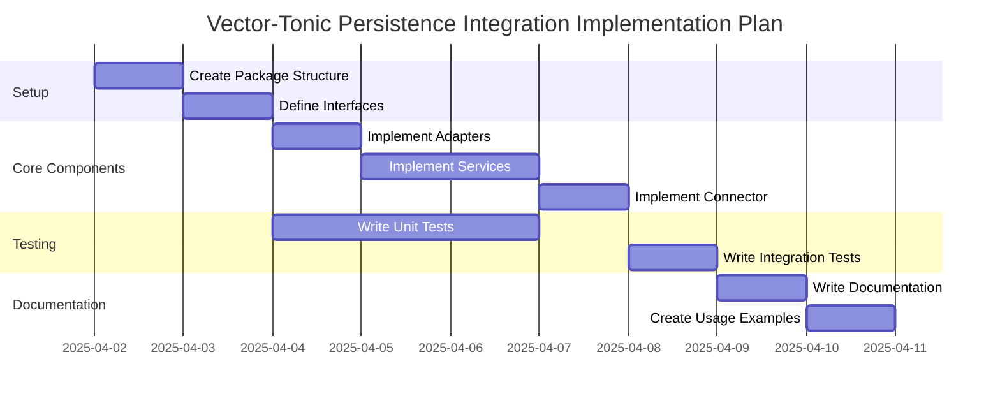

# Vector-Tonic Persistence Integration Implementation Plan

## Overview

This document outlines the implementation plan for integrating the Vector-Tonic Window system with the ArangoDB persistence layer in Habitat Evolution. The plan follows a test-driven approach and leverages dependency injection and the adapter pattern to create a flexible, maintainable architecture.

## Implementation Timeline

The implementation of the Vector-Tonic Persistence Integration is expected to take several days and will be broken down into the following phases:

## Phase 1: Setup (Days 1-2)

### Day 1: Create Package Structure

1. Create the integration package structure
2. Set up the test directory structure
3. Create empty files for interfaces, adapters, services, and connector

### Day 2: Define Interfaces

1. Define repository interfaces
2. Define service interfaces
3. Define adapter interfaces
4. Write tests for interfaces

## Phase 2: Core Components (Days 3-6)

### Day 3: Implement Adapters

1. Implement Pattern Adapter
2. Implement Field State Adapter
3. Implement Relationship Adapter
4. Implement AdaptiveID Adapter
5. Write tests for adapters

### Days 4-5: Implement Services

1. Implement Pattern Persistence Service
2. Implement Field State Persistence Service
3. Implement Relationship Persistence Service
4. Write tests for services

### Day 6: Implement Connector

1. Implement Vector-Tonic Persistence Connector
2. Implement factory function for easy creation
3. Write tests for connector

## Phase 3: Testing (Days 3-7)

### Days 3-5: Write Unit Tests

1. Write tests for interfaces
2. Write tests for adapters
3. Write tests for services
4. Write tests for connector

### Day 7: Write Integration Tests

1. Write tests for the integration between the Vector-Tonic Window system and the persistence layer
2. Write tests for the end-to-end flow of data from document ingestion to persistence

## Phase 4: Documentation (Days 8-9)

### Day 8: Write Documentation

1. Write documentation for interfaces
2. Write documentation for adapters
3. Write documentation for services
4. Write documentation for connector

### Day 9: Create Usage Examples

1. Create usage examples for common scenarios
2. Create integration guides for different use cases
3. Create troubleshooting guides

## Test-Driven Development Approach

The implementation will follow a test-driven development approach, with the following steps for each component:

1. Write tests that define the expected behavior
2. Implement the component to pass the tests
3. Refactor the implementation as needed
4. Repeat for the next component

This approach ensures that each component meets its requirements and integrates properly with the others.

## Dependency Injection

The implementation will use dependency injection to decouple components and make testing easier. This involves:

1. Components receive their dependencies through constructors
2. Default implementations are provided for convenience
3. Tests can provide mock implementations for dependencies

## Adapter Pattern

The implementation will use the adapter pattern to bridge between different components. This involves:

1. Adapters translate between domain models and persistence models
2. Adapters handle impedance mismatches between components
3. Adapters support the co-evolution principles of the system

## Interface-Based Design

The implementation will use interface-based design to define clear contracts between components. This involves:

1. Interfaces define the behavior of components
2. Multiple implementations can be provided for the same interface
3. Tests can use mock implementations of interfaces

## Event-Driven Architecture

The implementation will use an event-driven architecture to reduce direct dependencies between components. This involves:

1. Components communicate through events
2. Services subscribe to relevant events
3. The event bus decouples publishers and subscribers

## Integration with Existing Codebase

The implementation will integrate with the existing codebase in a way that minimizes disruption. This involves:

1. Creating a new package structure for the integration
2. Using the existing event bus for communication
3. Connecting to the existing Vector-Tonic Window system
4. Using the existing ArangoDB connection for persistence

## Documentation and Examples

The implementation will include comprehensive documentation and examples to make it easy to understand and use. This includes:

1. Documentation for each component
2. Usage examples for common scenarios
3. Integration guides for different use cases
4. Troubleshooting guides

## Conclusion

This implementation plan provides a roadmap for integrating the Vector-Tonic Window system with the ArangoDB persistence layer in Habitat Evolution. By following a test-driven approach and leveraging dependency injection and the adapter pattern, the integration will be flexible, maintainable, and aligned with the pattern evolution and co-evolution principles of Habitat.
