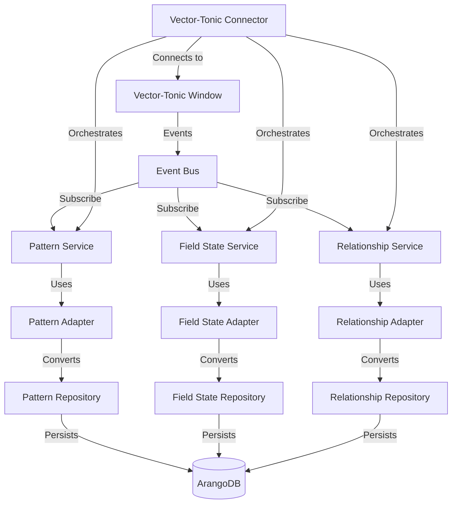

# Vector-Tonic Persistence Integration

## Overview

This document outlines the architecture and implementation plan for integrating the Vector-Tonic Window system with the ArangoDB persistence layer in Habitat Evolution. The integration follows a test-driven approach and leverages dependency injection and the adapter pattern to create a flexible, maintainable architecture.

## Table of Contents

1. [Architectural Principles](#architectural-principles)
2. [Package Structure](#package-structure)
3. [Component Interfaces](#component-interfaces)
4. [Adapters](#adapters)
5. [Services](#services)
6. [Connector](#connector)
7. [Implementation Plan](#implementation-plan)
8. [Testing Strategy](#testing-strategy)
9. [Usage Examples](#usage-examples)
10. [Integration with Existing Codebase](#integration-with-existing-codebase)

## Architectural Principles

The Vector-Tonic Persistence Integration is built on several key architectural principles:

### Dependency Injection

Components receive their dependencies through constructors rather than creating them directly. This approach:

- Decouples components, making testing easier
- Allows for swapping implementations (e.g., different persistence layers)
- Reduces import issues by centralizing dependencies

### Adapter Pattern

Adapters bridge between different components, handling the translation between different models and formats:

- Maintains separation of concerns
- Handles impedance mismatches between components
- Supports the co-evolution principles of the system

### Interface-Based Design

All components define clear interfaces that specify their behavior:

- Enables multiple implementations of the same interface
- Facilitates testing through mock implementations
- Creates a contract between components

### Event-Driven Architecture

The integration leverages an event-driven architecture:

- Components communicate through events
- Services subscribe to relevant events
- Reduces direct dependencies between components

## Package Structure

```
src/habitat_evolution/integration/
├── __init__.py
├── vector_tonic_persistence/
│   ├── __init__.py
│   ├── interfaces/
│   │   ├── __init__.py
│   │   ├── persistence_interfaces.py
│   │   ├── pattern_interfaces.py
│   │   ├── field_state_interfaces.py
│   │   └── relationship_interfaces.py
│   ├── adapters/
│   │   ├── __init__.py
│   │   ├── adaptive_id_adapter.py
│   │   ├── pattern_adapter.py
│   │   ├── field_state_adapter.py
│   │   └── relationship_adapter.py
│   ├── services/
│   │   ├── __init__.py
│   │   ├── persistence_service.py
│   │   ├── pattern_service.py
│   │   ├── field_state_service.py
│   │   └── relationship_service.py
│   └── connector.py
└── tests/
    ├── __init__.py
    ├── test_interfaces.py
    ├── test_adapters.py
    ├── test_services.py
    └── test_connector.py
```

## System Architecture



## Component Interfaces

### Repository Interfaces

```python
# persistence_interfaces.py
from typing import Protocol, Dict, Any, List, Optional
from datetime import datetime

class AdaptiveIDRepository(Protocol):
    """
    Interface for a repository that manages AdaptiveID objects.
    
    This repository is responsible for persisting and retrieving AdaptiveID objects,
    which represent the identity and versioning of concepts in the system.
    """
    
    def save(self, adaptive_id: Any) -> str:
        """
        Save an AdaptiveID object to the repository.
        
        Args:
            adaptive_id: The AdaptiveID object to save.
            
        Returns:
            The ID of the saved AdaptiveID.
        """
        ...
    
    def find_by_id(self, id: str) -> Optional[Any]:
        """
        Find an AdaptiveID by its ID.
        
        Args:
            id: The ID of the AdaptiveID to find.
            
        Returns:
            The AdaptiveID if found, None otherwise.
        """
        ...
    
    def find_by_base_concept(self, base_concept: str) -> List[Any]:
        """
        Find AdaptiveIDs by their base concept.
        
        Args:
            base_concept: The base concept to search for.
            
        Returns:
            A list of AdaptiveIDs with the specified base concept.
        """
        ...

class PatternRepository(Protocol):
    """
    Interface for a repository that manages pattern objects.
    
    This repository is responsible for persisting and retrieving patterns,
    which represent coherent structures detected in the vector-tonic window.
    """
    
    def save(self, pattern: Dict[str, Any]) -> str:
        """
        Save a pattern to the repository.
        
        Args:
            pattern: The pattern to save.
            
        Returns:
            The ID of the saved pattern.
        """
        ...
    
    def find_by_id(self, id: str) -> Optional[Dict[str, Any]]:
        """
        Find a pattern by its ID.
        
        Args:
            id: The ID of the pattern to find.
            
        Returns:
            The pattern if found, None otherwise.
        """
        ...
    
    def find_by_relationship(self, source: str, predicate: str, target: str) -> List[Dict[str, Any]]:
        """
        Find patterns by their relationship structure.
        
        Args:
            source: The source of the relationship.
            predicate: The predicate of the relationship.
            target: The target of the relationship.
            
        Returns:
            A list of patterns with the specified relationship structure.
        """
        ...

class FieldStateRepository(Protocol):
    """
    Interface for a repository that manages field state objects.
    
    This repository is responsible for persisting and retrieving field states,
    which represent the state of the vector-tonic field at a specific point in time.
    """
    
    def save(self, field_state: Dict[str, Any]) -> str:
        """
        Save a field state to the repository.
        
        Args:
            field_state: The field state to save.
            
        Returns:
            The ID of the saved field state.
        """
        ...
    
    def find_by_timestamp(self, timestamp: datetime) -> List[Dict[str, Any]]:
        """
        Find field states by their timestamp.
        
        Args:
            timestamp: The timestamp to search for.
            
        Returns:
            A list of field states with the specified timestamp.
        """
        ...
    
    def get_latest(self) -> Optional[Dict[str, Any]]:
        """
        Get the latest field state.
        
        Returns:
            The latest field state if available, None otherwise.
        """
        ...

class RelationshipRepository(Protocol):
    """
    Interface for a repository that manages relationship objects.
    
    This repository is responsible for persisting and retrieving relationships,
    which represent connections between concepts in the system.
    """
    
    def save_relationship(self, source_id: str, predicate: str, target_id: str, metadata: Dict[str, Any]) -> str:
        """
        Save a relationship to the repository.
        
        Args:
            source_id: The ID of the source entity.
            predicate: The predicate of the relationship.
            target_id: The ID of the target entity.
            metadata: Additional metadata for the relationship.
            
        Returns:
            The ID of the saved relationship.
        """
        ...
    
    def find_by_source(self, source_id: str) -> List[Dict[str, Any]]:
        """
        Find relationships by their source ID.
        
        Args:
            source_id: The source ID to search for.
            
        Returns:
            A list of relationships with the specified source ID.
        """
        ...
    
    def find_by_target(self, target_id: str) -> List[Dict[str, Any]]:
        """
        Find relationships by their target ID.
        
        Args:
            target_id: The target ID to search for.
            
        Returns:
            A list of relationships with the specified target ID.
        """
        ...
    
    def find_by_predicate(self, predicate: str) -> List[Dict[str, Any]]:
        """
        Find relationships by their predicate.
        
        Args:
            predicate: The predicate to search for.
            
        Returns:
            A list of relationships with the specified predicate.
        """
        ...
```

For more detailed interfaces and implementations, see the additional documentation:

- [Pattern Interfaces](./vector_tonic_persistence_interfaces.md)
- [Field State Interfaces](./vector_tonic_persistence_field_state.md)
- [Relationship Interfaces](./vector_tonic_persistence_relationship.md)
