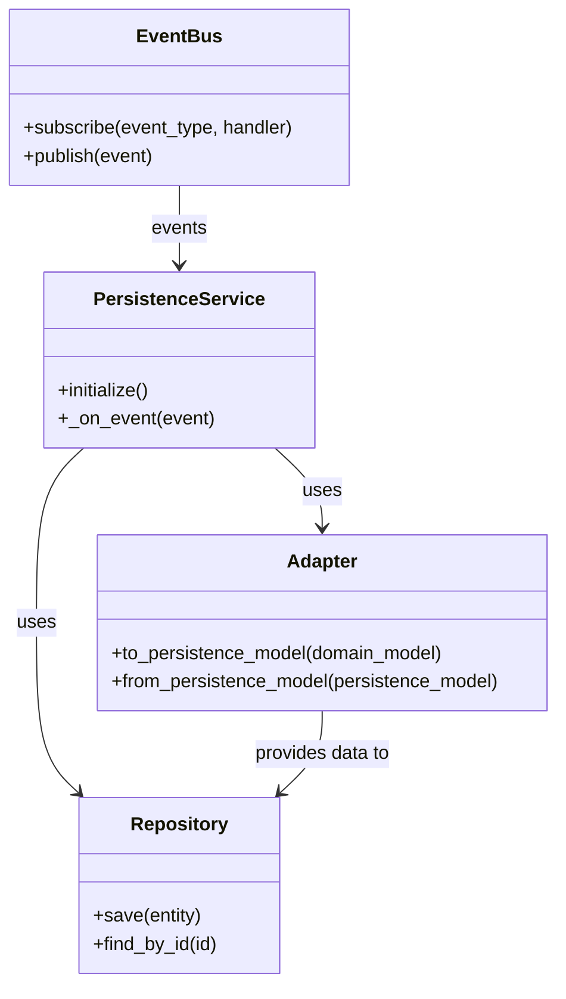

# Vector-Tonic Persistence Services

This document details the service implementations for the Vector-Tonic Persistence Integration. Services are responsible for handling events from the Vector-Tonic Window system and persisting the relevant data in ArangoDB.

## Service Architecture



## Pattern Persistence Service

The Pattern Persistence Service handles pattern detection events from the Vector-Tonic Window system and persists them in ArangoDB.

```python
# pattern_service.py
from typing import Dict, Any, List, Optional, Protocol
from datetime import datetime
import json

from src.habitat_evolution.core.services.event_bus import Event, LocalEventBus
from src.habitat_evolution.integration.vector_tonic_persistence.interfaces.persistence_interfaces import PatternRepository
from src.habitat_evolution.integration.vector_tonic_persistence.adapters.pattern_adapter import PatternAdapter

class PatternPersistenceService:
    """
    Service for persisting patterns detected by the vector-tonic-window system.
    
    This service subscribes to pattern-related events from the vector-tonic-window
    system and persists them in ArangoDB using the Pattern Repository.
    """
    
    def __init__(self, event_bus: Any, pattern_repository: PatternRepository, pattern_adapter: PatternAdapter):
        """
        Initialize the Pattern Persistence Service.
        
        Args:
            event_bus: The event bus to subscribe to for pattern events.
            pattern_repository: The repository for persisting patterns.
            pattern_adapter: The adapter for converting between domain and persistence models.
        """
        self.event_bus = event_bus
        self.pattern_repository = pattern_repository
        self.pattern_adapter = pattern_adapter
    
    def initialize(self):
        """
        Initialize the service and subscribe to events.
        
        This method subscribes to pattern-related events from the vector-tonic-window
        system, such as pattern detection and evolution events.
        """
        self.event_bus.subscribe("pattern_detected", self._on_pattern_detected)
        self.event_bus.subscribe("pattern_evolved", self._on_pattern_evolved)
        self.event_bus.subscribe("pattern_merged", self._on_pattern_merged)
        self.event_bus.subscribe("pattern_split", self._on_pattern_split)
        self.event_bus.subscribe("pattern_dissolved", self._on_pattern_dissolved)
        
        print("Pattern Persistence Service initialized")
    
    def _on_pattern_detected(self, event: Event):
        """
        Handle pattern detected events.
        
        Args:
            event: The pattern detected event from the event bus.
            
        Returns:
            The ID of the persisted pattern.
        """
        pattern_data = event.data
        
        # Convert to persistence model
        persistence_model = self.pattern_adapter.to_persistence_model(pattern_data)
        
        # Add detection metadata
        if "metadata" not in persistence_model:
            persistence_model["metadata"] = {}
        
        persistence_model["metadata"]["detection_event_id"] = getattr(event, "id", None)
        persistence_model["metadata"]["detection_timestamp"] = datetime.now().isoformat()
        
        # Save to repository
        pattern_id = self.pattern_repository.save(persistence_model)
        
        # Log the persistence
        print(f"Pattern {pattern_id} persisted successfully")
        
        # Publish pattern persisted event
        self.event_bus.publish(Event(
            type="pattern_persisted",
            data={
                "pattern_id": pattern_id,
                "original_event_id": getattr(event, "id", None)
            }
        ))
        
        return pattern_id
    
    def _on_pattern_evolved(self, event: Event):
        """
        Handle pattern evolved events.
        
        Args:
            event: The pattern evolved event from the event bus.
            
        Returns:
            The ID of the persisted pattern.
        """
        pattern_data = event.data
        pattern_id = getattr(pattern_data, "id", None)
        
        # Find the existing pattern
        existing_pattern = None
        if pattern_id:
            existing_pattern = self.pattern_repository.find_by_id(pattern_id)
        
        if not existing_pattern:
            # If the pattern doesn't exist, treat it as a new pattern
            return self._on_pattern_detected(event)
        
        # Convert to persistence model
        persistence_model = self.pattern_adapter.to_persistence_model(pattern_data)
        
        # Add evolution metadata
        if "metadata" not in persistence_model:
            persistence_model["metadata"] = {}
        
        persistence_model["metadata"]["evolution_event_id"] = getattr(event, "id", None)
        persistence_model["metadata"]["evolution_timestamp"] = datetime.now().isoformat()
        
        # Merge with existing pattern
        for key, value in existing_pattern.items():
            if key not in persistence_model or persistence_model[key] is None:
                persistence_model[key] = value
        
        # Save to repository
        pattern_id = self.pattern_repository.save(persistence_model)
        
        # Log the persistence
        print(f"Pattern {pattern_id} evolved and persisted successfully")
        
        # Publish pattern evolved and persisted event
        self.event_bus.publish(Event(
            type="pattern_evolved_persisted",
            data={
                "pattern_id": pattern_id,
                "original_event_id": getattr(event, "id", None)
            }
        ))
        
        return pattern_id
    
    def _on_pattern_merged(self, event: Event):
        """
        Handle pattern merged events.
        
        Args:
            event: The pattern merged event from the event bus.
            
        Returns:
            The ID of the merged pattern.
        """
        # Implementation for pattern merging
        # This would handle the case where two patterns are merged into one
        pass
    
    def _on_pattern_split(self, event: Event):
        """
        Handle pattern split events.
        
        Args:
            event: The pattern split event from the event bus.
            
        Returns:
            A list of IDs for the resulting patterns.
        """
        # Implementation for pattern splitting
        # This would handle the case where one pattern is split into multiple patterns
        pass
    
    def _on_pattern_dissolved(self, event: Event):
        """
        Handle pattern dissolved events.
        
        Args:
            event: The pattern dissolved event from the event bus.
            
        Returns:
            The ID of the dissolved pattern.
        """
        # Implementation for pattern dissolution
        # This would handle the case where a pattern is no longer valid and should be marked as dissolved
        pass
```

## Field State Persistence Service

The Field State Persistence Service handles field state update events from the Vector-Tonic Window system and persists them in ArangoDB.

```python
# field_state_service.py
from typing import Dict, Any, List, Optional, Protocol
from datetime import datetime
import json

from src.habitat_evolution.core.services.event_bus import Event, LocalEventBus
from src.habitat_evolution.integration.vector_tonic_persistence.interfaces.persistence_interfaces import FieldStateRepository
from src.habitat_evolution.integration.vector_tonic_persistence.adapters.field_state_adapter import FieldStateAdapter

class FieldStatePersistenceService:
    """
    Service for persisting field states from the vector-tonic-window system.
    
    This service subscribes to field state-related events from the vector-tonic-window
    system and persists them in ArangoDB using the Field State Repository.
    """
    
    def __init__(self, event_bus: Any, field_state_repository: FieldStateRepository, field_state_adapter: FieldStateAdapter):
        """
        Initialize the Field State Persistence Service.
        
        Args:
            event_bus: The event bus to subscribe to for field state events.
            field_state_repository: The repository for persisting field states.
            field_state_adapter: The adapter for converting between domain and persistence models.
        """
        self.event_bus = event_bus
        self.field_state_repository = field_state_repository
        self.field_state_adapter = field_state_adapter
    
    def initialize(self):
        """
        Initialize the service and subscribe to events.
        
        This method subscribes to field state-related events from the vector-tonic-window
        system, such as field state updates and topology changes.
        """
        self.event_bus.subscribe("field_state_updated", self._on_field_state_updated)
        self.event_bus.subscribe("topology_metrics_updated", self._on_topology_metrics_updated)
        self.event_bus.subscribe("system_metrics_updated", self._on_system_metrics_updated)
        self.event_bus.subscribe("parameters_adjusted", self._on_parameters_adjusted)
        
        print("Field State Persistence Service initialized")
    
    def _on_field_state_updated(self, event: Event):
        """
        Handle field state updated events.
        
        Args:
            event: The field state updated event from the event bus.
            
        Returns:
            The ID of the persisted field state.
        """
        field_state_data = event.data.get('field_state', {})
        
        # Convert to persistence model
        persistence_model = self.field_state_adapter.to_persistence_model(field_state_data)
        
        # Add update metadata
        if "metadata" not in persistence_model:
            persistence_model["metadata"] = {}
        
        persistence_model["metadata"]["update_event_id"] = getattr(event, "id", None)
        persistence_model["metadata"]["update_timestamp"] = datetime.now().isoformat()
        
        # Save to repository
        field_state_id = self.field_state_repository.save(persistence_model)
        
        # Log the persistence
        print(f"Field state {field_state_id} persisted successfully")
        
        # Publish field state persisted event
        self.event_bus.publish(Event(
            type="field_state_persisted",
            data={
                "field_state_id": field_state_id,
                "original_event_id": getattr(event, "id", None)
            }
        ))
        
        return field_state_id
    
    def _on_topology_metrics_updated(self, event: Event):
        """
        Handle topology metrics updated events.
        
        Args:
            event: The topology metrics updated event from the event bus.
            
        Returns:
            The ID of the persisted field state.
        """
        topology_metrics = event.data.get('topology_metrics', {})
        
        # Get the latest field state
        latest_field_state = self.field_state_repository.get_latest()
        
        if not latest_field_state:
            # If there's no existing field state, create a new one
            field_state_data = {
                "topology_metrics": topology_metrics,
                "timestamp": datetime.now().isoformat()
            }
            
            # Convert to persistence model
            persistence_model = self.field_state_adapter.to_persistence_model(field_state_data)
        else:
            # Update the existing field state
            persistence_model = latest_field_state
            persistence_model["topology_metrics"] = topology_metrics
            persistence_model["timestamp"] = datetime.now().isoformat()
        
        # Add update metadata
        if "metadata" not in persistence_model:
            persistence_model["metadata"] = {}
        
        persistence_model["metadata"]["topology_update_event_id"] = getattr(event, "id", None)
        persistence_model["metadata"]["topology_update_timestamp"] = datetime.now().isoformat()
        
        # Save to repository
        field_state_id = self.field_state_repository.save(persistence_model)
        
        # Log the persistence
        print(f"Topology metrics updated and persisted successfully in field state {field_state_id}")
        
        return field_state_id
    
    def _on_system_metrics_updated(self, event: Event):
        """
        Handle system metrics updated events.
        
        Args:
            event: The system metrics updated event from the event bus.
            
        Returns:
            The ID of the persisted field state.
        """
        system_metrics = event.data.get('system_metrics', {})
        
        # Get the latest field state
        latest_field_state = self.field_state_repository.get_latest()
        
        if not latest_field_state:
            # If there's no existing field state, create a new one
            field_state_data = {
                "system_metrics": system_metrics,
                "timestamp": datetime.now().isoformat()
            }
            
            # Convert to persistence model
            persistence_model = self.field_state_adapter.to_persistence_model(field_state_data)
        else:
            # Update the existing field state
            persistence_model = latest_field_state
            persistence_model["system_metrics"] = system_metrics
            persistence_model["timestamp"] = datetime.now().isoformat()
        
        # Add update metadata
        if "metadata" not in persistence_model:
            persistence_model["metadata"] = {}
        
        persistence_model["metadata"]["system_update_event_id"] = getattr(event, "id", None)
        persistence_model["metadata"]["system_update_timestamp"] = datetime.now().isoformat()
        
        # Save to repository
        field_state_id = self.field_state_repository.save(persistence_model)
        
        # Log the persistence
        print(f"System metrics updated and persisted successfully in field state {field_state_id}")
        
        return field_state_id
    
    def _on_parameters_adjusted(self, event: Event):
        """
        Handle parameters adjusted events.
        
        Args:
            event: The parameters adjusted event from the event bus.
            
        Returns:
            The ID of the persisted field state.
        """
        parameters = event.data.get('parameters', {})
        
        # Get the latest field state
        latest_field_state = self.field_state_repository.get_latest()
        
        if not latest_field_state:
            # If there's no existing field state, create a new one
            field_state_data = {
                "parameters": parameters,
                "timestamp": datetime.now().isoformat()
            }
            
            # Convert to persistence model
            persistence_model = self.field_state_adapter.to_persistence_model(field_state_data)
        else:
            # Update the existing field state
            persistence_model = latest_field_state
            persistence_model["parameters"] = parameters
            persistence_model["timestamp"] = datetime.now().isoformat()
        
        # Add update metadata
        if "metadata" not in persistence_model:
            persistence_model["metadata"] = {}
        
        persistence_model["metadata"]["parameters_update_event_id"] = getattr(event, "id", None)
        persistence_model["metadata"]["parameters_update_timestamp"] = datetime.now().isoformat()
        
        # Save to repository
        field_state_id = self.field_state_repository.save(persistence_model)
        
        # Log the persistence
        print(f"Parameters updated and persisted successfully in field state {field_state_id}")
        
        return field_state_id
```

## Relationship Persistence Service

The Relationship Persistence Service handles relationship detection events from the Vector-Tonic Window system and persists them in ArangoDB.

```python
# relationship_service.py
from typing import Dict, Any, List, Optional, Protocol
from datetime import datetime
import json

from src.habitat_evolution.core.services.event_bus import Event, LocalEventBus
from src.habitat_evolution.integration.vector_tonic_persistence.interfaces.persistence_interfaces import RelationshipRepository, AdaptiveIDRepository
from src.habitat_evolution.integration.vector_tonic_persistence.adapters.relationship_adapter import RelationshipAdapter
from src.habitat_evolution.adaptive_core.id.adaptive_id import AdaptiveID

class RelationshipPersistenceService:
    """
    Service for persisting relationships detected by the vector-tonic-window system.
    
    This service subscribes to relationship-related events from the vector-tonic-window
    system and persists them in ArangoDB using the Relationship Repository.
    """
    
    def __init__(self, 
                 event_bus: Any, 
                 relationship_repository: RelationshipRepository, 
                 adaptive_id_repository: AdaptiveIDRepository,
                 relationship_adapter: RelationshipAdapter):
        """
        Initialize the Relationship Persistence Service.
        
        Args:
            event_bus: The event bus to subscribe to for relationship events.
            relationship_repository: The repository for persisting relationships.
            adaptive_id_repository: The repository for managing AdaptiveIDs.
            relationship_adapter: The adapter for converting between domain and persistence models.
        """
        self.event_bus = event_bus
        self.relationship_repository = relationship_repository
        self.adaptive_id_repository = adaptive_id_repository
        self.relationship_adapter = relationship_adapter
    
    def initialize(self):
        """
        Initialize the service and subscribe to events.
        
        This method subscribes to relationship-related events from the vector-tonic-window
        system, such as relationship detection and evolution events.
        """
        self.event_bus.subscribe("relationship_detected", self._on_relationship_detected)
        self.event_bus.subscribe("relationship_evolved", self._on_relationship_evolved)
        self.event_bus.subscribe("relationship_dissolved", self._on_relationship_dissolved)
        
        print("Relationship Persistence Service initialized")
    
    def _on_relationship_detected(self, event: Event):
        """
        Handle relationship detected events.
        
        Args:
            event: The relationship detected event from the event bus.
            
        Returns:
            The ID of the persisted relationship.
        """
        rel_data = event.data
        
        # Extract relationship data
        relationship = self.relationship_adapter.extract_relationship_from_event(event)
        
        # Find or create AdaptiveIDs for source and target
        source_id = relationship.get("source_id")
        target_id = relationship.get("target_id")
        
        source_adaptive_id = self._find_or_create_adaptive_id(source_id)
        target_adaptive_id = self._find_or_create_adaptive_id(target_id)
        
        # Convert to persistence model
        persistence_model = self.relationship_adapter.to_persistence_model(relationship)
        
        # Add detection metadata
        if "metadata" not in persistence_model:
            persistence_model["metadata"] = {}
        
        persistence_model["metadata"]["detection_event_id"] = getattr(event, "id", None)
        persistence_model["metadata"]["detection_timestamp"] = datetime.now().isoformat()
        
        # Save to repository
        relationship_id = self.relationship_repository.save_relationship(
            source_id=source_adaptive_id.id,
            predicate=relationship.get("predicate"),
            target_id=target_adaptive_id.id,
            metadata=persistence_model.get("metadata", {})
        )
        
        # Log the persistence
        print(f"Relationship {relationship_id} persisted successfully")
        
        # Publish relationship persisted event
        self.event_bus.publish(Event(
            type="relationship_persisted",
            data={
                "relationship_id": relationship_id,
                "original_event_id": getattr(event, "id", None)
            }
        ))
        
        return relationship_id
    
    def _on_relationship_evolved(self, event: Event):
        """
        Handle relationship evolved events.
        
        Args:
            event: The relationship evolved event from the event bus.
            
        Returns:
            The ID of the persisted relationship.
        """
        # Implementation for relationship evolution
        # This would handle the case where a relationship changes over time
        pass
    
    def _on_relationship_dissolved(self, event: Event):
        """
        Handle relationship dissolved events.
        
        Args:
            event: The relationship dissolved event from the event bus.
            
        Returns:
            The ID of the dissolved relationship.
        """
        # Implementation for relationship dissolution
        # This would handle the case where a relationship is no longer valid
        pass
    
    def _find_or_create_adaptive_id(self, entity_id: str) -> AdaptiveID:
        """
        Find or create an AdaptiveID for an entity.
        
        Args:
            entity_id: The ID of the entity.
            
        Returns:
            The AdaptiveID for the entity.
        """
        # Try to find the AdaptiveID
        adaptive_id = self.adaptive_id_repository.find_by_id(entity_id)
        
        if not adaptive_id:
            # Create a new AdaptiveID
            adaptive_id = AdaptiveID(
                base_concept=entity_id,
                creator_id="relationship_persistence_service"
            )
            
            # Save the AdaptiveID
            self.adaptive_id_repository.save(adaptive_id)
        
        return adaptive_id
```

## Testing Services

Each service should be thoroughly tested to ensure it correctly handles events and persists data. Here's an example of how to test the Pattern Persistence Service:

```python
# test_pattern_service.py
import unittest
from unittest.mock import Mock, MagicMock
from datetime import datetime
from src.habitat_evolution.core.services.event_bus import Event, LocalEventBus
from src.habitat_evolution.integration.vector_tonic_persistence.services.pattern_service import PatternPersistenceService

class TestPatternPersistenceService(unittest.TestCase):
    def setUp(self):
        # Create mocks
        self.event_bus = Mock(spec=LocalEventBus)
        self.pattern_repository = Mock()
        self.pattern_adapter = Mock()
        
        # Create the service
        self.service = PatternPersistenceService(
            event_bus=self.event_bus,
            pattern_repository=self.pattern_repository,
            pattern_adapter=self.pattern_adapter
        )
    
    def test_initialize(self):
        # Initialize the service
        self.service.initialize()
        
        # Check that the service subscribed to the correct events
        self.event_bus.subscribe.assert_any_call("pattern_detected", self.service._on_pattern_detected)
        self.event_bus.subscribe.assert_any_call("pattern_evolved", self.service._on_pattern_evolved)
        self.event_bus.subscribe.assert_any_call("pattern_merged", self.service._on_pattern_merged)
        self.event_bus.subscribe.assert_any_call("pattern_split", self.service._on_pattern_split)
        self.event_bus.subscribe.assert_any_call("pattern_dissolved", self.service._on_pattern_dissolved)
    
    def test_on_pattern_detected(self):
        # Create a mock event
        pattern_data = MagicMock()
        event = Event(type="pattern_detected", data=pattern_data)
        
        # Set up the adapter to return a persistence model
        persistence_model = {"_key": "pattern_123", "name": "Test Pattern"}
        self.pattern_adapter.to_persistence_model.return_value = persistence_model
        
        # Set up the repository to return a pattern ID
        self.pattern_repository.save.return_value = "pattern_123"
        
        # Call the method
        pattern_id = self.service._on_pattern_detected(event)
        
        # Check that the adapter was called with the pattern data
        self.pattern_adapter.to_persistence_model.assert_called_once_with(pattern_data)
        
        # Check that the repository was called with the persistence model
        self.pattern_repository.save.assert_called_once()
        
        # Check that the method returned the pattern ID
        self.assertEqual(pattern_id, "pattern_123")
        
        # Check that the service published a pattern persisted event
        self.event_bus.publish.assert_called_once()
        published_event = self.event_bus.publish.call_args[0][0]
        self.assertEqual(published_event.type, "pattern_persisted")
        self.assertEqual(published_event.data["pattern_id"], "pattern_123")

if __name__ == "__main__":
    unittest.main()
```

For more detailed service implementations and tests, see the additional documentation:

- [Pattern Service Tests](./vector_tonic_persistence_pattern_service_tests.md)
- [Field State Service Tests](./vector_tonic_persistence_field_state_service_tests.md)
- [Relationship Service Tests](./vector_tonic_persistence_relationship_service_tests.md)
