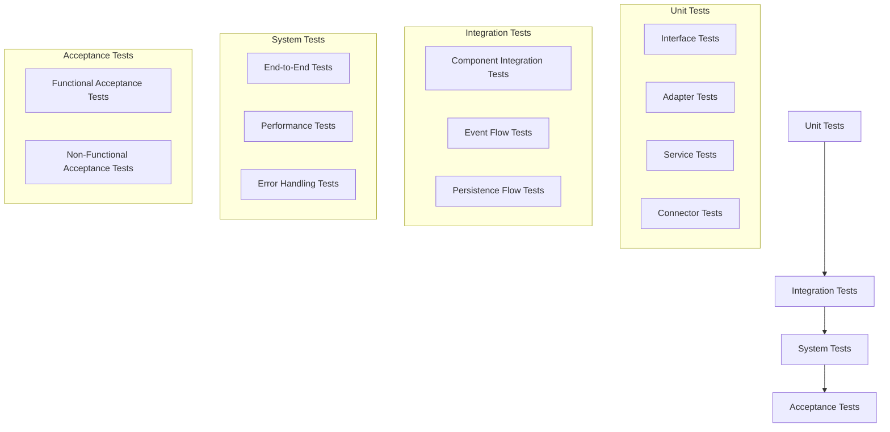

# Vector-Tonic Persistence Integration Testing Strategy

## Overview

This document outlines the testing strategy for the Vector-Tonic Persistence Integration. The strategy follows a comprehensive approach to ensure that the integration between the Vector-Tonic Window system and the ArangoDB persistence layer is robust and reliable.

## Testing Levels

The testing strategy includes multiple levels of testing, each with a specific focus:



## Unit Tests

Unit tests focus on testing individual components in isolation, using mocks for dependencies.

### Interface Tests

Interface tests verify that implementations of interfaces meet the contract defined by the interface.

```python
# test_interfaces.py
import unittest
from unittest.mock import Mock
from src.habitat_evolution.integration.vector_tonic_persistence.interfaces.persistence_interfaces import PatternRepository

class TestPatternRepository(unittest.TestCase):
    def test_pattern_repository_interface(self):
        # Create a mock implementation of the interface
        repo = Mock(spec=PatternRepository)
        
        # Test the save method
        pattern = {"name": "Test Pattern"}
        repo.save.return_value = "pattern_123"
        pattern_id = repo.save(pattern)
        self.assertEqual(pattern_id, "pattern_123")
        repo.save.assert_called_once_with(pattern)
        
        # Test the find_by_id method
        repo.find_by_id.return_value = pattern
        result = repo.find_by_id("pattern_123")
        self.assertEqual(result, pattern)
        repo.find_by_id.assert_called_once_with("pattern_123")
        
        # Test the find_by_relationship method
        repo.find_by_relationship.return_value = [pattern]
        results = repo.find_by_relationship("source", "predicate", "target")
        self.assertEqual(results, [pattern])
        repo.find_by_relationship.assert_called_once_with("source", "predicate", "target")
```

### Adapter Tests

Adapter tests verify that adapters correctly translate between domain models and persistence models.

```python
# test_adapters.py
import unittest
from datetime import datetime
from src.habitat_evolution.integration.vector_tonic_persistence.adapters.pattern_adapter import PatternAdapter
from src.habitat_evolution.adaptive_core.id.adaptive_id import AdaptiveID

class MockPattern:
    def __init__(self):
        self.id = "pattern_123"
        self.name = "Test Pattern"
        self.description = "A test pattern"
        self.version_history = {"initial": {"timestamp": "2025-04-01T12:00:00", "origin": "test"}}
        self.relationships = []
        self.metadata = {"creator": "test_user"}
        self.coherence = 0.8
        self.stability = 0.7
        self.resonance = 0.9
        self.detection_timestamp = "2025-04-01T12:00:00"
        self.last_updated = "2025-04-01T12:00:00"

class TestPatternAdapter(unittest.TestCase):
    def setUp(self):
        self.adapter = PatternAdapter()
        self.pattern = MockPattern()
    
    def test_to_persistence_model(self):
        # Convert the pattern to a persistence model
        persistence_model = self.adapter.to_persistence_model(self.pattern)
        
        # Check that the conversion was correct
        self.assertEqual(persistence_model["_key"], self.pattern.id)
        self.assertEqual(persistence_model["name"], self.pattern.name)
        self.assertEqual(persistence_model["description"], self.pattern.description)
        self.assertEqual(persistence_model["version_history"], self.pattern.version_history)
        self.assertEqual(persistence_model["relationships"], [])
        self.assertEqual(persistence_model["metadata"], self.pattern.metadata)
        self.assertEqual(persistence_model["coherence"], self.pattern.coherence)
        self.assertEqual(persistence_model["stability"], self.pattern.stability)
        self.assertEqual(persistence_model["resonance"], self.pattern.resonance)
        self.assertEqual(persistence_model["detection_timestamp"], self.pattern.detection_timestamp)
        self.assertEqual(persistence_model["last_updated"], self.pattern.last_updated)
    
    def test_from_persistence_model(self):
        # Create a persistence model
        persistence_model = {
            "_key": "pattern_123",
            "name": "Test Pattern",
            "description": "A test pattern",
            "version_history": {"initial": {"timestamp": "2025-04-01T12:00:00", "origin": "test"}},
            "relationships": [],
            "metadata": {"creator": "test_user"},
            "coherence": 0.8,
            "stability": 0.7,
            "resonance": 0.9,
            "detection_timestamp": "2025-04-01T12:00:00",
            "last_updated": "2025-04-01T12:00:00"
        }
        
        # Convert the persistence model to a pattern
        adaptive_id = self.adapter.from_persistence_model(persistence_model)
        
        # Check that the conversion was correct
        self.assertEqual(adaptive_id.base_concept, persistence_model["name"])
        self.assertEqual(adaptive_id.creator_id, "system")  # Default value
        self.assertEqual(adaptive_id.versions["initial"]["timestamp"], "2025-04-01T12:00:00")
        self.assertEqual(adaptive_id.versions["initial"]["origin"], "test")
        self.assertEqual(adaptive_id.temporal_context["detection_timestamp"], persistence_model["detection_timestamp"])
```

### Service Tests

Service tests verify that services correctly handle events and interact with repositories.

```python
# test_services.py
import unittest
from unittest.mock import Mock, MagicMock
from datetime import datetime
from src.habitat_evolution.core.services.event_bus import Event, LocalEventBus
from src.habitat_evolution.integration.vector_tonic_persistence.services.pattern_service import PatternPersistenceService

class TestPatternPersistenceService(unittest.TestCase):
    def setUp(self):
        # Create mocks
        self.event_bus = Mock(spec=LocalEventBus)
        self.pattern_repository = Mock()
        self.pattern_adapter = Mock()
        
        # Create the service
        self.service = PatternPersistenceService(
            event_bus=self.event_bus,
            pattern_repository=self.pattern_repository,
            pattern_adapter=self.pattern_adapter
        )
    
    def test_initialize(self):
        # Initialize the service
        self.service.initialize()
        
        # Check that the service subscribed to the correct events
        self.event_bus.subscribe.assert_any_call("pattern_detected", self.service._on_pattern_detected)
        self.event_bus.subscribe.assert_any_call("pattern_evolved", self.service._on_pattern_evolved)
        self.event_bus.subscribe.assert_any_call("pattern_merged", self.service._on_pattern_merged)
        self.event_bus.subscribe.assert_any_call("pattern_split", self.service._on_pattern_split)
        self.event_bus.subscribe.assert_any_call("pattern_dissolved", self.service._on_pattern_dissolved)
    
    def test_on_pattern_detected(self):
        # Create a mock event
        pattern_data = MagicMock()
        event = Event(type="pattern_detected", data=pattern_data)
        
        # Set up the adapter to return a persistence model
        persistence_model = {"_key": "pattern_123", "name": "Test Pattern"}
        self.pattern_adapter.to_persistence_model.return_value = persistence_model
        
        # Set up the repository to return a pattern ID
        self.pattern_repository.save.return_value = "pattern_123"
        
        # Call the method
        pattern_id = self.service._on_pattern_detected(event)
        
        # Check that the adapter was called with the pattern data
        self.pattern_adapter.to_persistence_model.assert_called_once_with(pattern_data)
        
        # Check that the repository was called with the persistence model
        self.pattern_repository.save.assert_called_once()
        
        # Check that the method returned the pattern ID
        self.assertEqual(pattern_id, "pattern_123")
        
        # Check that the service published a pattern persisted event
        self.event_bus.publish.assert_called_once()
        published_event = self.event_bus.publish.call_args[0][0]
        self.assertEqual(published_event.type, "pattern_persisted")
        self.assertEqual(published_event.data["pattern_id"], "pattern_123")
```

### Connector Tests

Connector tests verify that the connector correctly orchestrates the interaction between components.

```python
# test_connector.py
import unittest
from unittest.mock import Mock, MagicMock
from datetime import datetime
from src.habitat_evolution.integration.vector_tonic_persistence.connector import VectorTonicPersistenceConnector

class TestVectorTonicPersistenceConnector(unittest.TestCase):
    def setUp(self):
        # Create mocks
        self.event_bus = Mock()
        self.db = Mock()
        self.vector_tonic_integrator = Mock()
        self.pattern_repository = Mock()
        self.field_state_repository = Mock()
        self.relationship_repository = Mock()
        self.adaptive_id_repository = Mock()
        
        # Create the connector with mocked dependencies
        self.connector = VectorTonicPersistenceConnector(
            event_bus=self.event_bus,
            db=self.db,
            vector_tonic_integrator=self.vector_tonic_integrator,
            pattern_repository=self.pattern_repository,
            field_state_repository=self.field_state_repository,
            relationship_repository=self.relationship_repository,
            adaptive_id_repository=self.adaptive_id_repository
        )
    
    def test_initialize(self):
        # Initialize the connector
        self.connector.initialize()
        
        # Check that the services were initialized
        self.assertTrue(hasattr(self.connector, 'pattern_service'))
        self.assertTrue(hasattr(self.connector, 'field_state_service'))
        self.assertTrue(hasattr(self.connector, 'relationship_service'))
    
    def test_connect_to_vector_tonic_window(self):
        # Create a mock window
        window = Mock()
        
        # Connect to the window
        self.connector.connect_to_vector_tonic_window(window)
        
        # Check that the integrator was called with the window
        self.vector_tonic_integrator.connect_to_window.assert_called_once_with(window)
    
    def test_process_document(self):
        # Create a mock document
        document = {"id": "doc_123", "content": "Test content"}
        
        # Set up the integrator to return a result
        expected_result = {"pattern_id": "pattern_123"}
        self.vector_tonic_integrator.process_document.return_value = expected_result
        
        # Process the document
        result = self.connector.process_document(document)
        
        # Check that the integrator was called with the document
        self.vector_tonic_integrator.process_document.assert_called_once_with(document)
        
        # Check that the method returned the expected result
        self.assertEqual(result, expected_result)
```

## Integration Tests

Integration tests focus on testing the interaction between components.

### Component Integration Tests

Component integration tests verify that components work together correctly.

```python
# test_component_integration.py
import unittest
from src.habitat_evolution.core.services.event_bus import LocalEventBus, Event
from src.habitat_evolution.integration.vector_tonic_persistence.adapters.pattern_adapter import PatternAdapter
from src.habitat_evolution.integration.vector_tonic_persistence.services.pattern_service import PatternPersistenceService
from src.habitat_evolution.pattern_aware_rag.persistence.arangodb.pattern_repository import PatternRepository
from src.habitat_evolution.adaptive_core.persistence.arangodb.connection import ArangoDBConnectionManager

class TestComponentIntegration(unittest.TestCase):
    def setUp(self):
        # Create real components
        self.event_bus = LocalEventBus()
        self.db = ArangoDBConnectionManager().get_db()
        self.pattern_adapter = PatternAdapter()
        self.pattern_repository = PatternRepository(self.db)
        
        # Create the service with real dependencies
        self.pattern_service = PatternPersistenceService(
            event_bus=self.event_bus,
            pattern_repository=self.pattern_repository,
            pattern_adapter=self.pattern_adapter
        )
        
        # Initialize the service
        self.pattern_service.initialize()
    
    def test_pattern_detection_to_persistence(self):
        # Create a mock pattern
        class MockPattern:
            def __init__(self):
                self.id = "pattern_123"
                self.name = "Test Pattern"
                self.description = "A test pattern"
                self.version_history = {"initial": {"timestamp": "2025-04-01T12:00:00", "origin": "test"}}
                self.relationships = []
                self.metadata = {"creator": "test_user"}
                self.coherence = 0.8
                self.stability = 0.7
                self.resonance = 0.9
                self.detection_timestamp = "2025-04-01T12:00:00"
                self.last_updated = "2025-04-01T12:00:00"
        
        pattern = MockPattern()
        
        # Create a pattern detected event
        event = Event(type="pattern_detected", data=pattern)
        
        # Subscribe to the pattern persisted event
        persisted_event = None
        def on_pattern_persisted(event):
            nonlocal persisted_event
            persisted_event = event
        
        self.event_bus.subscribe("pattern_persisted", on_pattern_persisted)
        
        # Publish the pattern detected event
        self.event_bus.publish(event)
        
        # Check that the pattern was persisted
        self.assertIsNotNone(persisted_event)
        self.assertEqual(persisted_event.type, "pattern_persisted")
        
        # Check that the pattern can be retrieved from the repository
        pattern_id = persisted_event.data["pattern_id"]
        persisted_pattern = self.pattern_repository.find_by_id(pattern_id)
        
        self.assertIsNotNone(persisted_pattern)
        self.assertEqual(persisted_pattern["name"], pattern.name)
        self.assertEqual(persisted_pattern["description"], pattern.description)
```

### Event Flow Tests

Event flow tests verify that events flow correctly through the system.

```python
# test_event_flow.py
import unittest
from src.habitat_evolution.core.services.event_bus import LocalEventBus, Event
from src.habitat_evolution.integration.vector_tonic_persistence.connector import create_connector
from src.habitat_evolution.adaptive_core.emergence.vector_tonic_window import VectorTonicWindow

class TestEventFlow(unittest.TestCase):
    def setUp(self):
        # Create real components
        self.event_bus = LocalEventBus()
        self.vector_tonic_window = VectorTonicWindow()
        
        # Create the connector with real dependencies
        self.connector = create_connector(event_bus=self.event_bus)
        
        # Connect to the vector-tonic window
        self.connector.connect_to_vector_tonic_window(self.vector_tonic_window)
    
    def test_document_processing_event_flow(self):
        # Create a document
        document = {
            "id": "doc_123",
            "title": "Climate Risk Assessment",
            "content": "Climate change poses significant risks to coastal communities...",
            "metadata": {
                "source": "research_paper",
                "author": "Dr. Jane Smith",
                "date": "2025-03-15"
            }
        }
        
        # Track events
        events = []
        def track_event(event):
            events.append(event)
        
        # Subscribe to events
        self.event_bus.subscribe("pattern_detected", track_event)
        self.event_bus.subscribe("field_state_updated", track_event)
        self.event_bus.subscribe("relationship_detected", track_event)
        self.event_bus.subscribe("pattern_persisted", track_event)
        self.event_bus.subscribe("field_state_persisted", track_event)
        self.event_bus.subscribe("relationship_persisted", track_event)
        
        # Process the document
        self.connector.process_document(document)
        
        # Check that events were generated
        self.assertTrue(any(event.type == "pattern_detected" for event in events))
        self.assertTrue(any(event.type == "field_state_updated" for event in events))
        self.assertTrue(any(event.type == "relationship_detected" for event in events))
        self.assertTrue(any(event.type == "pattern_persisted" for event in events))
        self.assertTrue(any(event.type == "field_state_persisted" for event in events))
        self.assertTrue(any(event.type == "relationship_persisted" for event in events))
```

### Persistence Flow Tests

Persistence flow tests verify that data is correctly persisted and retrieved.

```python
# test_persistence_flow.py
import unittest
from src.habitat_evolution.integration.vector_tonic_persistence.connector import create_connector
from src.habitat_evolution.adaptive_core.emergence.vector_tonic_window import VectorTonicWindow

class TestPersistenceFlow(unittest.TestCase):
    def setUp(self):
        # Create real components
        self.vector_tonic_window = VectorTonicWindow()
        
        # Create the connector with real dependencies
        self.connector = create_connector()
        
        # Connect to the vector-tonic window
        self.connector.connect_to_vector_tonic_window(self.vector_tonic_window)
    
    def test_document_processing_persistence_flow(self):
        # Create a document
        document = {
            "id": "doc_123",
            "title": "Climate Risk Assessment",
            "content": "Climate change poses significant risks to coastal communities...",
            "metadata": {
                "source": "research_paper",
                "author": "Dr. Jane Smith",
                "date": "2025-03-15"
            }
        }
        
        # Process the document
        result = self.connector.process_document(document)
        
        # Check that the result contains a pattern ID
        self.assertIn("pattern_id", result)
        
        # Retrieve the pattern
        pattern = self.connector.get_pattern_by_id(result["pattern_id"])
        
        # Check that the pattern was correctly persisted
        self.assertIsNotNone(pattern)
        
        # Retrieve the field state
        field_state = self.connector.get_latest_field_state()
        
        # Check that the field state was correctly persisted
        self.assertIsNotNone(field_state)
        
        # Retrieve the relationships
        relationships = self.connector.get_relationships_by_source(document["id"])
        
        # Check that the relationships were correctly persisted
        self.assertTrue(len(relationships) > 0)
```

## System Tests

System tests focus on testing the system as a whole.

### End-to-End Tests

End-to-end tests verify that the system works correctly from document ingestion to persistence and retrieval.

```python
# test_end_to_end.py
import unittest
import json
from src.habitat_evolution.integration.vector_tonic_persistence.connector import create_connector
from src.habitat_evolution.adaptive_core.emergence.vector_tonic_window import VectorTonicWindow

class TestEndToEnd(unittest.TestCase):
    def setUp(self):
        # Create real components
        self.vector_tonic_window = VectorTonicWindow()
        
        # Create the connector with real dependencies
        self.connector = create_connector()
        
        # Connect to the vector-tonic window
        self.connector.connect_to_vector_tonic_window(self.vector_tonic_window)
    
    def test_climate_risk_document_processing(self):
        # Load a climate risk document
        with open("tests/data/climate_risk_document.json", "r") as f:
            document = json.load(f)
        
        # Process the document
        result = self.connector.process_document(document)
        
        # Check that the result contains a pattern ID
        self.assertIn("pattern_id", result)
        
        # Retrieve the pattern
        pattern = self.connector.get_pattern_by_id(result["pattern_id"])
        
        # Check that the pattern was correctly persisted
        self.assertIsNotNone(pattern)
        self.assertEqual(pattern.base_concept, "Climate Risk")
        
        # Retrieve the field state
        field_state = self.connector.get_latest_field_state()
        
        # Check that the field state was correctly persisted
        self.assertIsNotNone(field_state)
        self.assertIn("metrics", field_state)
        self.assertIn("topology_metrics", field_state)
        
        # Retrieve the relationships
        relationships = self.connector.get_relationships_by_source(document["id"])
        
        # Check that the relationships were correctly persisted
        self.assertTrue(len(relationships) > 0)
        self.assertEqual(relationships[0]["source_id"], document["id"])
```

### Performance Tests

Performance tests verify that the system meets performance requirements.

```python
# test_performance.py
import unittest
import time
import json
from src.habitat_evolution.integration.vector_tonic_persistence.connector import create_connector
from src.habitat_evolution.adaptive_core.emergence.vector_tonic_window import VectorTonicWindow

class TestPerformance(unittest.TestCase):
    def setUp(self):
        # Create real components
        self.vector_tonic_window = VectorTonicWindow()
        
        # Create the connector with real dependencies
        self.connector = create_connector()
        
        # Connect to the vector-tonic window
        self.connector.connect_to_vector_tonic_window(self.vector_tonic_window)
    
    def test_document_processing_performance(self):
        # Load a document
        with open("tests/data/climate_risk_document.json", "r") as f:
            document = json.load(f)
        
        # Measure the time to process the document
        start_time = time.time()
        result = self.connector.process_document(document)
        end_time = time.time()
        
        # Check that the processing time is within acceptable limits
        processing_time = end_time - start_time
        self.assertLess(processing_time, 5.0)  # Processing should take less than 5 seconds
```

### Error Handling Tests

Error handling tests verify that the system handles errors correctly.

```python
# test_error_handling.py
import unittest
from unittest.mock import Mock, MagicMock
from src.habitat_evolution.integration.vector_tonic_persistence.connector import VectorTonicPersistenceConnector

class TestErrorHandling(unittest.TestCase):
    def setUp(self):
        # Create mocks
        self.event_bus = Mock()
        self.db = Mock()
        self.vector_tonic_integrator = Mock()
        self.pattern_repository = Mock()
        self.field_state_repository = Mock()
        self.relationship_repository = Mock()
        self.adaptive_id_repository = Mock()
        
        # Create the connector with mocked dependencies
        self.connector = VectorTonicPersistenceConnector(
            event_bus=self.event_bus,
            db=self.db,
            vector_tonic_integrator=self.vector_tonic_integrator,
            pattern_repository=self.pattern_repository,
            field_state_repository=self.field_state_repository,
            relationship_repository=self.relationship_repository,
            adaptive_id_repository=self.adaptive_id_repository
        )
    
    def test_process_document_error_handling(self):
        # Create a mock document
        document = {"id": "doc_123", "content": "Test content"}
        
        # Set up the integrator to raise an exception
        self.vector_tonic_integrator.process_document.side_effect = Exception("Test exception")
        
        # Process the document and check that the exception is handled
        with self.assertRaises(Exception):
            self.connector.process_document(document)
```

## Acceptance Tests

Acceptance tests focus on verifying that the system meets the requirements of stakeholders.

### Functional Acceptance Tests

Functional acceptance tests verify that the system meets functional requirements.

```python
# test_functional_acceptance.py
import unittest
import json
from src.habitat_evolution.integration.vector_tonic_persistence.connector import create_connector
from src.habitat_evolution.adaptive_core.emergence.vector_tonic_window import VectorTonicWindow

class TestFunctionalAcceptance(unittest.TestCase):
    def setUp(self):
        # Create real components
        self.vector_tonic_window = VectorTonicWindow()
        
        # Create the connector with real dependencies
        self.connector = create_connector()
        
        # Connect to the vector-tonic window
        self.connector.connect_to_vector_tonic_window(self.vector_tonic_window)
    
    def test_pattern_detection_and_persistence(self):
        # Load a document
        with open("tests/data/climate_risk_document.json", "r") as f:
            document = json.load(f)
        
        # Process the document
        result = self.connector.process_document(document)
        
        # Check that the result contains a pattern ID
        self.assertIn("pattern_id", result)
        
        # Retrieve the pattern
        pattern = self.connector.get_pattern_by_id(result["pattern_id"])
        
        # Check that the pattern was correctly persisted
        self.assertIsNotNone(pattern)
        
        # Check that the pattern has the expected properties
        self.assertEqual(pattern.base_concept, "Climate Risk")
        self.assertIn("initial", pattern.versions)
        self.assertIn("detection_timestamp", pattern.temporal_context)
    
    def test_field_state_tracking(self):
        # Load a document
        with open("tests/data/climate_risk_document.json", "r") as f:
            document = json.load(f)
        
        # Process the document
        self.connector.process_document(document)
        
        # Retrieve the field state
        field_state = self.connector.get_latest_field_state()
        
        # Check that the field state was correctly persisted
        self.assertIsNotNone(field_state)
        
        # Check that the field state has the expected properties
        self.assertIn("metrics", field_state)
        self.assertIn("topology_metrics", field_state)
        self.assertIn("system_metrics", field_state)
        self.assertIn("parameters", field_state)
    
    def test_relationship_tracking(self):
        # Load a document
        with open("tests/data/climate_risk_document.json", "r") as f:
            document = json.load(f)
        
        # Process the document
        self.connector.process_document(document)
        
        # Retrieve the relationships
        relationships = self.connector.get_relationships_by_source(document["id"])
        
        # Check that the relationships were correctly persisted
        self.assertTrue(len(relationships) > 0)
        
        # Check that the relationships have the expected properties
        self.assertEqual(relationships[0]["source_id"], document["id"])
        self.assertIn("predicate", relationships[0])
        self.assertIn("target_id", relationships[0])
        self.assertIn("confidence", relationships[0])
```

### Non-Functional Acceptance Tests

Non-functional acceptance tests verify that the system meets non-functional requirements.

```python
# test_non_functional_acceptance.py
import unittest
import time
import json
import psutil
from src.habitat_evolution.integration.vector_tonic_persistence.connector import create_connector
from src.habitat_evolution.adaptive_core.emergence.vector_tonic_window import VectorTonicWindow

class TestNonFunctionalAcceptance(unittest.TestCase):
    def setUp(self):
        # Create real components
        self.vector_tonic_window = VectorTonicWindow()
        
        # Create the connector with real dependencies
        self.connector = create_connector()
        
        # Connect to the vector-tonic window
        self.connector.connect_to_vector_tonic_window(self.vector_tonic_window)
    
    def test_performance_requirements(self):
        # Load a document
        with open("tests/data/climate_risk_document.json", "r") as f:
            document = json.load(f)
        
        # Measure the time to process the document
        start_time = time.time()
        result = self.connector.process_document(document)
        end_time = time.time()
        
        # Check that the processing time is within acceptable limits
        processing_time = end_time - start_time
        self.assertLess(processing_time, 5.0)  # Processing should take less than 5 seconds
    
    def test_memory_requirements(self):
        # Load a document
        with open("tests/data/climate_risk_document.json", "r") as f:
            document = json.load(f)
        
        # Get the memory usage before processing
        process = psutil.Process()
        memory_before = process.memory_info().rss
        
        # Process the document
        result = self.connector.process_document(document)
        
        # Get the memory usage after processing
        memory_after = process.memory_info().rss
        
        # Check that the memory usage is within acceptable limits
        memory_usage = memory_after - memory_before
        self.assertLess(memory_usage, 100 * 1024 * 1024)  # Memory usage should be less than 100 MB
```

## Conclusion

This testing strategy provides a comprehensive approach to testing the Vector-Tonic Persistence Integration. By following this strategy, we can ensure that the integration is robust, reliable, and meets the requirements of stakeholders.

The strategy includes multiple levels of testing, from unit tests to acceptance tests, and covers all aspects of the integration, from individual components to the system as a whole. This approach ensures that the integration is thoroughly tested and that any issues are identified and addressed early in the development process.
