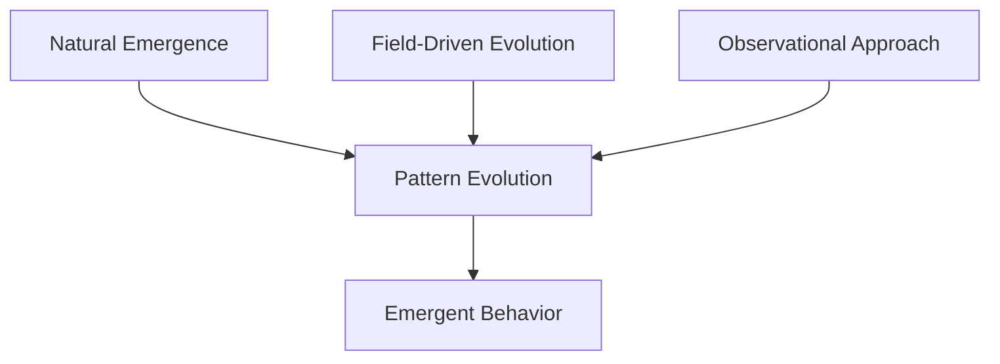
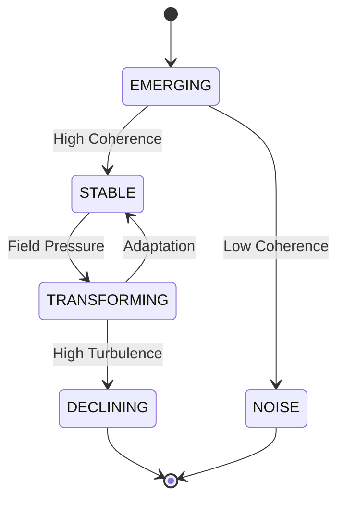
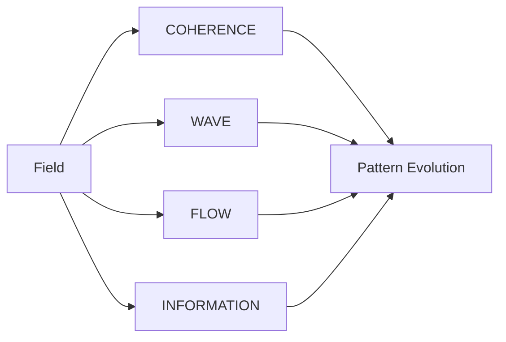

# Habitat Overview: A Natural Pattern Evolution System

## Core Philosophy

The Habitat system represents a paradigm shift in pattern evolution, built on three fundamental principles:



### Key Principles
1. **Natural Emergence**: Patterns emerge through field interactions rather than direct control
2. **Field-Driven Evolution**: Evolution occurs through field dynamics, not explicit rules
3. **Observational Approach**: System focuses on observing and understanding rather than controlling

## Scientific Framework Integration

The system integrates multiple scientific paradigms, each contributing essential mechanics:

### 1. Wave Mechanics
```python
# From gradient_service.py
async def calculate_gradient(self, field_id: str, position: Dict[str, float]) -> GradientVector:
    """Calculate the gradient vector at a position in the field"""
    # Calculate gradient components using central differences
    dx = 0.01  # Small delta for numerical differentiation
    gradient_components = {}
    for axis in position.keys():
        pos_forward = position.copy()
        pos_backward = position.copy()
        pos_forward[axis] += dx
        pos_backward[axis] -= dx
        
        # Calculate potential difference
        potential_diff = await self.calculate_potential_difference(
            field_id, pos_backward, pos_forward
        )
        gradient_components[axis] = potential_diff / (2 * dx)
```

### 2. Field Theory
```python
# Field State representation with Neo4j persistence
class FieldState:
    field_id: str
    timestamp: datetime
    potential: float
    dimensions: Tuple[int, int]
    mean_intensity: float
    max_intensity: float
    min_intensity: float

    def to_neo4j(self) -> Dict[str, Any]:
        """Export field state to Neo4j compatible format"""
        return {
            'timestamp': self.timestamp.isoformat(),
            'dimensions': self.dimensions,
            'mean_intensity': float(self.mean_intensity),
            'max_intensity': float(self.max_intensity),
            'min_intensity': float(self.min_intensity)
        }
    gradient: Dict[str, float]
    stability: float
    metadata: Dict[str, any]
```

### 3. Flow Dynamics
```python
# Pattern flow characteristics
pattern_flow = {
    "coherent": {  # Patterns with coherence > 0.3
        "turbulence_impact": 0.5,  # Reduced impact
        "flow_type": "gradient_driven",
        "volume": "stable"
    },
    "incoherent": {  # Patterns with coherence ≤ 0.3
        "turbulence_impact": 2.0,  # Amplified impact
        "viscosity": "exponential_growth",
        "flow": "strong_negative",
        "volume": "reducing"
    }
}
```

## Pattern States and Behavior

Patterns in Habitat exhibit different states with distinct characteristics:



### Pattern Characteristics
| State | Strength | Persistence | Coherence | Flow Behavior |
|-------|----------|-------------|-----------|---------------|
| EMERGING | High | Low | Variable | Gradient-following |
| STABLE | High | High | >0.7 | Self-maintaining |
| DECLINING | Low | Low | <0.3 | Strong negative |
| TRANSFORMING | Variable | Low | Variable | High current |
| NOISE | Low | Very Low | <0.2 | Dissipative |

## Field Dynamics

The field acts as an active medium with multiple interaction modes:



### Gradient Effects
```python
# Validated through tests
test_results = {
    "coherent_pattern": {
        "viscosity": "< 0.4",  # Low resistance
        "volume": "> 0.6",     # Maintained volume
        "current": "< |1.0|"   # Stable flow
    },
    "incoherent_pattern": {
        "viscosity": "> 0.9",  # High resistance
        "volume": "< 0.3",     # Volume reduction
        "current": "< -1.5"    # Strong negative flow
    }
}
```

## Implementation Evidence

The system's effectiveness is demonstrated through comprehensive testing:

```python
# From test_pattern_coherence_detection
async def test_pattern_coherence_detection(self, config):
    """Validates pattern coherence through multiple lenses:
    1. Wave Mechanics: Phase relationships
    2. Field Theory: Gradient propagation
    3. Information Theory: Signal-to-noise analysis
    4. Flow Dynamics: Viscosity and turbulence
    """
    # Test setup and pattern creation
    patterns = [
        {"name": "Core Pattern", "coherence": 1.0},
        {"name": "Coherent Satellite", "coherence": 0.6},
        {"name": "Incoherent Noise", "coherence": 0.2}
    ]
```

## Conclusion

Habitat achieves complex pattern evolution through:
1. Natural field-mediated interactions
2. Multi-modal analysis (Wave, Field, Flow, Information)
3. Adaptive state transitions
4. Emergent behavior without explicit rules

This creates a rich environment for studying pattern evolution in a way that mirrors natural systems.

---
*Note: Code snippets and diagrams are simplified representations of the actual system implementation.*
