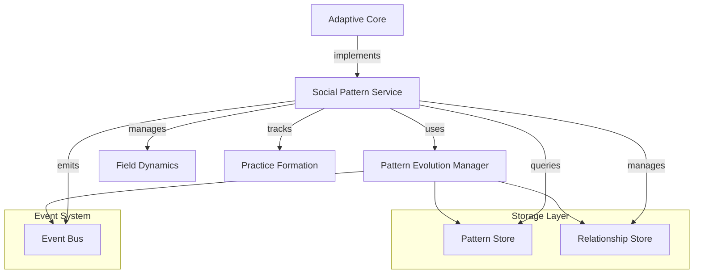

# Social Pattern Evolution

This package implements social pattern detection, analysis, and evolution tracking across personal, community, and organizational scales.

## Directory Structure

```
social/
├── core/                   # Core implementation
│   ├── field.py           # Social field dynamics
│   ├── pattern.py         # Pattern detection/evolution
│   └── practice.py        # Practice formation/stability
│
├── data/                  # Data management
│   ├── crawlers/          # Source-specific crawlers
│   ├── processors/        # Data cleaning/preparation
│   └── storage/           # Data persistence
│
├── analysis/             # Analysis tools
│   ├── personal/         # Individual pattern analysis
│   ├── community/        # Group pattern analysis
│   └── organization/     # Institutional pattern analysis
│
├── visualization/        # Visualization tools
│   ├── field_viz/       # Field state visualization
│   ├── pattern_viz/     # Pattern evolution viz
│   └── network_viz/     # Neo4j graph visualization
│
└── tests/               # Test suite
    ├── integration/     # Integration tests
    ├── unit/           # Unit tests
    └── data/           # Test data
```

## Social Metrics Framework

The service tracks several key metrics through the `SocialMetrics` class:

### Field Dynamics
- `field_energy`: Energy level in the social field
- `field_coherence`: Coherence of patterns within the field
- `field_flow`: Flow dynamics between patterns

### Social Dynamics
- `adoption_rate`: Rate at which patterns are being adopted
- `influence_reach`: Pattern's influence on other patterns
- `stability_index`: Overall stability measure

### Practice Formation
- `practice_maturity`: Maturity level of emerging practices
- `institutionalization`: Degree of practice institutionalization

## Service Architecture



## Core Interfaces

### Pattern Evolution Interface
```python
class PatternEvolutionService:
    async def register_pattern(self, pattern_data: Dict)
    async def get_pattern_metrics(self, pattern_id: str)
    async def update_pattern_state(self, pattern_id: str, new_state: Dict)
```

### Event Interface
- `social.practice.emerged`: Emitted when a pattern becomes a stable practice
- `social.field.updated`: Emitted when field state changes
- `pattern.updated`: Emitted when pattern state changes

## Pattern Evolution Flow

1. **Pattern Registration**
   - Patterns are registered with field state
   - Initial metrics are calculated
   - Pattern is tracked in the evolution system

2. **Practice Evolution**
   ```python
   async def track_practice_evolution(self, pattern_id: str, practice_data: Dict):
       # Calculate practice metrics
       # Update pattern state if mature
       # Create relationships with other practices
       # Emit practice emergence events
   ```

3. **Relationship Management**
   - Tracks relationships between patterns
   - Updates relationship properties based on practice alignment
   - Manages practice networks and influence flows

## Integration with Core Systems

### Pattern Core Integration
- Uses `PatternEvolutionManager` for basic pattern management
- Extends core pattern states with social-specific states
- Implements core quality metrics with social context

### Adaptive Core Integration
- Implements `PatternEvolutionService` interface
- Provides social-specific pattern metrics
- Supports adaptive pattern evolution

## Key Features

1. **Field-based Pattern Detection**
   - Tracks emergence through field dynamics
   - Monitors coherence and stability
   - Maps resource and knowledge flows

2. **Practice Formation**
   - Tracks evolution from patterns to practices
   - Measures practice maturity and stability
   - Manages practice relationships

3. **Social Network Analysis**
   - Tracks pattern relationships
   - Measures influence and adoption
   - Maps practice networks

4. **Event-Driven Updates**
   - Real-time metric updates
   - Practice emergence notifications
   - Field state change propagation

## Components

### Core Components

1. Field Dynamics (`core/field.py`)
   - Social field state management
   - Energy/flow calculations
   - Field interactions

2. Pattern Evolution (`core/pattern.py`)
   - Pattern detection
   - Evolution tracking
   - State transitions

3. Practice Formation (`core/practice.py`)
   - Practice emergence
   - Stability analysis
   - Pattern institutionalization

### Data Management

1. Crawlers (`data/crawlers/`)
   - Source-specific data collection
   - Rate limiting
   - Content extraction

2. Processors (`data/processors/`)
   - Data cleaning
   - Feature extraction
   - Pattern tagging

3. Storage (`data/storage/`)
   - Neo4j integration
   - Pattern persistence
   - History tracking

### Analysis Tools

1. Personal Analysis
   - Individual pattern detection
   - Practice formation
   - Adaptation tracking

2. Community Analysis
   - Group pattern emergence
   - Resource flow analysis
   - Network effects

3. Organization Analysis
   - Institutional dynamics
   - Practice diffusion
   - Culture evolution

## Usage

See individual component READMEs for detailed usage instructions.
